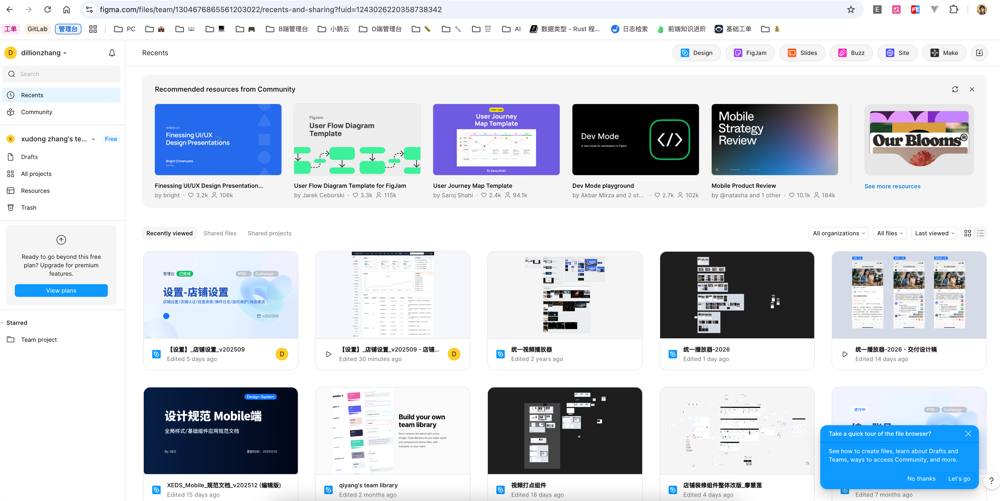
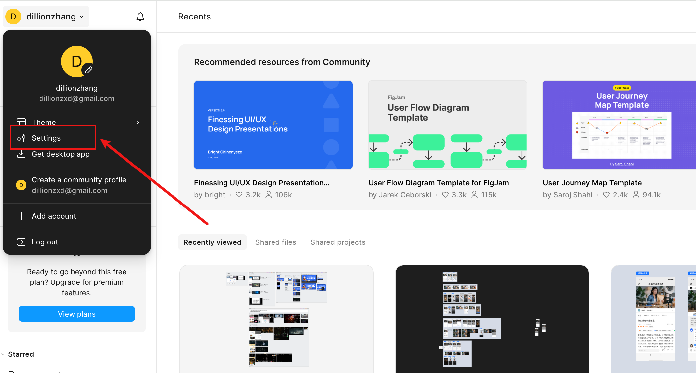
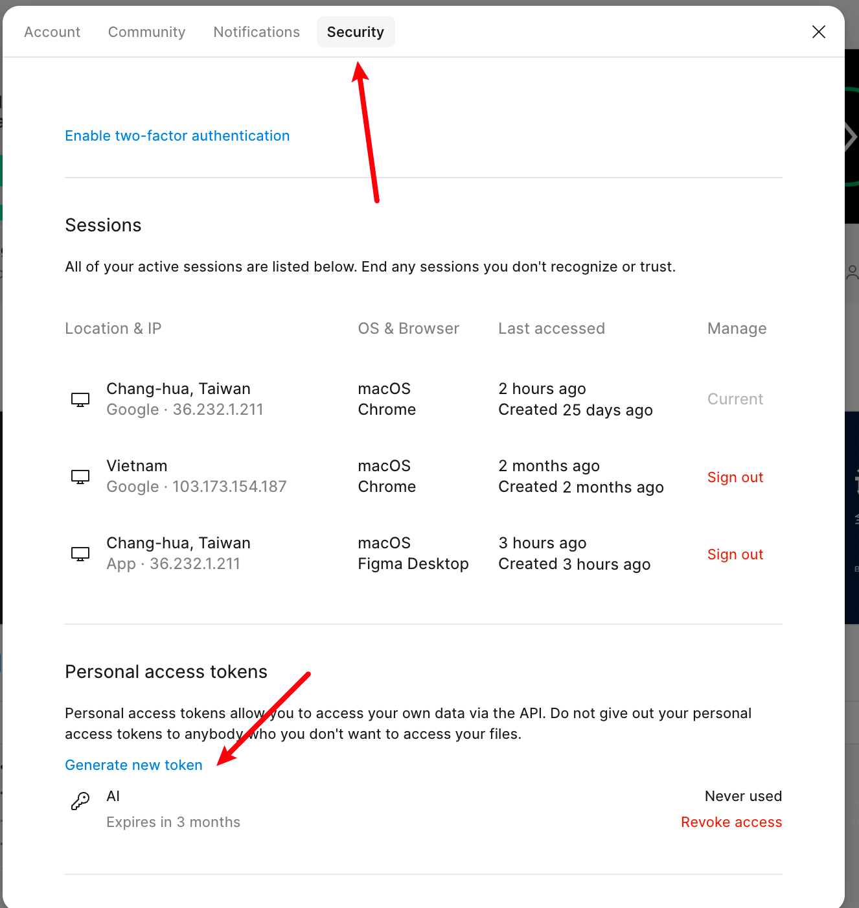
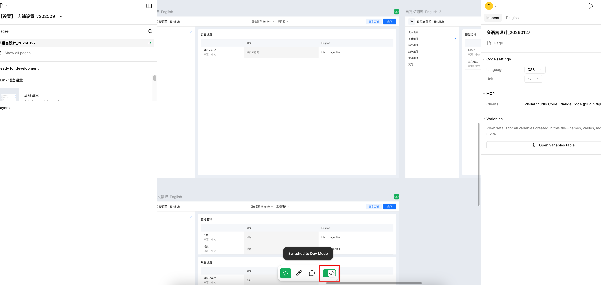
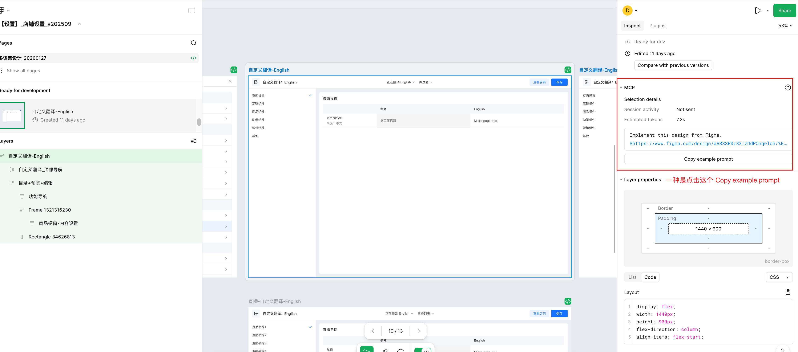
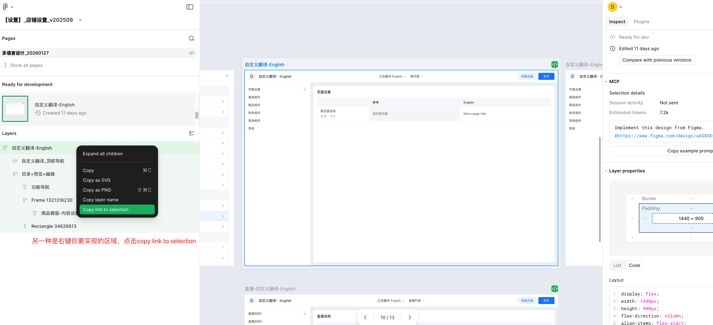
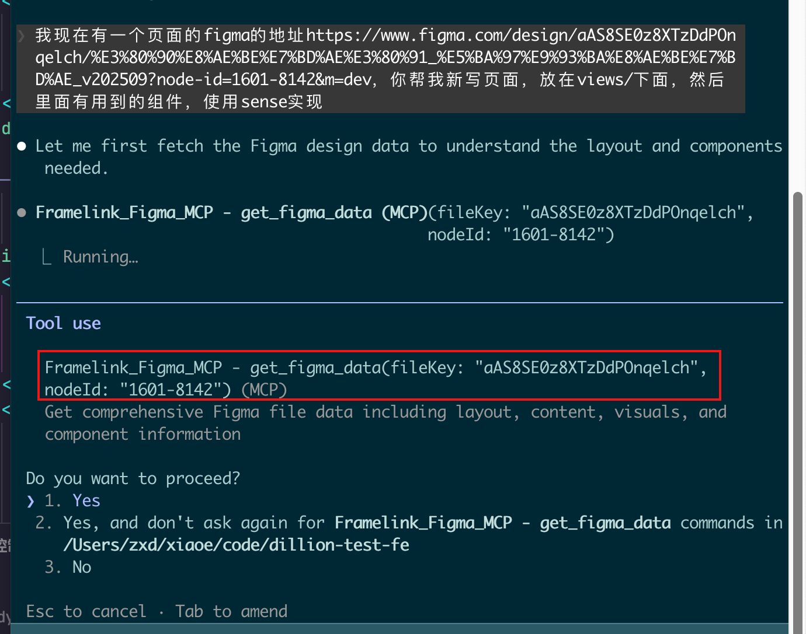

# 背景
在前端开发过程中，频繁在 Figma 和代码编辑器之间切换、手动复制样式、测量间距不仅效率低下，还容易出现视觉还原偏差。
本文将介绍如何通过安装 Figma MCP (Model Context Protocol)，打通 AI 编程工具（如 Claude Code, Cursor, Trae 等）与 Figma 的连接。安装后，AI 可以直接读取设计稿数据，帮你快速生成精准的 UI 代码。

# 核心工具
MCP Server: https://github.com/GLips/Figma-Context-MCP 
适用环境: Claude Code, OpenCode, VS Code, Trae 等支持 MCP 的编辑器。

# 准备工作：获取 Figma API Key

注意： 在配置工具之前，我们需要先从 Figma 获取访问权限密钥（Personal Access Token）。

1.登录 Figma，随便打开一个Figma设计文件，或者直接在首页。
a.
2.点击左上角的 头像/主菜单，在下拉菜单中选择 Settings (设置)。
a.
3.在设置弹窗中，点击 Security (安全) 选项卡。
a.
4.向下滑动找到 Personal access tokens 区域。
5.点击 Generate new token，输入描述（例如 "MCP-Agent"），然后复制生成的以 figd_ 开头的字符串。
a.重要提示： Token 只会显示一次，请务必妥善保存！

# 安装与配置

根据你使用的开发工具，选择对应的配置方式。将代码中的 YOUR-KEY 替换为你刚才获取的 figd_xxxxx 密钥

## Claude Code(命令行)
直接在终端运行以下命令即可添加：
claude mcp add Framelink_Figma_MCP -- npx -y figma-developer-mcp --figma-api-key=YOUR-KEY --stdio

## Opencode使用
在项目根目录 .mcp.json 配置文件中添加以下 JSON 对象：

{
  "mcp": {
    "Framelink_Figma_MCP": {
      "type": "local",
      "command": ["npx", "-y", "figma-developer-mcp", "--figma-api-key=YOUR-KEY", "--stdio"],
      "enabled": true
    }
  }
}

## VS Code使用
在项目根目录 .mcp.json 配置文件中添加以下 JSON 对象：

"mcp": {
  "servers": {
    "Framelink_Figma_MCP": {
      "type": "stdio",
      "command": "npx",
      "args": ["-y", "figma-developer-mcp", "--figma-api-key=YOUR-KEY", "--stdio"]
    }
  }
}

## Trae使用 
在 Trae 的 MCP 配置文件中添加：

{
  "mcpServers": {
    "Framelink_Figma_MCP": {
      "command": "npx",
      "args": ["-y", "figma-developer-mcp", "--figma-api-key=YOUR-KEY", "--stdio"]
    }
  }
}

# 如何使用

## 提供figama链接

打开dev mode 模式

## 发送指令： "请读取这个 Figma 链接，并帮我用 Vue  实现这个组件。"
