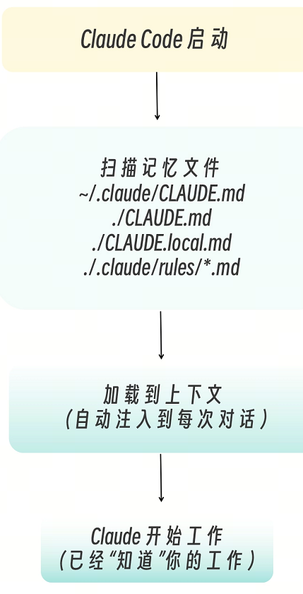
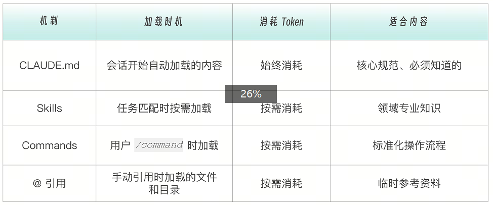
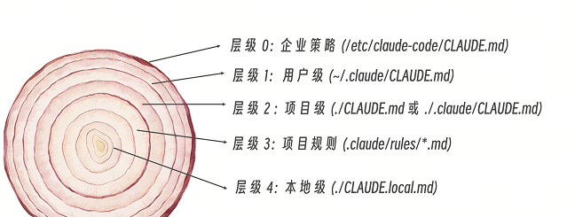
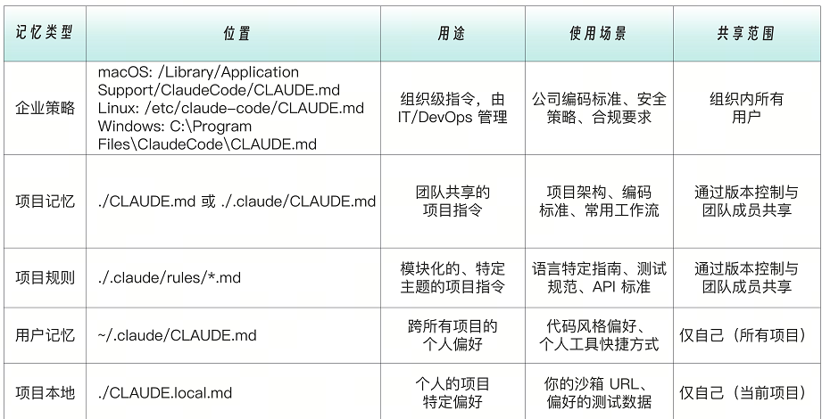

# Claude Code 记忆系统的工作原理


这就像你给新员工一份入职手册，他读完之后就知道公司的规矩。不同的是，Claude 每次对话都会重新“入职”——所以这份手册必须简洁有效。



# Claude Code 的五层记忆架构
Claude Code 支持五个层级的记忆，就像洋葱一样，从外到内，按层级结构组织——高层级的文件优先加载，为底层文件提供基础：





# 企业策略级记忆设定
企业策略级记忆设定的作用是组织范围内的指令，由 IT/DevOps 统一管理和部署组织。适合内容是，公司编码标准、安全策略、合规要求以及禁止使用的库或模式。通过配置管理系统（MDM、Group Policy、Ansible 等）部署，确保在所有开发者机器上一致分发。

位置：macOS: /Library/Application Support/ClaudeCode/CLAUDE.md
Linux: /etc/claude-code/CLAUDE.md
Windows: C:\Program Files\ClaudeCode\CLAUDE.md
```
# 公司开发策略

## 安全要求
- 禁止在代码中硬编码任何密钥或敏感信息
- 所有 API 调用必须使用 HTTPS
- 用户输入必须经过验证和清理

## 合规要求
- 所有日志必须排除 PII（个人身份信息）
- 数据库连接必须使用加密传输

## 禁止项
- 禁止使用未经审批的第三方库
- 禁止直接访问生产数据库
```

# 用户级内容设定
承载的是你的全局偏好，即跨所有项目生效的个人偏好，如个人代码风格，沟通语言设置，通用工作习惯等。比如说我希望所有的 PPT 都是 16:9，黑体字。这种设置就应该放在此处。

位置：~/.claude/CLAUDE.md

```# 个人偏好

## 沟通方式
- 使用中文回复
- 代码注释使用英文
- 解释简洁直接，不要过多铺垫

## 通用代码风格
- 缩进使用 2 空格
- 优先使用 async/await
- 变量命名使用 camelCase
- 常量命名使用 UPPER_SNAKE_CASE

## 我的常用工具
- 包管理器: uv
- 编辑器: VS Code
- 终端: zsh
```

# 项目级团队共享规范

团队共享规范是团队共享的项目知识，应该提交到 Git。适合存放的内容包括项目架构和技术栈、团队编码规范、重要的设计决策和常用命令。位置：项目根目录的  ./CLAUDE.md


示例（一个后端 API 项目）：

```
# 项目：订单服务 API

## 技术栈
- Node.js 20 + TypeScript
- Fastify（Web 框架）
- Prisma（ORM）
- PostgreSQL + Redis
- Zod（数据验证）

## 目录结构
src/ 
├── routes/ # 路由定义 
├── controllers/ # 请求处理 
├── services/ # 业务逻辑 
├── repositories/ # 数据访问 
├── schemas/ # Zod schemas 
└── types/ # 类型定义

## API 响应格式
```typescript
interface ApiResponse<T> {
  success: boolean;
  data?: T;
  error?: { code: string; message: string };
}
编码规范
- TypeScript strict 模式
- 禁止使用 any，使用 unknown + 类型守卫
- 所有 API 端点必须有 Zod schema 验证
- 业务错误使用自定义 Error 类
常用命令
- pnpm dev - 启动开发服务器
- pnpm test - 运行测试
- pnpm prisma migrate dev - 运行数据库迁移
```
# 本地级个人工作空间

个人工作空间用于记载个人工作笔记，不提交到 Git，适合内容包括本地环境配置、个人调试技巧、当前工作备注，敏感信息（测试账号等）。位置：项目根目录的./CLAUDE.local.md示例如下。

```
# 本地开发笔记

## 我的环境
- 本地 API: http://localhost:3000
- 测试数据库: order_service_dev
- Redis: localhost:6379

## 测试账号
- admin@test.com / test123
- user@test.com / test123

## 当前工作
- 正在重构支付模块
- 参考 PR #234 的讨论
- 周五前完成

## 调试技巧
- 订单状态机日志: LOG_LEVEL=debug pnpm dev
- 查看 Redis 缓存: redis-cli KEYS "order:*"
```
这里重点强调一下：记得把  CLAUDE.local.md  加入  .gitignore！

