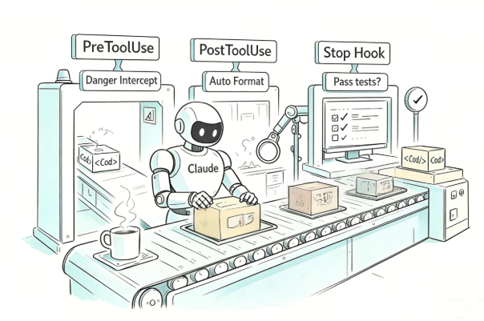
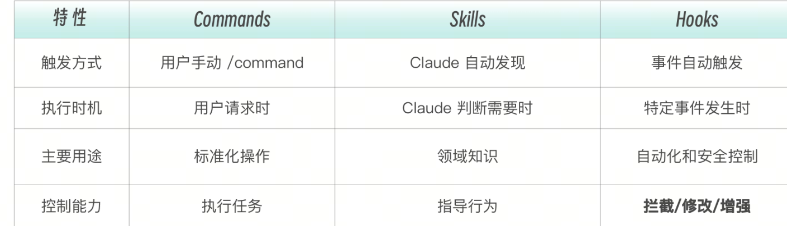
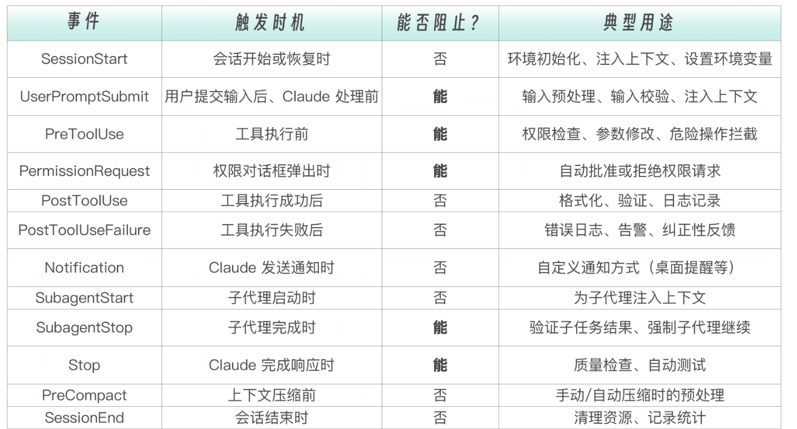

# Hooks 的本质——AI 时代的中间件
如果你有 Web 开发经验，你一定熟悉中间件（Middleware）的概念。
```
请求 → 中间件1 → 中间件2 → 中间件3 → 处理函数
                    ↓
              认证、日志、限流
```
中间件在请求到达最终处理函数之前插入检查和处理，实现横切关注点（Cross-cutting Concerns）。这些逻辑不属于任何一个业务功能，但又必须贯穿所有请求——认证要每个接口都检查，日志要每个操作都记录，限流要每个入口都控制。

Claude Code 的 Hooks 机制与此异曲同工，但它针对的不是 HTTP 请求，而是  AI Agent 的工具调用。

```
用户请求 → Claude 决策 → [PreToolUse Hook] → 工具执行 → [PostToolUse Hook] → 响应
                              ↓                            ↓
                         权限检查、拦截             格式化、验证、日志
```

Hooks 是 AI 助手的中间件——拦截、监控、增强每一次交互。这个类比不仅是形象上的相似。Web 中间件解决的核心问题是“业务代码不应该操心安全和日志”，Hooks 解决的核心问题也一样——Claude 不应该操心格式化和权限检查，它只管写好代码就行。安全防线、质量守卫、审计日志，全部由 Hooks 在“幕后”自动完成。



和 Commands 和 Skills 相比，Hooks 是三者中唯一能拦截和修改 Claude 行为的机制。



这三者构成了一个完整的控制谱系。

如果把 Claude 比作一个工程师，Commands 是你给他下达的任务指令，Skills 是他掌握的领域知识，而 Hooks 是公司的安全制度和质量规范——不管你做什么任务、用什么知识，这些制度都在背后默默运行。

# 17 种 Hook 事件——完整生命周期覆盖


17 个事件，乍看数量不少，但它们的设计逻辑非常清晰——按照“能否阻止”这一列来看，整个事件体系分为三大阵营。

控制点——能阻止的事件（PreToolUse、UserPromptSubmit、Stop、SubagentStop）：你可以通过它们改变 Claude 的执行路径——拦截危险操作、拒绝不合理的输入、强制 Claude 继续修复。它们是 Hooks 系统的肌肉。

接管点——替代默认行为的事件（PermissionRequest）：它不是简单地阻止，而是接管了原本由用户手动处理的权限弹窗——你的脚本可以自动批准或拒绝权限请求，替代人类的决策。它是 Hooks 系统的自动驾驶。

观察点——不能阻止的事件（SessionStart、PostToolUse、PostToolUseFailure、Notification、SubagentStart、PreCompact、SessionEnd）：你只能在这些时刻做记录、做反馈、做后处理，但不能改变已经发生的事情。它们是 Hooks 系统的眼睛。

这种不对称设计是有意为之的。工具执行前可以拦截，因为操作还没发生，拦截不会造成不一致状态。工具执行后不能拦截，因为操作已经完成——你不能“取消”一个已经写入磁盘的文件。但你可以观察它、记录它、反馈它。

# Hook 配置详解

Hooks 可以直接定义在子代理的 frontmatter 中，只在该子代理执行期间生效。这比在全局 settings.json 中配置更精准
怎么选择配置位置？一个简单的判断流程：

用户级（~/.claude/settings.json）：个人习惯。比如你喜欢的日志格式、桌面通知方式。这些配置只影响你自己，不需要和团队同步。
项目级（.claude/settings.json）：团队约定。比如代码格式化规则、敏感文件保护列表。这些配置应该提交到 git，让团队所有成员共享。

本地覆盖（.claude/settings.local.json）：当你需要在本地临时覆盖团队配置时使用，比如调试时关闭某个 Hook。
子代理 frontmatter：子代理专属的 Hook。比如  db-reader  的 SQL 注入检查——这个检查只和数据库操作相关，不应该影响其他场景。

一个典型的 Hook 配置长这样：

```
{
  "hooks": {
    "PreToolUse": [
      {
        "matcher": "Bash",
        "hooks": [
          {
            "type": "command",
            "command": "./hooks/block-dangerous.sh"
          }
        ]
      }
    ],
    "PostToolUse": [
      {
        "matcher": "Write",
        "hooks": [
          {
            "type": "command",
            "command": "prettier --write $CLAUDE_FILE_PATH"
          }
        ]
      }
    ]
  }
}
```

这个 JSON 结构有三层嵌套，初看可能有点绕。让我用树形图来拆解它的逻辑层次。

```
hooks                            ← 第一层：顶层容器
├── PreToolUse                   ← 第二层：事件类型（什么时候触发）
│   └── [第一组规则]
│       ├── matcher: "Bash"      ← 第三层：匹配器（针对哪个工具）
│       └── hooks: [...]         ← 第三层：Hook 列表（执行什么）
│           └── type: "command"
│           └── command: "..."
└── PostToolUse
    └── [第二组规则]
        ├── matcher: "Write"
        └── hooks: [...]
```
第一层选择“什么时候”——在工具执行前还是执行后？第二层选择“针对谁”——是所有工具还是特定工具？第三层选择“做什么”——执行脚本、调用 LLM、还是启动子代理？三层决策，层层收窄，最终精准地把正确的检查逻辑应用到正确的时机和工具上。

Matcher 匹配用于指定 Hook 应用于哪些工具。它支持四种匹配模式：
```
// 精确匹配单个工具
"matcher": "Write"

// 匹配多个工具（用竖线分隔）
"matcher": "Edit|Write|MultiEdit"

// 匹配所有工具
"matcher": "*"

// 空匹配（用于生命周期事件）
"matcher": ""
```
精确匹配是最常用的模式——你通常知道你要保护的是哪个工具。竖线分隔适合“同类工具组”的场景，比如  Edit|Write|MultiEdit  都涉及文件修改，用同一个保护策略。通配符  *  要谨慎使用，它会匹配所有工具，适合审计日志这类无差别记录的场景
# 四种 Hook 执行类型
当一个 Hook 被触发后，其具体执行方式有四种，前三种能力和代价逐级递增，第四种面向远程服务场景。

Command 类型——执行 Shell 脚本
这是最常用、最可靠的类型。command可以是任何 shell 命令或脚本路径。timeout 指定超时时间（毫秒），默认 60 秒。Command 类型的优势在于确定性——同样的输入永远产生同样的输出，不存在 LLM 的随机性。一个正则表达式匹配  rm -rf /，要么匹配到，要么没匹配到，没有“可能”“大概”的中间地带。
```
{
  "type": "command",
  "command": "./hooks/check-security.sh",
  "timeout": 30000
}
```