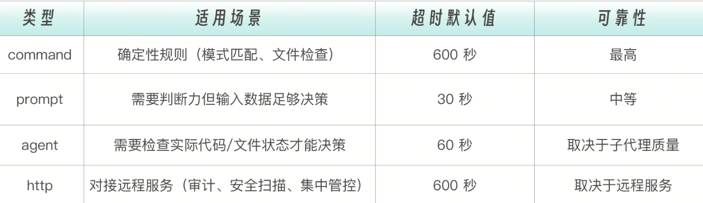

# Hooks 的本质——AI 时代的中间件
如果你有 Web 开发经验，你一定熟悉中间件（Middleware）的概念。
```
请求 → 中间件1 → 中间件2 → 中间件3 → 处理函数
                    ↓
              认证、日志、限流
```
中间件在请求到达最终处理函数之前插入检查和处理，实现横切关注点（Cross-cutting Concerns）。这些逻辑不属于任何一个业务功能，但又必须贯穿所有请求——认证要每个接口都检查，日志要每个操作都记录，限流要每个入口都控制。

Claude Code 的 Hooks 机制与此异曲同工，但它针对的不是 HTTP 请求，而是  AI Agent 的工具调用。

```
用户请求 → Claude 决策 → [PreToolUse Hook] → 工具执行 → [PostToolUse Hook] → 响应
                              ↓                            ↓
                         权限检查、拦截             格式化、验证、日志
```

Hooks 是 AI 助手的中间件——拦截、监控、增强每一次交互。这个类比不仅是形象上的相似。Web 中间件解决的核心问题是“业务代码不应该操心安全和日志”，Hooks 解决的核心问题也一样——Claude 不应该操心格式化和权限检查，它只管写好代码就行。安全防线、质量守卫、审计日志，全部由 Hooks 在“幕后”自动完成。


和 Commands 和 Skills 相比，Hooks 是三者中唯一能拦截和修改 Claude 行为的机制。


这三者构成了一个完整的控制谱系。

如果把 Claude 比作一个工程师，Commands 是你给他下达的任务指令，Skills 是他掌握的领域知识，而 Hooks 是公司的安全制度和质量规范——不管你做什么任务、用什么知识，这些制度都在背后默默运行。

# 17 种 Hook 事件——完整生命周期覆盖


17 个事件，乍看数量不少，但它们的设计逻辑非常清晰——按照“能否阻止”这一列来看，整个事件体系分为三大阵营。

控制点——能阻止的事件（PreToolUse、UserPromptSubmit、Stop、SubagentStop）：你可以通过它们改变 Claude 的执行路径——拦截危险操作、拒绝不合理的输入、强制 Claude 继续修复。它们是 Hooks 系统的肌肉。

接管点——替代默认行为的事件（PermissionRequest）：它不是简单地阻止，而是接管了原本由用户手动处理的权限弹窗——你的脚本可以自动批准或拒绝权限请求，替代人类的决策。它是 Hooks 系统的自动驾驶。

观察点——不能阻止的事件（SessionStart、PostToolUse、PostToolUseFailure、Notification、SubagentStart、PreCompact、SessionEnd）：你只能在这些时刻做记录、做反馈、做后处理，但不能改变已经发生的事情。它们是 Hooks 系统的眼睛。

这种不对称设计是有意为之的。工具执行前可以拦截，因为操作还没发生，拦截不会造成不一致状态。工具执行后不能拦截，因为操作已经完成——你不能“取消”一个已经写入磁盘的文件。但你可以观察它、记录它、反馈它。

# Hook 配置详解

Hooks 可以直接定义在子代理的 frontmatter 中，只在该子代理执行期间生效。这比在全局 settings.json 中配置更精准
怎么选择配置位置？一个简单的判断流程：

用户级（~/.claude/settings.json）：个人习惯。比如你喜欢的日志格式、桌面通知方式。这些配置只影响你自己，不需要和团队同步。
项目级（.claude/settings.json）：团队约定。比如代码格式化规则、敏感文件保护列表。这些配置应该提交到 git，让团队所有成员共享。

本地覆盖（.claude/settings.local.json）：当你需要在本地临时覆盖团队配置时使用，比如调试时关闭某个 Hook。
子代理 frontmatter：子代理专属的 Hook。比如  db-reader  的 SQL 注入检查——这个检查只和数据库操作相关，不应该影响其他场景。

一个典型的 Hook 配置长这样：

```
{
  "hooks": {
    "PreToolUse": [
      {
        "matcher": "Bash",
        "hooks": [
          {
            "type": "command",
            "command": "./hooks/block-dangerous.sh"
          }
        ]
      }
    ],
    "PostToolUse": [
      {
        "matcher": "Write",
        "hooks": [
          {
            "type": "command",
            "command": "prettier --write $CLAUDE_FILE_PATH"
          }
        ]
      }
    ]
  }
}
```

这个 JSON 结构有三层嵌套，初看可能有点绕。让我用树形图来拆解它的逻辑层次。

```
hooks                            ← 第一层：顶层容器
├── PreToolUse                   ← 第二层：事件类型（什么时候触发）
│   └── [第一组规则]
│       ├── matcher: "Bash"      ← 第三层：匹配器（针对哪个工具）
│       └── hooks: [...]         ← 第三层：Hook 列表（执行什么）
│           └── type: "command"
│           └── command: "..."
└── PostToolUse
    └── [第二组规则]
        ├── matcher: "Write"
        └── hooks: [...]
```
第一层选择“什么时候”——在工具执行前还是执行后？第二层选择“针对谁”——是所有工具还是特定工具？第三层选择“做什么”——执行脚本、调用 LLM、还是启动子代理？三层决策，层层收窄，最终精准地把正确的检查逻辑应用到正确的时机和工具上。

Matcher 匹配用于指定 Hook 应用于哪些工具。它支持四种匹配模式：
```
// 精确匹配单个工具
"matcher": "Write"

// 匹配多个工具（用竖线分隔）
"matcher": "Edit|Write|MultiEdit"

// 匹配所有工具
"matcher": "*"

// 空匹配（用于生命周期事件）
"matcher": ""
```
精确匹配是最常用的模式——你通常知道你要保护的是哪个工具。竖线分隔适合“同类工具组”的场景，比如  Edit|Write|MultiEdit  都涉及文件修改，用同一个保护策略。通配符  *  要谨慎使用，它会匹配所有工具，适合审计日志这类无差别记录的场景
# 四种 Hook 执行类型
当一个 Hook 被触发后，其具体执行方式有四种，前三种能力和代价逐级递增，第四种面向远程服务场景。

## Command 类型——执行 Shell 脚本
这是最常用、最可靠的类型。command可以是任何 shell 命令或脚本路径。timeout 指定超时时间（毫秒），默认 60 秒。Command 类型的优势在于确定性——同样的输入永远产生同样的输出，不存在 LLM 的随机性。一个正则表达式匹配  rm -rf /，要么匹配到，要么没匹配到，没有“可能”“大概”的中间地带。
```
{
  "type": "command",
  "command": "./hooks/check-security.sh",
  "timeout": 30000
}
```
## Prompt 类型——LLM 评估
规则无法用确定性脚本表达时，就需要 LLM 的判断力。Prompt 类型会用一个小型 LLM（通常是 Haiku）来评估当前情况。比如“这段代码是否有安全隐患”——这种判断需要理解代码语义，不是简单的模式匹配能解决的。但 Prompt 类型只能“看一眼就判断”，它无法主动去读取更多文件来辅助决策。
```
{
  "type": "prompt",
  "prompt": "Evaluate if this task was completed correctly. Check for any errors or incomplete work."
}
```

## Agent 类型——子代理评估

这是最强大也最“重”的评估方式。Agent Hook 会启动一个子代理，这个子代理可以使用 Read、Grep、Glob 等工具来验证条件——不只是“看一眼就判断”，而是可以“翻代码确认”。比如验证“所有公共 API 都有文档注释”，需要子代理实际遍历代码文件才能做出准确判断。
```
{
  "type": "agent",
  "prompt": "Verify that all unit tests pass. Run the test suite and check the results. $ARGUMENTS",
  "timeout": 120
}
```
还有一种  HTTP 类型——它不在本地执行逻辑，而是把事件数据以 POST 请求发送到远程 HTTP 端点，由远程服务返回决策结果。适合团队共享审计服务、集中式安全扫描等场景。
一句话概括：能用 command 的不用 prompt，能用 prompt 的不用 agent，需要对接远程服务时用 http。确定性规则永远比 LLM 判断更可靠，LLM 判断比子代理执行更快。



# PreToolUse：工具执行前的守门

PreToolUse 是最强大的 Hook 事件，因为它能阻止工具执行。它就像机场的安检门——在你登机（工具执行）之前，先过一道检查。PreToolUse Hook 可以做三件事：允许（allow，放行），拒绝（deny，拦截），修改（updatedInput，改写输入参数后再执行）。
第三种能力特别有趣——你不仅能“放行或拦截”，还能“偷偷改参数”。比如用户要执行  rm -rf /tmp/test，你可以把它改成  rm -rf /tmp/test --dry-run，先看看会删什么再说。

要写出有效的 PreToolUse Hook，你需要理解它的通信协议——脚本从 stdin 读入什么数据、向 Claude 返回什么决策
每个 Hook 脚本通过 stdin 接收一个 JSON 对象，包含做出判断所需的全部上下文。

这些字段告诉你：谁在执行（session_id），在哪里执行（cwd），什么权限模式（permission_mode），要执行什么工具（tool_name），什么参数（tool_input）。有了这些信息，你的脚本就能精准判断这个操作是否安全。

Hook 脚本通过退出码和 stdout JSON 告诉 Claude 下一步做什么。

最简单的方式是用退出码——exit 0  表示放行，exit 2  表示阻止，其他非零退出码表示脚本出错但不阻止。这个区分很重要：脚本出错不应该阻止正常工作流——你的安全检查脚本因为  jq  没安装而报错退出码 1，这不应该阻止 Claude 执行一个完全安全的命令。只有退出码 2 才表示“我检查过了，这个操作确实危险”。

需要更精细的控制时，通过 stdout 输出 JSON 决策。官方推荐的  hookSpecificOutput  格式支持四种响应方式。

## 允许执行——检查通过，放行（exit 0  就等于默认允许，输出 JSON 让意图更明确）。
```
{
  "hookSpecificOutput": {
    "hookEventName": "PreToolUse",
    "permissionDecision": "allow"
  }
}
```

## 拒绝执行——发现危险操作，直接拦截。permissionDecisionReason  会反馈给 Claude。
```
{
  "hookSpecificOutput": {
    "hookEventName": "PreToolUse",
    "permissionDecision": "deny",
    "permissionDecisionReason": "This command is not allowed"
  }
}
```
## 交给用户确认——操作不是明确的“安全”或“危险”，而是“需要人类判断”。
```
{
  "hookSpecificOutput": {
    "hookEventName": "PreToolUse",
    "permissionDecision": "ask",
    "permissionDecisionReason": "This command modifies production data"
  }
}
```
## 修改输入后执行——不拦截操作，而是改写参数后放行：

```
{
  "hookSpecificOutput": {
    "hookEventName": "PreToolUse",
    "permissionDecision": "allow",
    "updatedInput": {
      "command": "rm -rf /tmp/test --dry-run"
    }
  }
}
```

这四种响应方式构成了一个连续光谱：allow → ask → deny，外加一个“暗中修正”的 updatedInput。实际设计中，优先选择最温和的响应——能 allow 的不 ask，能 ask 的不 deny。

# 阻止危险命令

每个工程团队都有一些“绝对不能执行”的命令。rm -rf /  会删除整个文件系统，git push --force origin main  会覆盖远程主分支的历史，DROP DATABASE  会销毁整个数据库。这些命令的共同特点是：一旦执行就无法挽回。

人在清醒状态下当然不会执行它们，但 Claude 作为 AI 有时会过于“积极”——如果用户说”清理一下项目”，Claude 可能会把  rm -rf  理解得过于字面。

下面这个脚本用模式匹配来拦截这些灾难性命令：

```
#!/bin/bash
# block-dangerous.sh
# 阻止危险的 Bash 命令

set -e

# 读取 stdin 输入
INPUT=$(cat)

# 提取命令
COMMAND=$(echo "$INPUT" | jq -r '.tool_input.command // ""')

# 调试输出（到 stderr，不影响 JSON 响应）
echo "DEBUG: Checking command: $COMMAND" >&2

# 危险命令模式
DANGEROUS_PATTERNS=(
    "rm -rf /"
    "rm -rf ~"
    "rm -rf \$HOME"
    "rm -rf /*"
    "> /dev/sd"
    "mkfs."
    "dd if="
    ":(){:|:&};:"               # Fork bomb
    "chmod -R 777 /"
    "git push --force origin main"
    "git push --force origin master"
    "git reset --hard origin"
    "DROP DATABASE"
    "DROP TABLE"
    "TRUNCATE"
    "curl.*| sh"                # 危险的管道执行
    "curl.*| bash"
    "wget.*| sh"
    "wget.*| bash"
)

# 检查每个危险模式
for pattern in "${DANGEROUS_PATTERNS[@]}"; do
    if [[ "$COMMAND" == *"$pattern"* ]]; then
        echo "BLOCKED: Command matches dangerous pattern: $pattern" >&2
        cat <<EOF
{
    "hookSpecificOutput": {
        "hookEventName": "PreToolUse",
        "permissionDecision": "deny",
        "permissionDecisionReason": "Blocked dangerous command pattern: $pattern. This command could cause irreversible damage."
    }
}
EOF
        exit 2
    fi
done

# 命令安全，允许执行
echo '{}'
exit 0
```

INPUT=$(cat)  从 stdin 读取 Claude 传入的 JSON 数据。jq -r '.tool_input.command'  从中提取要执行的命令字符串。// ""  是 jq 的空值保护——如果字段不存在，返回空字符串而不是报错。


echo "DEBUG: ..." >&2  这一行值得特别说明：调试信息必须输出到 stderr（文件描述符 2），而不是 stdout。因为 stdout 被 Claude 用来读取 JSON 决策——如果你往 stdout 打了一行调试文本，Claude 会因为 JSON 解析失败而报错。这是 Hook 脚本开发中最常见的坑。

DANGEROUS_PATTERNS  数组定义了所有需要拦截的命令模式。

注意最后的curl.*| sh  和  wget.*| bash。这是一种常见的攻击手法：从网络下载脚本并直接执行，绕过任何安全审查。在 AI 辅助编程场景下，如果 Claude 从某个“教程”学到了这种做法，Hook 会自动拦截。

另外，exit 2  是“有意阻止”，exit 0  是“检查通过、放行”。整个脚本的逻辑就是一个黑名单匹配，命中任何一个危险模式就拦截，否则放行。

```
{
  "hooks": {
    "PreToolUse": [
      {
        "matcher": "Bash",
        "hooks": [
          {
            "type": "command",
            "command": "./hooks/block-dangerous.sh"
          }
        ]
      }
    ]
  }
}
```
我们在 Claude Code 里实际触发一次拦截：
```
# 1. 确认 jq 可用
which jq

# 2. 进入项目目录（已配好 .claude/settings.json 和 hooks 脚本）
cd 06-Hooks/projects/01-safety-hooks

# 3. 启动 Claude Code
claude
```
进入会话后，故意让 Claude 执行一个危险命令：
请帮我执行 rm -rf /tmp/test，清理一下临时文件

Claude 会尝试调用 Bash 工具执行这条命令。此时 PreToolUse Hook 自动触发，你会在终端看到类似这样的输出：
```
⛔ Hook blocked tool call: Blocked dangerous command pattern: rm -rf /.
   This command could cause irreversible damage.
```

Claude 收到拦截信息后，会自动调整策略——它不会傻傻地重试被拦截的命令，而是换一种更安全的方式来完成你的请求。整个过程你什么都不用做，防线自动运行

你也可以用管道手动验证脚本逻辑，不需要启动 Claude：

