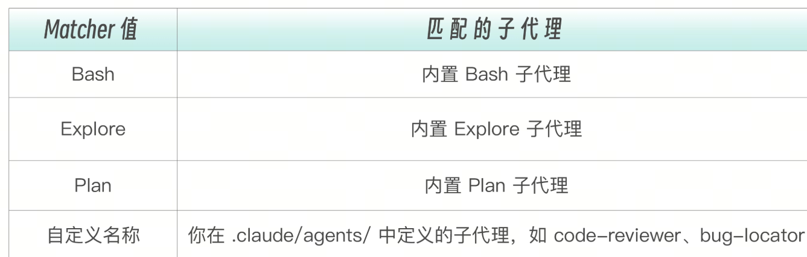
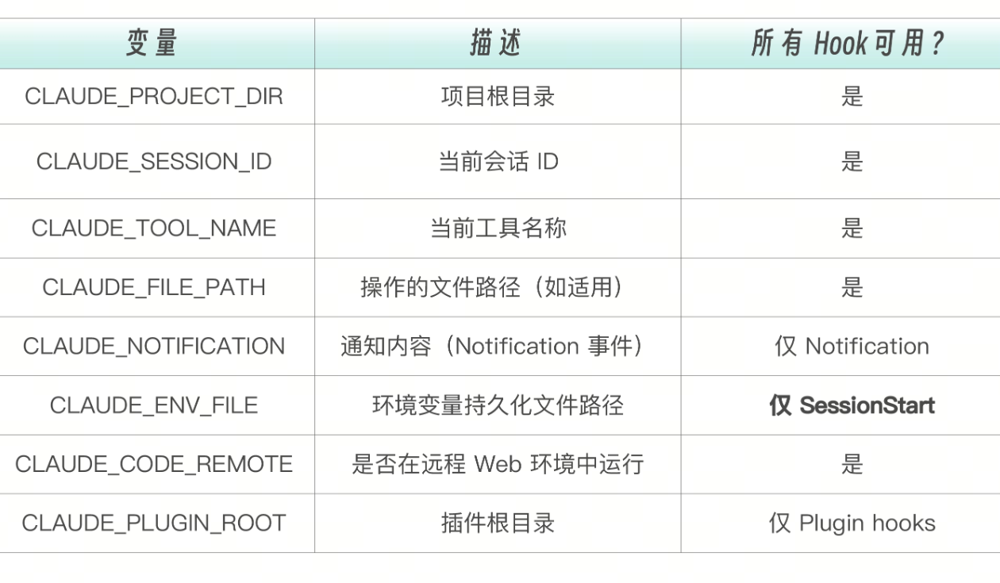

Hooks 的基础概念——中间件本质、事件体系、配置结构，以及最常用的 PreToolUse 和 PostToolUse 两大实战。PreToolUse 在工具执行前做“入口安检”，PostToolUse 在工具执行后做“过程质检”。

但还有一个关键环节我们没有覆盖：Claude 做完整个任务后，谁来验收？

这就好比工厂的流水线：安检门（PreToolUse）检查原料是否合格，质检站（PostToolUse）检查每道工序的产出。但产品最终出厂前，还需要一道终检——确认成品整体质量达标。这道终检，就是 Stop Hook。

# Stop Hook——任务完成时的质量门控

Stop Hook 在 Claude 完成响应后运行。如果说 PreToolUse 是入口安检，PostToolUse 是过程质检，那么 Stop Hook 就是出厂验收——在 Claude 宣布“我做完了”之后，再检查一遍交付物的质量。

Stop Hook 的核心能力是让 Claude 继续工作，Stop Hook 和其他 Hook 的最大区别。这个能力来源于它的  continue  字段：

{
  "decision": "block",
  "reason": "Tests are failing, please fix them",
  "continue": true
}


continue: true  意味着“不要停，继续工作”。这创造了一个自动循环：Claude 认为完成了 → Stop Hook 检查 → 发现测试失败 → 把失败信息反馈给 Claude → Claude 继续修复 → 再次完成 → 再次检查……直到所有检查通过，Claude 才被允许真正停下来。

这种机制把质量保证从“事后检查“变成了”交付前置条件”，这样能让 Claude 不是做完了再检查，而是检查通过了才算做完。

## 实战：自动测试门控

这是 Stop Hook 最经典的应用——Claude 完成任务后自动运行测试，测试不通过就不让停。

为什么要在 Stop 时运行测试而不是在每次文件修改后？因为一个功能的实现通常涉及多个文件的修改。中间状态的测试必然会失败——你改了接口但还没改实现，测试当然过不了。只有在 Claude 认为“全部完成”的时刻，再运行测试才有意义。

```
#!/bin/bash
# run-tests.sh
# 在 Claude 完成时自动运行测试

set -e

echo "DEBUG: Running tests before stopping..." >&2

# 确定项目目录
if [ -n "$CLAUDE_PROJECT_DIR" ]; then
    cd "$CLAUDE_PROJECT_DIR"
fi

# 检测项目类型并运行相应的测试
RUN_TESTS=false
TEST_RESULT=""
TEST_PASSED=true

# Node.js 项目
if [ -f "package.json" ]; then
    RUN_TESTS=true
    echo "DEBUG: Detected Node.js project" >&2

    if grep -q '"test"' package.json; then
        TEST_RESULT=$(npm test 2>&1) || TEST_PASSED=false
    else
        TEST_RESULT="No test script found in package.json"
        TEST_PASSED=true  # 没有测试不算失败
    fi

# Python 项目
elif [ -f "pytest.ini" ] || [ -f "setup.py" ] || [ -f "pyproject.toml" ]; then
    RUN_TESTS=true
    echo "DEBUG: Detected Python project" >&2

    if command -v pytest &> /dev/null; then
        TEST_RESULT=$(pytest 2>&1) || TEST_PASSED=false
    fi

# Go 项目
elif [ -f "go.mod" ]; then
    RUN_TESTS=true
    TEST_RESULT=$(go test ./... 2>&1) || TEST_PASSED=false

# Rust 项目
elif [ -f "Cargo.toml" ]; then
    RUN_TESTS=true
    TEST_RESULT=$(cargo test 2>&1) || TEST_PASSED=false
fi

# 如果没有检测到测试框架
if [ "$RUN_TESTS" = false ]; then
    echo '{}'
    exit 0
fi

# 转义 JSON 特殊字符
TEST_RESULT_ESCAPED=$(echo "$TEST_RESULT" | head -50 | jq -Rs '.')

if [ "$TEST_PASSED" = true ]; then
    # 测试通过，允许停止
    echo '{"decision": "approve", "reason": "All tests passed."}'
else
    # 测试失败，让 Claude 继续修复
    cat <<EOF
{
    "decision": "block",
    "reason": "Tests are failing. Please fix the issues before stopping.",
    "continue": true,
    "systemMessage": $TEST_RESULT_ESCAPED
}
EOF
fi

exit 0
```

项目类型检测：脚本通过检查特征文件来判断项目类型—— package.json  意味着 Node.js，pyproject.toml  意味着 Python，go.mod  意味着 Go，Cargo.toml  意味着 Rust。这种“约定优于配置”的检测方式让脚本能在不同类型的项目中通用，无需额外配置。

容错处理：grep -q '"test"' package.json  先检查 package.json 中是否有 test 脚本。如果项目根本没有配置测试命令，脚本不会报错，而是报告 “No test script found” 并放行。没有测试不等于测试失败——你不能因为项目还没写测试就阻止 Claude 完成工作。

结果截断：head -50  只取测试输出的前 50 行。测试失败的输出可能非常长（几百行甚至几千行），但 Claude 只需要看到关键的错误信息就能定位问题。传入太多信息反而会稀释重点

关键分支：测试通过时，输出  additionalContext  告诉 “Claude All tests passed”，脚本正常退出；测试失败时，输出  "decision": "block"  加  "continue": true，强制 Claude 继续工作。Claude 会收到测试失败的详细信息，然后自动尝试修复。

```
{
  "hooks": {
    "Stop": [
      {
        "hooks": [
          {
            "type": "command",
            "command": "./hooks/run-tests.sh"
          }
        ]
      }
    ]
  }
}
```
注意 Stop 事件没有  matcher  字段——因为 Stop 是生命周期事件，不针对特定工具。

动手试一下——进入质量钩子项目，让 Claude 写一段会导致测试失败的代码，观察 Stop Hook 的自动门控行为：
进入会话后，给 Claude 一个会产生测试失败的任务：
帮我创建一个 Node.js 项目，写一个 add 函数和对应的测试，但故意让测试失败

当 Claude 写完代码准备停下来时，Stop Hook 自动触发  run-tests.sh。如果测试失败，你会看到：
● Stop hook returned blocking error Tests are failing. Please fix the issues before stopping. ⎿ [测试失败的详细输出...]
● Claude 继续修复代码...

Claude 收到失败信息后会自动修复，直到测试通过才真正停下来。如果你看到的是  hook error  而不是  blocking error，请检查  jq  是否可用

这个 Hook 实现了一个强大的保障——Claude 不会在测试失败的情况下停止工作。它会不断尝试修复，直到所有测试通过。这在 Claude 执行复杂的重构任务时特别有价值——重构常常会破坏现有测试，而这个 Hook 确保 Claude 会把测试修好才停手。

# 用 Prompt 类型实现更灵活的 Stop Hook

Shell 脚本适合检查客观事实——测试通不通过、文件存不存在。但有时候你需要检查更“主观”的东西，包括代码风格是否合理？功能实现是否完整？有没有遗漏边界情况？这些判断需要“理解力”，不是模式匹配能解决的。

这时可以用 Prompt 类型的 Stop Hook，让一个小型 LLM（通常是 Haiku）担任代码审查员：

```
{
  "hooks": {
    "Stop": [
      {
        "hooks": [
          {
            "type": "prompt",
            "prompt": "Review the changes made in this session. Check that: 1) All requested features are implemented 2) No obvious bugs or security issues 3) Code follows project conventions. If any issues found, respond with continue: true and explain what needs to be fixed."
          }
        ]
      }
    ]
  }
}
```
这相当于在 Claude 完成工作后，让另一个 AI 做 code review。两个 AI 的视角不同——主 Claude 相当于作者，Prompt Hook 的 Haiku 担任审查者。审查者往往能发现作者忽略的问题，因为它没有“我刚写的代码当然是对的”这种认知偏见。

当然，Prompt 类型的可靠性低于 Command 类型。LLM 可能漏检，也可能误报。但作为测试门控（Command 类型）之外的第二层防线，它能覆盖一些脚本无法检查的维度。

# 防止 Stop Hook 死循环：stop_hook_active
Stop Hook 的  continue: true  很强大，但也有风险——如果 Claude 一直修不好，就会进入死循环：测试失败 → Claude 修复 → 测试还是失败 → Claude 再修 → 还是失败……如此无限循环。

所幸官方提供了一个安全字段  stop_hook_active：当 Claude 因为 Stop Hook 而继续工作时，下一次 Stop 事件的输入中  stop_hook_active  会被设为  true。你的脚本应该检查这个字段来避免死循环：

```
#!/bin/bash
INPUT=$(cat)

# 检查是否已经因为 Stop Hook 继续过了
if [ "$(echo "$INPUT" | jq -r '.stop_hook_active')" = "true" ]; then
    # 已经重试过一次了，这次让 Claude 停下来
    exit 0
fi

# 正常的测试逻辑
npm test 2>&1
if [ $? -ne 0 ]; then
    echo '{"decision": "block", "reason": "Tests still failing, please fix."}'
else
    exit 0
fi
```
这个模式允许 Claude 重试一次——第一次 Stop 时检查测试，如果失败就让 Claude 继续修复；第二次 Stop 时，stop_hook_active  为  true，无论测试是否通过都让 Claude 停下来。

# 子代理事件——SubagentStart 与 SubagentStop
## SubagentStart：为子代理注入上下文

SubagentStart  在子代理被启动时触发。它的 matcher 匹配的是子代理类型名，而不是工具名。


SubagentStart 接收的输入数据包含子代理的标识信息。
```
{
  "session_id": "abc123",
  "cwd": "/project/root",
  "hook_event_name": "SubagentStart",
  "agent_id": "agent-def456",
  "agent_type": "code-reviewer"
}
```
SubagentStart 不能阻止子代理启动（这是设计决策——启动子代理是主会话的明确意图，不应该被 Hook 否决），但可以通过  additionalContext  向子代理注入上下文信息。

```
{
  "hookSpecificOutput": {
    "hookEventName": "SubagentStart",
    "additionalContext": "当前分支是 feature/payment-refactor，请特别关注支付相关的代码变更"
  }
}
```

这个能力的价值在于自动化上下文注入。比如你有一个  code-reviewer  子代理，每次启动时都需要知道团队的编码规范。

如果没有 SubagentStart Hook，你得在每次调用子代理时手动提醒它“请遵循 camelCase 命名规范“。有了 Hook，这个提醒将自动发生。

```
{
  "hooks": {
    "SubagentStart": [
      {
        "matcher": "code-reviewer",
        "hooks": [
          {
            "type": "command",
            "command": "echo '{\"hookSpecificOutput\":{\"hookEventName\":\"SubagentStart\",\"additionalContext\":\"Team coding standards: use camelCase, max line length 100, always add JSDoc for public APIs\"}}'"
          }
        ]
      }
    ]
  }
}
```
这样，每次  code-reviewer  子代理启动时，都会自动收到团队编码规范——不需要在每次调用时手动提醒，不需要把规范写到子代理的 prompt 里（那样会占用子代理的上下文空间）。

## SubagentStop：验证子代理的工作成果

SubagentStop  在子代理完成工作后触发。它的决策控制和  Stop  事件完全一致——可以阻止子代理停止，强制它继续工作。

SubagentStop 的输入数据有一个独特的字段，agent_transcript_path。
```
{
  "session_id": "abc123",
  "cwd": "/project/root",
  "hook_event_name": "SubagentStop",
  "stop_hook_active": false,
  "agent_id": "agent-def456",
  "agent_type": "code-reviewer",
  "transcript_path": "~/.claude/projects/.../main-session.jsonl",
  "agent_transcript_path": "~/.claude/projects/.../subagents/agent-def456.jsonl"
}
```
注意两个 transcript path 的区别，transcript_path  是主会话的对话记录，agent_transcript_path  是子代理自己的对话记录。这意味着你的 Hook 脚本可以读取子代理的完整对话历史来判断质量——不是只看最终结果，而是能看到子代理是怎么得出结论的。

SubagentStop 的决策控制和 Stop 事件一样，可以用  decision: "block"  阻止子代理完成，强制它继续工作。

```
{
  "decision": "block",
  "reason": "Code review is incomplete: you found 3 issues but only provided fixes for 2. Please complete the review."
}
```

## 用 SubagentStop 验证代码审查质量

下面这个脚本验证  code-reviewer  子代理的审查是否完整——如果它发现了问题但没有给出修复建议，就强制它继续工作。

这个需求背后的逻辑是：一个好的代码审查不仅要发现问题，还要提供解决方案。只说“这里有 bug，而不说建议如何修复的审查是不完整的。Hook 可以把这个“完整性要求”固化为自动检查：

```
#!/bin/bash
# verify-review-quality.sh
# 验证 code-reviewer 子代理的审查是否完整

INPUT=$(cat)
AGENT_TYPE=$(echo "$INPUT" | jq -r '.agent_type')
STOP_HOOK_ACTIVE=$(echo "$INPUT" | jq -r '.stop_hook_active')
TRANSCRIPT=$(echo "$INPUT" | jq -r '.agent_transcript_path')

# 只检查 code-reviewer
if [ "$AGENT_TYPE" != "code-reviewer" ]; then
    exit 0
fi

# 防止死循环
if [ "$STOP_HOOK_ACTIVE" = "true" ]; then
    exit 0
fi

# 读取子代理的输出，检查是否包含必要的审查要素
if [ -f "$TRANSCRIPT" ]; then
    HAS_ISSUES=$(grep -c "issue\|问题\|bug\|warning" "$TRANSCRIPT" || true)
    HAS_SUGGESTIONS=$(grep -c "suggest\|建议\|recommend" "$TRANSCRIPT" || true)

    if [ "$HAS_ISSUES" -gt 0 ] && [ "$HAS_SUGGESTIONS" -eq 0 ]; then
        cat <<EOF
{
    "decision": "block",
    "reason": "You found issues but didn't provide suggestions. Please add actionable suggestions for each issue."
}
EOF
        exit 0
    fi
fi

exit 0
```
这个脚本的逻辑分为三层防护。

第一层：只检查  code-reviewer  类型的子代理，其他子代理直接放行。第二层：检查  stop_hook_active，防止死循环。第三层：读取子代理的对话记录，用关键词匹配检查是否包含问题和建议两类内容。如果只有问题没有建议，就阻止子代理完成。

```
{
  "hooks": {
    "SubagentStop": [
      {
        "matcher": "code-reviewer",
        "hooks": [
          {
            "type": "command",
            "command": "./hooks/verify-review-quality.sh"
          }
        ]
      }
    ]
  }
}
```
当然，用关键词匹配来判断审查质量是比较粗糙的。对于更精细的质量验证，可以用 Prompt 或 Agent 类型的 Hook，让 LLM 来评估子代理的输出：

```
{
  "hooks": {
    "SubagentStop": [
      {
        "matcher": "code-reviewer",
        "hooks": [
          {
            "type": "prompt",
            "prompt": "Evaluate this code review result: $ARGUMENTS. Check that: 1) All issues have severity levels 2) Each issue has a concrete suggestion 3) No false positives. Respond with {\"ok\": true} or {\"ok\": false, \"reason\": \"what's missing\"}."
          }
        ]
      }
    ]
  }
}
```

这让 LLM 来理解审查报告的语义，而不仅仅是匹配关键词。它能判断这个建议是否具体可操作，这是脚本无法做到的。

## 实战项目——完整的 Hook 系统

### 项目一：安全钩子系统
目标：保护敏感资源，防止危险操作，记录审计日志。

```
.claude/
├── settings.json
└── hooks/
    ├── block-dangerous.sh    # 阻止危险命令
    ├── protect-files.sh      # 保护敏感文件
    └── audit-log.sh          # 记录操作日志
```
.claude/settings.json：
```
{
  "hooks": {
    "PreToolUse": [
      {
        "matcher": "Bash",
        "hooks": [
          {
            "type": "command",
            "command": "./hooks/block-dangerous.sh"
          }
        ]
      },
      {
        "matcher": "Write",
        "hooks": [
          {
            "type": "command",
            "command": "./hooks/protect-files.sh"
          }
        ]
      },
      {
        "matcher": "Edit",
        "hooks": [
          {
            "type": "command",
            "command": "./hooks/protect-files.sh"
          }
        ]
      }
    ],
    "PostToolUse": [
      {
        "matcher": "*",
        "hooks": [
          {
            "type": "command",
            "command": "./hooks/audit-log.sh"
          }
        ]
      }
    ]
  }
}
```
这个配置创建了一个纵深防御体系——三道防线各司其职，形成层层递进的安全屏障。

第一道防线：命令拦截（PreToolUse → Bash）。在任何 Bash 命令执行前，检查它是否匹配危险命令模式。这是最外层的防护，拦截的是明确的“灾难性操作”——rm -rf /、git push --force origin main、DROP DATABASE  等。

第二道防线：文件保护（PreToolUse → Write|Edit）。在任何文件写入或编辑操作前，检查目标文件是否是敏感文件。这是第二层防护，拦截的是看似无害但后果严重的操作——Claude 可能只是想"帮你整理配置文件"，但  .env  绝对不能动。

第三道防线：审计日志（PostToolUse → *）。所有操作完成后，无差别记录到审计日志。这不是防护，而是事后追溯的能力。即使前两道防线有漏网之鱼，审计日志也能帮你在事后查明发生了什么。

三道防线的强度递减（拦截 → 拦截 → 记录），但覆盖面递增（Bash → Write|Edit → 所有工具）。这就是经典的纵深防御策略——不把安全寄托在任何单一防线上。

### 项目二：质量钩子系统

目标：自动格式化代码，检查 lint 错误，确保测试通过。
项目结构：
```
.claude/
├── settings.json
└── hooks/
    ├── auto-format.sh        # 自动格式化
    ├── lint-check.sh         # Lint 检查
    └── run-tests.sh          # 运行测试
```
.claude/settings.json：
```
{
  "hooks": {
    "PostToolUse": [
      {
        "matcher": "Write",
        "hooks": [
          {
            "type": "command",
            "command": "./hooks/auto-format.sh"
          },
          {
            "type": "command",
            "command": "./hooks/lint-check.sh"
          }
        ]
      },
      {
        "matcher": "Edit",
        "hooks": [
          {
            "type": "command",
            "command": "./hooks/auto-format.sh"
          },
          {
            "type": "command",
            "command": "./hooks/lint-check.sh"
          }
        ]
      }
    ],
    "Stop": [
      {
        "hooks": [
          {
            "type": "command",
            "command": "./hooks/run-tests.sh"
          }
        ]
      }
    ]
  }
}
```

这个配置创建了一个两阶段质量保证流水线。

第一阶段：逐文件质量保证（PostToolUse → Write|Edit）。每次 Claude 写入或编辑文件后，立即执行两个操作——先格式化（确保代码风格一致），再 Lint 检查（确保没有语法或逻辑问题）。注意两个 Hook 在同一个  hooks  数组中，它们会按顺序执行——先格式化再 Lint，顺序不能反（否则 Lint 检查的是格式化之前的代码）。

第二阶段：全局质量门控（Stop）。Claude 完成所有工作后，运行完整的测试套件。如果测试失败，Claude 会收到失败信息并继续修复，直到所有测试通过才被允许停下来。

两个阶段的分工很明确——第一阶段是"边做边查"，保证每个文件的局部质量；第二阶段是做完再验，保证整体功能的正确性。这正是 eesel.ai 博客所描述的效果：Hooks 确定性地运行格式化器和 linter，确保代码符合风格指南；它们还能自动执行测试套件以捕获回归问题。

# 高级模式与最佳实践
可以为同一事件配置多个 Hook，它们按顺序执行：
```
{
  "hooks": {
    "PostToolUse": [
      {
        "matcher": "Write",
        "hooks": [
          { "type": "command", "command": "./hooks/format.sh" },
          { "type": "command", "command": "./hooks/lint.sh" },
          { "type": "command", "command": "./hooks/log.sh" }
        ]
      }
    ]
  }
}
```
注意执行顺序和中断语义。三个 Hook 按数组顺序依次执行——先格式化，再 Lint，最后记日志。如果任何一个 Hook 返回阻止决策（比如 lint.sh 返回  exit 2），后续的 Hook（log.sh）不会执行。所以你应该把“不能失败”的 Hook（如日志记录）放在最前面，或者确保它们不会互相干扰。

## 环境变量
Hooks 可以访问多个环境变量，让你的脚本更灵活。  


其中  CLAUDE_ENV_FILE  是一个特别有用的变量。SessionStart Hook 可以向这个文件写入  export  语句，这些环境变量会在后续所有 Bash 命令中生效，相当于在会话开始时，就设置了全局环境。
```
#!/bin/bash
# session-setup.sh - SessionStart hook
if [ -n "$CLAUDE_ENV_FILE" ]; then
    echo 'export NODE_ENV=development' >> "$CLAUDE_ENV_FILE"
    echo 'export DEBUG_LOG=true' >> "$CLAUDE_ENV_FILE"
fi
exit 0
```
利用  CLAUDE_FILE_PATH  可以让 Hook 只在特定目录下生效——比如只对  src/  目录下的文件运行 Lint。
