# Agentic Loop——工具驱动的智能循环
如果 Claude 没有工具，它只能做一件事：输出文本。
```
用户: 帮我修复 src/api.js 中的 bug
Claude:（思考）这应该是一个 JavaScript 文件...
       （继续思考）用户想让我修复 bug...
       （输出文本）"您好，请提供 src/api.js 的内容，我来帮您分析问题。"
```
它能思考、能分析、能给建议，但不能行动。有了工具，情况完全不同，我们和 Claude 的交流可能是这样的。
```
用户: 帮我修复 src/api.js 中的 bug
Claude:（思考）让我先读取这个文件
       （调用 Read 工具）→ 获取文件内容
       （思考）我发现了问题，第 42 行的 null 检查缺失
       （调用 Edit 工具）→ 修改文件
       （思考）让我运行测试确认修复成功
       （调用 Bash 工具）→ 执行 npm test
       （输出）"我已经修复了问题，测试全部通过。"
```
## 工具让 Claude 从顾问变成了执行者。
Claude Code 的工作循环——Agentic Loop 可以分为三个阶段，根据任务需要灵活切换。
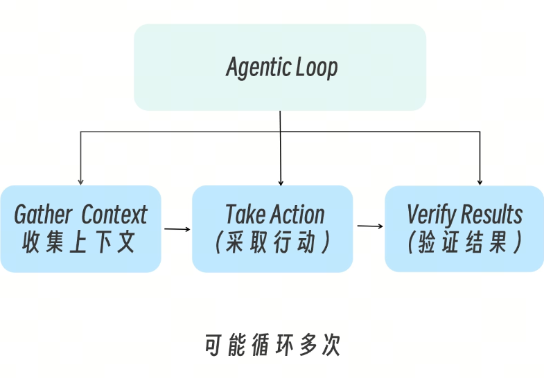
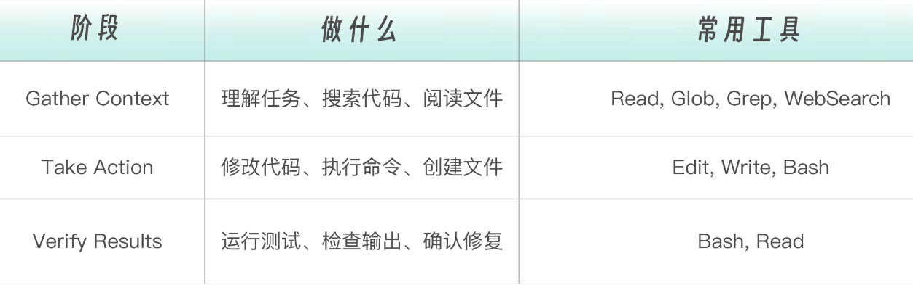

简单任务可能只需要一轮，复杂任务可能循环几十次。每一次工具调用的返回结果，都会反馈给 Claude，影响下一步的决策。

Claude（模型）负责推理，Tools 负责行动。而 Claude Code 扮演的角色是  Agentic Harness，它把模型和工具连接起来，提供执行环境、上下文管理、权限控制等基础设施。

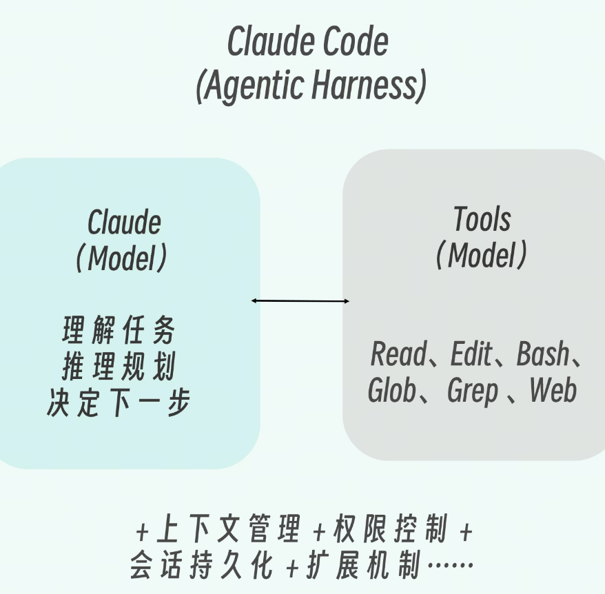

理解这个架构很重要，因为你配置的所有扩展（Skills、Hooks、MCP）都是在这个 Harness 上工作的，而不是直接修改 Claude 模型本身。

## Claude Code 内置工具完整清单
早期，Claude Code 只是内置了十几个工具（目前逐渐增多，可能已经有 20 多个了，

文件操作类，Claude 与代码交互的最基本方式。Read 是只读的，不需要额外授权；Edit、Write、MultiEdit 会修改文件系统，因此需要用户确认。

搜索类，Claude 的“眼睛”——在动手之前先看清楚代码库的全貌。Glob 按文件名模式定位文件，Grep 按内容搜索定位代码行，两者都是只读操作，无需授权。

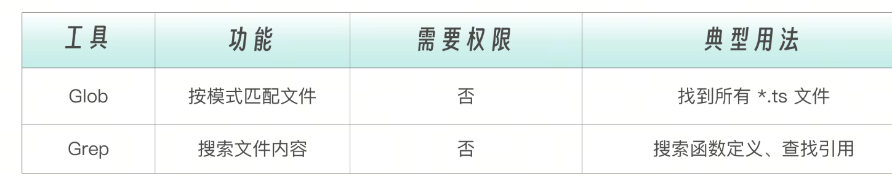

执行类，整个工具集里能力最强也最危险的一个。Bash 可以执行操作系统能做的一切。正因如此，它始终需要用户授权。


网络类，让 Claude 突破本地文件系统的边界，访问互联网上的信息。查文档、搜报错、获取 API 响应都靠这两个工具。

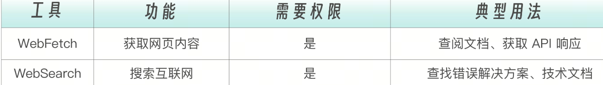

编排类，这组工具不直接操作代码，而是管理 Agent 的工作流程：把复杂任务委派给子代理、在需要时向用户提问、用任务清单跟踪多步骤进度。
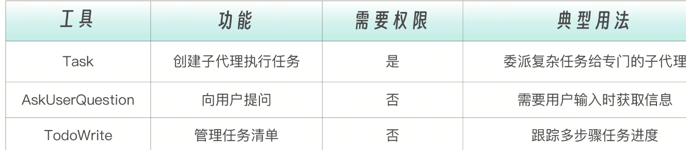

辅助类，支撑性工具，用于管理后台任务和系统状态切换。日常使用中不常直接接触，但在自动化场景下不可或缺。

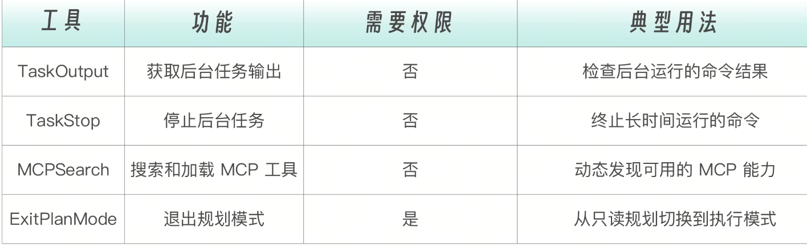

## 工具的风险等级
为什么要这样分类？因为不同类别的工具有不同的风险等级：
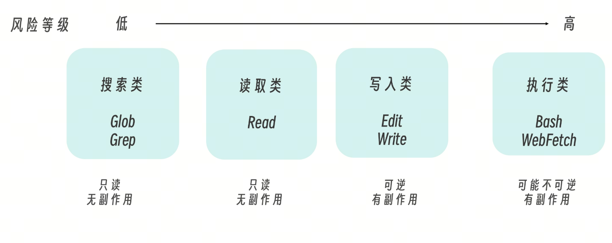

理解这个分类，你就能：
为子代理配置最小权限（只读任务只给 Read/Grep/Glob）
设计防护机制（高风险工具加 Hook 检查）
理解权限提示的逻辑（低风险工具不弹窗，高风险工具要确认）
## 从原语到涌现——工具设计哲学
答案指向同一个工程哲学：Claude Code 的工具集是一组精心选择的原语（primitives），而不是一组特化的高级能力。
## 软件工程的五个原子操作
一个开发者每天做的所有事情，无论多么复杂，都可以分解为五种原子操作。
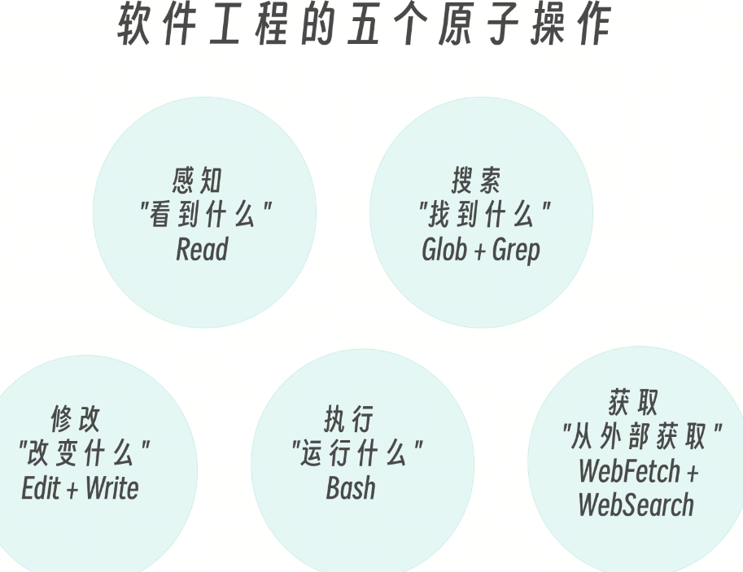
任何复杂任务，无论是“重构整个模块”还是“搭建 CI/CD 流水线”，都是这五种操作的不同排列组合。

这就是 Claude Code 工具设计的核心洞察：不需要为每种任务造一个专用工具，只需要把原子操作做好。

类比：为什么编程语言只需要几条指令

这个设计哲学并不新鲜，我们回顾一些优秀的产品，就能发现它们的思路都是这样。
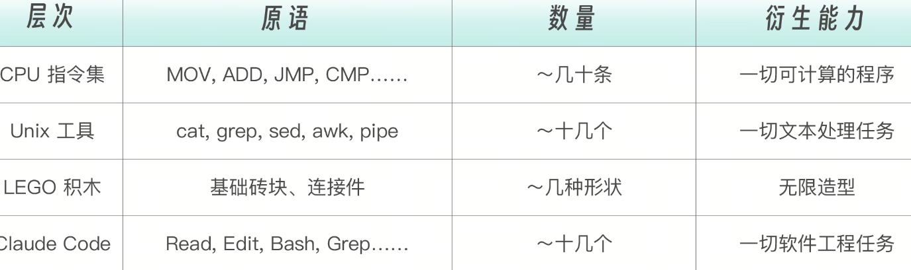

Unix 的设计哲学是“做好一件事”（Do One Thing Well），然后通过管道组合。Claude Code 的工具设计完全继承了这个思想，但比 Unix 管道强大得多。Unix 管道是预定义的、线性的。而 Claude Code 的组合是动态的、分支的、自适应的，Claude 在每次工具调用后，根据返回的结果重新推理下一步该做什么。

涌现：为什么 1+1 远大于 2
为什么这些简单工具组合在一起，能产生远超其各自能力之和的效果？
答案是涌现（Emergence）：
涌现能力 = 原语工具 × LLM 推理 × 反馈循环

原语工具提供行动能力（感知、搜索、修改、执行、获取）
LLM 推理提供决策能力（理解任务 → 分解步骤 → 选择工具 → 解读结果）
反馈循环让二者持续交互（工具输出 → 新的理解 → 新的行动）
我们用一个具体例子说明。比方说，我们要完成“修复用户登录时偶尔出现的 500 错误”这任务，虽然没有任何一个工具能“修复 bug”，但看看它们是怎么组合的。
```
第 1 步：Grep("500", "error", "login")
         → 找到 3 个文件中有相关错误日志
         → Claude 推理："日志显示错误出现在 auth-service.js"

第 2 步：Read("src/auth-service.js")
         → 读取 200 行代码
         → Claude 推理："第 87 行的 token 验证没有 null 检查"

第 3 步：Grep("validateToken", type: "files_with_matches")
         → 找到 5 个文件引用了这个函数
         → Claude 推理："需要同时检查调用方是否有防御性处理"

第 4 步：Read("src/middleware/auth.js")
         → 读取调用方代码
         → Claude 推理："调用方也没有 null 检查，需要在源头修复"

第 5 步：Edit("src/auth-service.js", line 87)
         → 添加 null 检查

第 6 步：Bash("npm test -- --grep 'auth'")
         → 运行测试，2 个失败
         → Claude 推理："测试用例需要更新"

第 7 步：Edit("tests/auth.test.js")
         → 更新测试用例

第 8 步：Bash("npm test")
         → 全部通过
```
单独看每一步，只是读文件、搜索文本、编辑文件、执行命令——极其简单。但组合起来看，Claude 完成了一次完整的 bug 调查、定位、修复、验证，还处理了跨文件依赖和测试更新。

这就是涌现——复杂的智能行为从简单工具的交互中自然产生。

“高级工具”是涌现出来的，不是内置的

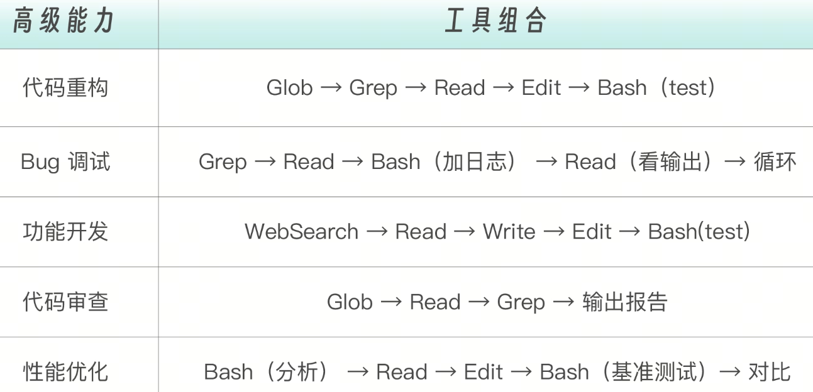

给 Claude 一个“重构工具”反而是有害的。  因为“重构”不是原子操作，它是一系列决策的集合。把决策权交给 Claude 的推理能力，比交给一个固定逻辑的工具更灵活。

## Bash：图灵完备的万能逃逸舱
在所有工具中，Bash 最特殊。它是唯一一个“不确定做什么”的工具——其他工具都有明确职责，但 Bash 能做操作系统能做的一切。
从理论上说，仅凭 Bash 一个工具，Claude 就能完成所有任务：用  cat  读文件、sed  改文件、find  搜索。那为什么还需要 Read、Edit、Glob、Grep？

我认为有三个原因。

1.结构化交互：Read 返回的文件内容带行号、受长度控制；Bash cat  返回原始文本。结构化返回值让 Claude 更准确地理解和定位代码。
2.权限精细控制：你可以允许 Read 但禁止 Bash，这样 Claude 能看代码但不能执行任意命令。如果只有 Bash，权限就是全有或全无。
3.Token 效率：Bash 输出通常包含大量冗余信息。专用工具返回精简的、Claude 直接需要的信息。
背后的设计原则是，Bash 提供能力的完备性，专用工具提供交互的效率和安全的可控性。二者缺一不可。

## 权限控制体系
如果说工具定义了“Claude 能做什么”，那么权限系统决定了“Claude 可以做到什么程度”。 同一组原语工具，在不同权限边界下，其行为能力和风险等级会呈现出完全不同的形态，这也是 Agent 系统从“可用”走向“可控”的关键一环。

从工程角度看，Claude Code 并不是简单地“给或不给权限”，而是构建了一套分层的权限控制体系：既保证低风险操作的流畅执行，又对高风险行为进行精细约束，从而在效率与安全之间取得平衡。

### 权限分层
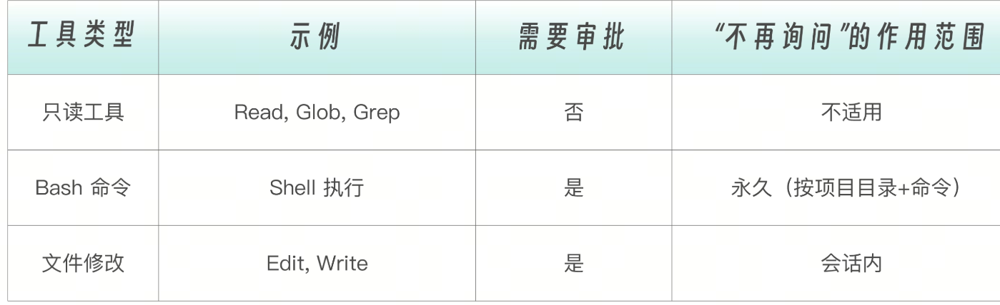

关键区别是，Bash 命令点“Yes, don’t ask again”后永久生效（该项目目录下），文件编辑的授权只在当前会话有效。

### 权限模式
Claude Code 支持多种权限模式，通过  Shift+Tab  循环切换。
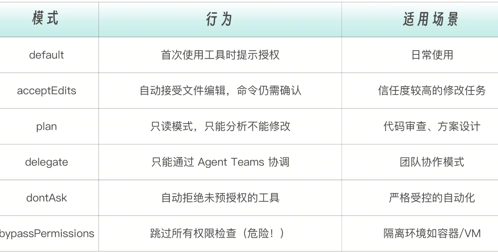

## 权限规则语法在  settings.json  中可以精细配置工具权限：
```
{
  "permissions": {
    "allow": [
      "Bash(npm run *)",
      "Bash(git status)",
      "Bash(git diff *)",
      "Read"
    ],
    "deny": [
      "Bash(rm -rf *)",
      "Bash(curl *)",
      "Edit(.env)"
    ]
  }
}
```
规则评估顺序：deny → ask → allow。deny 规则总是优先。
Bash 规则通配符：
Bash(npm run build)     # 精确匹配 "npm run build"
Bash(npm run *)         # 匹配 "npm run" 后跟任意内容
Bash(git * main)        # 匹配 "git checkout main", "git merge main" 等

注意空格边界：Bash(ls *)  匹配  ls -la  但不匹配  lsof；Bash(ls*)  两者都匹配。
Read/Edit 规则路径语法：
```
{
  "permissions": {
    "allow": [
      "Read",
      "Edit(/src/**/*.ts)"
    ],
    "deny": [
      "Read(./.env)",
      "Edit(//etc/passwd)",
      "Read(~/.ssh/*)"
    ]
  }
}
```
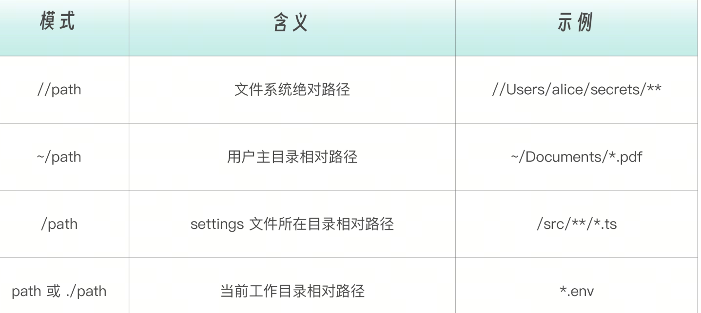

### WebFetch 和 MCP 工具规则：
```
{
  "permissions": {
    "allow": [
      "WebFetch(domain:github.com)",
      "mcp__puppeteer",
      "mcp__database__query"
    ],
    "deny": [
      "WebFetch(domain:internal.company.com)",
      "mcp__database__drop_table"
    ]
  }
}
```
## 配置文件层级
权限配置可以在多个层级设置，按从高到低的优先级排序，如下表所示。
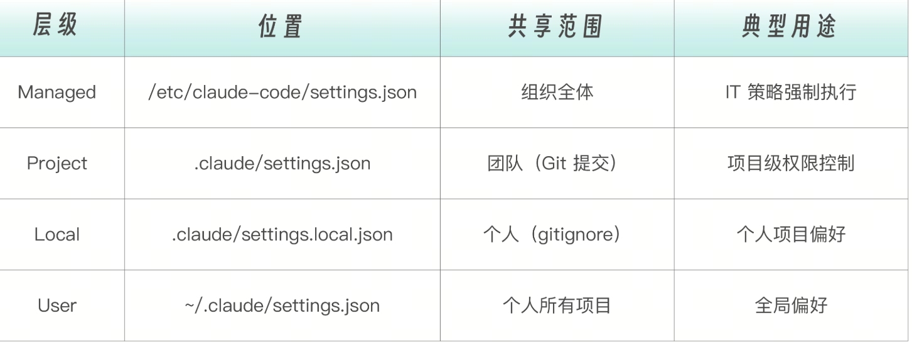


CLI 工具控制除了配置文件，还可以通过 CLI 参数临时控制工具：

```
# 限制可用工具集
claude --tools "Read,Grep,Glob"

# 预授权特定命令（执行时不弹窗）
claude --allowedTools "Bash(npm run *)" "Bash(git diff *)" "Read"

# 禁用特定工具（从上下文中完全移除）
claude --disallowedTools "Bash(curl *)" "Edit"
```
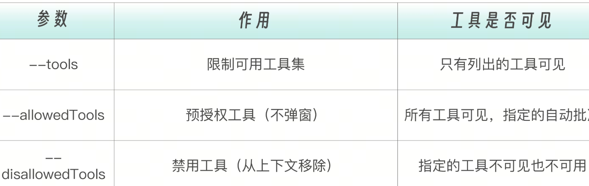

这些控制机制同样适用于子代理配置：

---
name: code-reviewer
description: Review code for security and quality issues
tools: Read, Grep, Glob          # 只给只读工具
model: sonnet
---

## 工具能力的三个层次
内置工具覆盖了大部分编码任务，但连接外部系统时需要扩展。工具能力可以分为三个层次——从内置原语到 Bash 可达到 MCP 扩展，每一层都在前一层的基础上拓展能力边界。

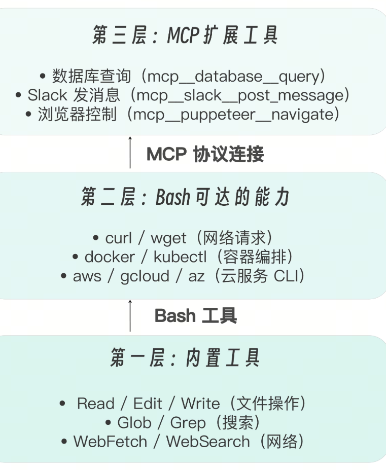

通过 Bash，Claude 已经可以运行任何命令行工具。那为什么还需要 MCP？三个理由：结构化输入输出（MCP 返回结构化数据，不需要解析文本）、工具发现（连接一个 MCP Server，所有工具自动可用）、安全隔离（MCP 在 Server 端做访问控制，比  Bash(curl *)  精细得多）

## 工具是基础，其他机制是上层建筑

Tools 与其他扩展机制的关系。
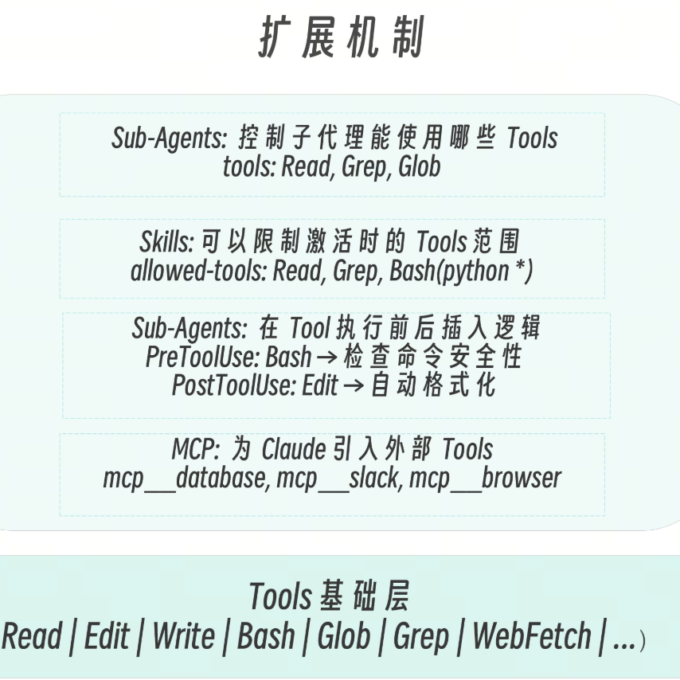

这种分层设计让你可以在不同粒度上精确控制 Claude 的能力边界。所有你在前面学过的扩展机制 SubAgents、Skills、Commands、Hooks、MCP，都建立在 Tools 基础上。理解了工具系统，就理解了整座大厦的地基。