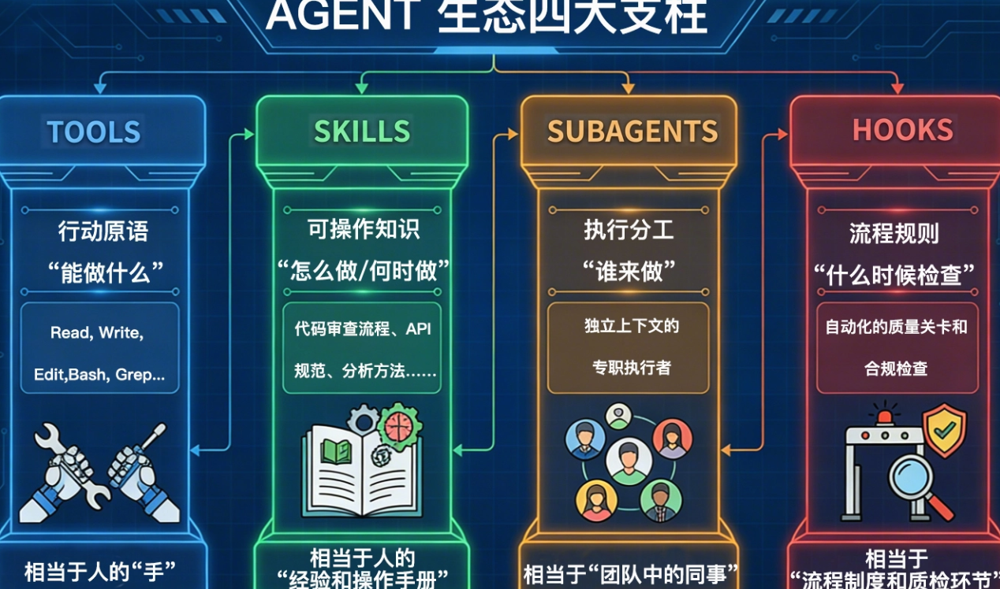
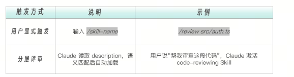
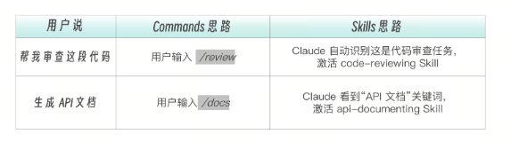
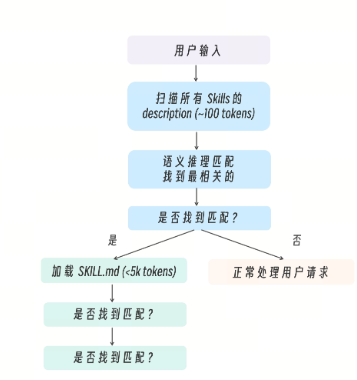
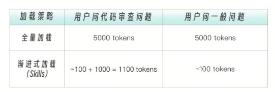

# 从第一性原理来理解什么是 Skills
在真实的工程团队里，很少有人能够把所有规范背下来。代码风格指南十几页，Git 提交规范三四种类型，API 设计有版本约定，安全审查有检查清单，部署流程有风险控制条款……这些规则并不复杂，但数量一多，就不可能长期驻留在脑中。人类工程师的做法很简单：需要时再查阅。如果我们把 Claude 当作真正的工程助手，它也会面临同样的问题。最直接的做法，是把所有团队规范写进 CLAUDE.md，让模型每次对话都读取这些内容。短期看这是可行的。但当知识规模扩大到几十页甚至上百页时，问题就出现了——每一次对话都在为“可能用不到的知识”支付上下文成本。这不仅消耗 tokens，更重要的是，它会稀释模型的注意力。真正需要用到的规则，反而淹没在冗余信息里。这正是 Skills 出现的背景。

Skills 并不是简单的“能力扩展机制”，它本质上是一种按需加载的认知结构。与其把所有知识常驻在上下文中，不如把它们封装成可独立触发的能力单元。当模型判断当前任务涉及某个特定领域时，再加载对应的知识与操作流程。

因此，我们可以给 Skills 一个更精确的定义：Skills 是一种可被语义触发的能力包，它包含领域知识、执行步骤、输出规范与约束条件，并在需要时渐进式加载到主 Agent 的认知空间中。

如果我们把 Agent 生态整体展开来看，会发现 Skills 并不是孤立存在的。Agent 生态中有四大支柱，每个都解决了一个根本性问题。

Tools 是行动原语。它回答的是能做什么。读文件、改代码、执行 Bash 命令……这些是操作层面的能力，类似人的双手。
SubAgents 是执行分工。它回答的是谁来做。当任务复杂到需要独立上下文时，子代理承担专职职责，类似团队中的同事。
Hooks 是流程规则。它回答的是什么时候检查。它们在关键节点自动触发质量校验或合规约束，类似企业中的质检流程。
而 Skills 回答的，是另外一个非常关键的问题：“怎么做，以及何时做”，它不是工具，也不是分工机制。它是一种可操作知识结构。

Skills 解决的核心问题是，在有限的上下文窗口中，让 Agent 在正确的时刻拥有正确的领域知识。
这不是工具问题（Tools 回答“能做什么”），也不是分工问题（SubAgents 回答“谁来做”），而是认知问题——Agent 需要知道特定领域的规范、流程、模式，才能做出正确决策。

# Skills 的核心生态位——可操作知识
一份 API 设计指南放在 Wiki 上，是静态文本。它不包含触发条件，不定义执行流程，不规定输出结构，也不会自动校验质量。它等待人去阅读。而一个 Skill，则是一段具备语义入口的标准操作程序。它通过 description 告诉模型：在什么情况下应该加载这项能力。它在正文中定义执行步骤，将抽象原则转化为可执行流程。它通过模板约束输出格式，确保结果标准化。它可以限制可调用工具的范围，防止越权操作。它甚至可以通过 hooks 在完成后自动执行验证逻辑。

当我们把文档封装为 Skill，它就不再是参考资料，而成为一种可被调用的行为模式。从工程视角看，这是对上下文资源的优化；但从系统设计视角看，这是一种更深层的变化。

过去的软件体系中，调度权始终掌握在人类手中。工程师写 Prompt、编排 Workflow、定义调用顺序。模型只是执行者。路径在设计时就被固定下来。但当知识规模持续扩大、场景组合持续增长时，这种“人预编排一切”的模式开始失效。我们无法穷举所有路径，也无法为每一种场景写出完整流程。

Skills 的真正突破点，在于它把能力的“语义定义权”交给模型。

人不再编排具体执行路径，而是定义能力的边界与含义。模型根据 description 理解能力语义，并在运行时决定是否加载、何时加载。这看似只是增加了一个字段，却完成了一次范式跃迁。我们从“人调度模型”，走向“模型调度能力”。

正因为“模型调度能力”和“可操作知识”的重要性，Skills 已经逐渐脱离了 Claude 的语境，成了 Agent 生态中的通用概念。“技能化”思路正在从 Claude 系统扩展到其他智能体平台，以及 AI 赋能的工程工具中。在 Claude 发布的 Agent Skills 公用仓库中，集成了大量可复用的能力。Coze 也推出了技能商店，为 Coze 智能体生态提供即插即用的能力组件。

# 企业本体论视角：Skills 是组织的 SOP 体系
当这种“可操作知识”机制扩展到企业层面，它的意义会更加清晰。如果把 Claude Code 的技术栈映射到企业组织结构，我们会发现一种高度对称的关系。Tools 对应员工的操作工具；SubAgents 对应岗位分工；Hooks 对应质量与合规流程；CLAUDE.md 类似企业文化与通用规章；MCP Servers 像外部合作伙伴；Plugins 是对外打包的解决方案。

而 Skills，正是企业的 SOP 体系。

Claude 在加载 code-review Skill 时，所做的事情，本质上是同一个过程。从这个角度看，Skills 不再只是技术机制，而是一种企业经验的结构化表达方式。当组织的“做事方式”被封装为可语义调用的能力单元，经验就不再依附于老员工的记忆，也不再散落在文档系统中。它变成模型可以理解、选择和继承的结构。对于企业来说，把专业流程、领域知识和行动判断封装成可复用的能力单元，然后让智能体按需加载和调用，这是一种让通用模型具备专业化、按需调用能力的通用设计模式。类似 Skills 的模块化能力已经被用于数据分析、校验、报告生成等任务，把自然语言指令转化成结构化的专业工作流；也有技术方案将企业组件库、开发规范等封装成“技能包”，让模型自动发现、理解并正确应用这些业务能力。

这就是为什么 Skills 在 Agent 时代具有特殊地位。它既不是单纯的工具层扩展，也不是应用层封装。它是认知层的调度结构，是企业本体论在模型世界中的映射。

在企业中，本体论决定了什么叫“产品”、什么叫“客户”、什么叫“流程”、什么叫“风险”。它定义了组织共享的语义边界。没有这层语义结构，所有规则都会碎片化，所有流程都会各自为政。当我们把这个视角带入 Agent 系统时，会发现同样的问题：模型需要的不仅是能力，更需要知道这些能力存在于怎样的“世界结构”中。这正是图中第四层——Enterprise Ontology——所表达的含义。

工具回答“能做什么”。技能回答“该怎么做”。智能体回答“什么时候做什么，以及由谁来做”。本体论回答“在什么世界里做”。当 Skills 被放入这样的结构中，我们才能看清它的真正位置。它是连接“行动能力”与“语义世界”的中间层。它将企业本体中的概念与规范，转译为可执行的行为模式。在有限的上下文窗口里，组织的做事方式第一次获得了结构化存在的形式。这，才是 Skills 的真正意义。

# 深入理解 Skill 触发机制
在 Claude Code 中，Skills 默认情况下支持两种触发方式。

这是 Skills 最重要的设计特性——同一个 Skill 既可以作为斜杠命令使用，也可以让 Claude 自动判断何时需要。为什么要这样设计？  用户有时知道自己要什么（/review），有时只是描述需求（“帮我看看代码“）。Skills 的双向触发机制让两种场景都能被满足，同时保持能力定义的统一。

举个例子：

两种方式调用的是同一个 Skill，执行的是同样的指令。和 Sub-Agents 类似，Skills 的触发机制靠 LLM 语义推理，而非精确匹配。Claude 读取所有 Skills 的 description，通过语义理解判断当前对话是否匹配某个 Skill。当用户发送消息时，Claude 的处理流程如下图所示：

假设你有 5 个 Skills，每个 SKILL.md 约 1000 tokens。

这里我们注意到，渐进式加载时 Token 的节省比例高达 78% ~ 98%。这就是为什么 Skills 采用“渐进式披露”而非“一次性加载”。当用户请求可能匹配多个 Skills 时，Claude 会：评估每个 Skill 的 description 与用户请求的相关性。选择最相关的那个。如果不确定，可能会询问用户或使用通用方式处理。之前讲过 Skill 有两种触发方式，理解这一点对 Skill 设计和触发过程也很重要。

这里我们注意到，渐进式加载时 Token 的节省比例高达 78% ~ 98%。这就是为什么 Skills 采用“渐进式披露”而非“一次性加载”。当用户请求可能匹配多个 Skills 时，Claude 会：评估每个 Skill 的 description 与用户请求的相关性。选择最相关的那个。如果不确定，可能会询问用户或使用通用方式处理。之前讲过 Skill 有两种触发方式，理解这一点对 Skill 设计和触发过程也很重要。

