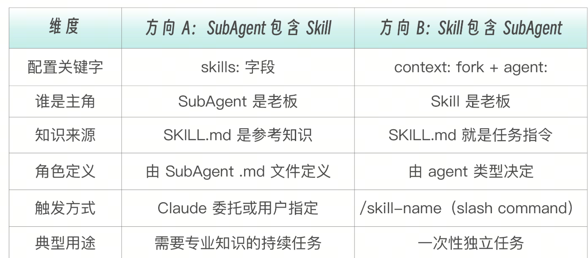
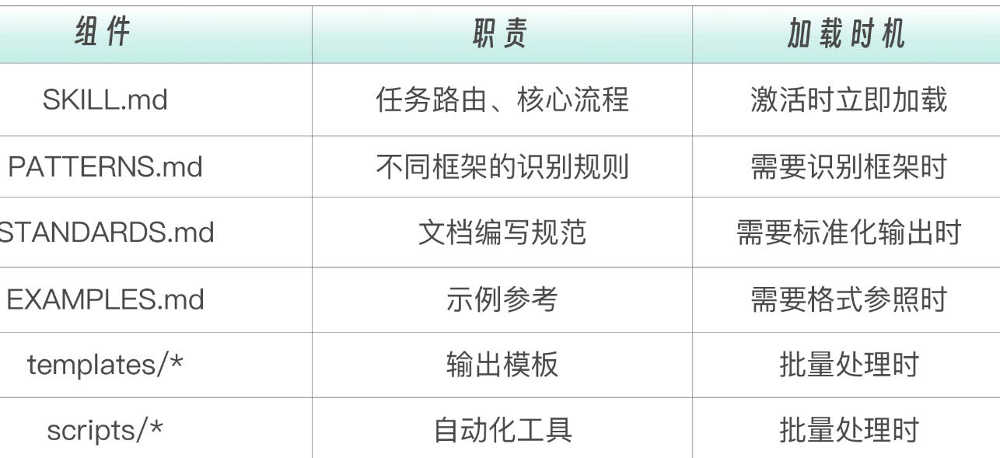

# 两个组合方向：谁包含谁
Skills 解决的是“怎么做”的问题，本质是知识注入——它让同一个 Agent 学会新的能力，就像给一个员工发了一本操作手册，员工还是那个人，只是掌握了更多方法与规范。SubAgents 解决的是“谁来做”的问题，本质是任务委托——它创建一个独立的执行者去完成某件事，就像把任务交给另一位同事，对方拥有自己的上下文、职责边界和决策空间。

当你犹豫到底是用 Skill 还是用 SubAgent 的时候，做出选择的核心判断标准在于：这件事到底需要“另一个人”来承担，还是只需要“多一本手册”来指导？

而更常见的情况是：结合起来使用。当你把两者组合时，本质上只有两个原子方向——是 SubAgent 内部加载 Skills，还是由主 Agent 通过 Skills 去编排和调用 SubAgents。

# 方向 A：SubAgent 包含 Skill（skills  字段）
此时，你定义子代理的角色，通过  skills  字段给它预加载领域知识。SubAgent 是老板，Skill 是工具书。

```
# .claude/agents/api-doc-generator.md
---
name: api-doc-generator
description: Generate API documentation by scanning Express route files.
tools: [Read, Grep, Glob, Write, Bash]
skills:
  - api-generating           # ← 关键：预加载 Skill 作为领域知识
---

You are an API documentation specialist.

## Your Mission
Generate or update API documentation for Express.js routes.
```
这种情况下，Claude Code 的执行流程如下：

```
Claude 主对话: "用 api-doc-generator 为 src/ 生成 API 文档"

主对话                              SubAgent (api-doc-generator)
  │                                    │
  ├─ 创建子代理 + 注入 Skill ──────→ │
  │                                    ├─ 上下文中已有：角色定义 + SKILL.md 全文
  │                                    ├─ 按 SKILL.md 步骤执行任务
  │                                    ├─ 使用 Skill 提供的脚本和模板
  │                                    ├─ 生成文档
  │  ←──── 返回结果摘要 ──────────── │
  ├─ 继续对话                          （子代理结束）
```
SubAgent 包含 Skill 是最常见的情况，适用场景包括子代理需要特定领域的专业知识来完成任务，同一个 Skill 可以被不同角色的 SubAgent 复用，以及需要长期维护的专家型 Agent。

# 方向 B：Skill 包含 SubAgent（context: fork）

在这种情况下，Skill 自带任务指令，通过  context: fork  配置自动“派遣”一个子代理去执行。Skill 是老板，SubAgent 是执行者。

```
---
name: deep-research
description: Research a topic thoroughly in the codebase
context: fork           # ← 关键：让 Skill 在独立子代理中执行
agent: Explore          # ← 子代理类型
---

Research $ARGUMENTS thoroughly:

1. Find relevant files using Glob and Grep
2. Read and analyze the code
3. Summarize findings with specific file references
```
此时的 Claude Code 执行流程如下：

```
用户: /deep-research authentication flow

主对话                              子代理（Explore）
  │                                    │
  ├─ 创建隔离上下文 ────────────────→ │
  │                                    ├─ 收到任务："Research authentication flow..."
  │                                    ├─ Glob/Grep 搜索相关文件
  │                                    ├─ Read 分析代码
  │                                    ├─ 生成结构化摘要
  │  ←──── 返回结果摘要 ──────────── │
  ├─ 继续对话（上下文干净）            （子代理结束）
```

子代理看不到你之前的对话历史，因此 SKILL.md 的内容成为子代理的任务指令。agent  字段决定子代理类型：Explore（只读探索）、Plan（规划）、general-purpose（通用，省略  agent  时默认使用)

这种应用方式的适用场景是研究型任务（深度探索代码库，不污染主对话），重型生成（批量生成文档，中间过程不需要用户看到），以及安全隔离（Skill 的操作不应影响主对话状态）



# 构建 Skill：参照着用
一个生产级的 Skill 的完整架构应该包含这些组件：
```
.claude/skills/api-generating/          # 标准 Skill 目录
├── SKILL.md                            # 入口：路由 + 核心逻辑
├── PATTERNS.md                         # 知识：框架识别模式
├── STANDARDS.md                        # 规范：文档编写标准
├── EXAMPLES.md                         # 示例：输入输出案例
├── templates/
│   ├── index.md                       # 模板：API 索引页
│   ├── endpoint.md                    # 模板：端点文档
│   └── openapi.yaml                   # 模板：OpenAPI 规范
└── scripts/
    ├── detect_routes.py               # 脚本：路由检测
    └── validate_openapi.sh            # 脚本：规范验证
```

也许你觉得只不过设计个 API 而已，为什么需要这么多组件？

但其实一位 API 文档专家，当有人请你写文档时，你需要识别技术栈（Express? FastAPI? Spring?）→ PATTERNS.md、遵循规范（字段命名、格式要求）→ STANDARDS.md、参考案例（不确定时看例子）→ EXAMPLES.md、使用模板（保证一致性）→ templates//批量处理（几十个端点不可能手写）→ scripts/。

这些都是长期的经验积累之后内化的结果，而一个生产级 Skill 所希望做到的， 就是把这些专家经验形式化。

# 主文件 SKILL.md
主文件不是堆砌所有内容，而是路由器——根据任务需求指向正确的资源。设计要点包括：使用 Quick Reference 表格作为一目了然的资源索引，用清晰的步骤告诉 Claude 标准流程，以及按需指引（只在需要时才去读详细文档）。

```
---
name: api-documenting
description: Generate API documentation from code. Use when the user wants to document APIs, create API reference, generate endpoint documentation, or needs help with OpenAPI/Swagger specs.
allowed-tools:
  - Read
  - Grep
  - Glob
  - Write
  - Bash(python:*)
  - Bash(./scripts/*:*)
---

# API Documentation Generator

Generate comprehensive API documentation from source code.

## Quick Reference

| Task | Resource |
|------|----------|
| Identify framework | See `PATTERNS.md` |
| Documentation standards | See `STANDARDS.md` |
| Example outputs | See `EXAMPLES.md` |

## Process

### Step 1: Identify API Endpoints

Look for route definitions. For framework-specific patterns, see `PATTERNS.md`.

### Step 2: Extract Information

For each endpoint, extract:
- HTTP method (GET, POST, PUT, DELETE, etc.)
- Path/route
- Parameters (path, query, body)
- Request/response schemas
- Authentication requirements

### Step 3: Generate Documentation

Use the template in `templates/endpoint.md` for each endpoint.

### Step 4: Create Overview

Generate an index using `templates/index.md`.

## Output Formats

### Markdown (Default)
Generate markdown suitable for README or docs site.

### OpenAPI/Swagger
If requested, generate OpenAPI 3.0 spec. See `templates/openapi.yaml`.

## Automation

To auto-detect routes:
```bash
python scripts/detect_routes.py <source_directory>
```
# 三种组合模式：具体咋用
第一部分介绍的两个组合方向是基础构件。实战中，它们还衍生出三种组合模式。

## 模式一：SubAgent 预加载 Skills（方向 A 的单次应用）
一个子代理预加载一个或多个 Skill，用领域知识增强自己的能力。这是最常见的模式，也是本讲的实战重点。
```
# 子代理在创建时预加载 Skill 作为领域知识
---
name: api-doc-generator
skills:
  - api-generating              # 预加载 API 文档生成知识
---
```
配置了 Skill 的子代理好比一个经过培训的专业技师。
而同一个 Agent，注入不同的 Skill，就变成不同的专家。这就是组合的力量。
现在我们来完成最后一步——把  Skill 装进 SubAgent，组装一个领域专家。
```
05-api-generator                        06-agent-skill-combo
─────────────                           ─────────────────
Skill 独立运行                           Skill + SubAgent 组合

SKILL.md（6 组件全展示）                  SKILL.md（精简为 3 组件）
┌─────────────────────────────┐        ┌──────────────────────────────────────┐
│ Quick Reference              │        │ 工作流程 — MANDATORY                 │
│ Process: Step 1-4            │   →    │ Step 1: Route Discovery（脚本）       │
│ Automation: 可选              │        │ Step 2: Route Analysis（分析）        │
│ 6 个引用文件                  │        │ Step 3: Documentation Generation      │
└─────────────────────────────┘        └──────────────────────────────────────┘

无 SubAgent 定义                         新增 SubAgent 定义
                                       ┌──────────────────────────────────────┐
                                       │ api-doc-generator.md                 │
                                       │ skills: [api-generating]             │
                                       │ "You are an API doc specialist."     │
                                       └──────────────────────────────────────┘

无测试目标                               新增 Express 测试路由
                                       ┌──────────────────────────────────────┐
                                       │ users.js  — 标准 CRUD（5 条路由）     │
                                       │ orders.js — 含链式路由（5 条路由）     │
                                       │ 共 10 条路由，验证覆盖率               │
                                       └──────────────────────────────────────┘
```

首先做的一件事是 Skill 精简化。你可能注意到，新的项目中的 Skill 和刚才创建的独立 Skill 有点不一样了，从原来的 6 个组件精简为 3 个组件。为什么？因为 SubAgent 已经有了角色定义，Skill 只需提供工作流程和工具：

```
05-api-generator（完整展示）         06-agent-skill-combo（实战精简）
├── SKILL.md                       ├── SKILL.md          ← 强化工作流程
├── PATTERNS.md                    ├── scripts/
├── STANDARDS.md                   │   └── detect-routes.py
├── EXAMPLES.md                    └── templates/
├── templates/ (3 files)               └── api-doc.md
└── scripts/ (2 files)

```
精简原则是参考型知识（PATTERNS、STANDARDS、EXAMPLES）在主对话场景中有用，但 SubAgent 场景下通常只需要执行流程。这里你可以回顾一下 Skill 和 Sub-Agent 的职责划分——Skill 负责 HOW，SubAgent 负责 WHO/WHAT。

然后是 SubAgent 的角色定义。SubAgent 的  .md  文件只定义角色和使命，具体的工作流程由 Skill 提供。其中  skills: [api-generating]  这一行——就是把"操作手册"交到 SubAgent 手里的那一刻。

```
# .claude/agents/api-doc-generator.md
---
name: api-doc-generator
description: Generate comprehensive API documentation by scanning Express route files.
model: sonnet
tools: [Read, Grep, Glob, Write, Bash]
skills:
  - api-generating           ← 预加载 Skill
---

You are an API documentation specialist.

## Your Mission

Generate or update API documentation for Express.js routes.

### Workflow

1. Run the route detection script as specified in the Skill
2. For each discovered route, analyze the handler code
3. Generate documentation using the Skill's template
4. Verify all routes are covered (cross-check with script output)

### Output

- Write documentation files to `docs/api/`
- Return a summary to the main conversation:
  - Number of routes documented
  - Any routes that could not be fully analyzed (with reasons)
  - Warnings (missing auth, undocumented parameters, etc.)
```
