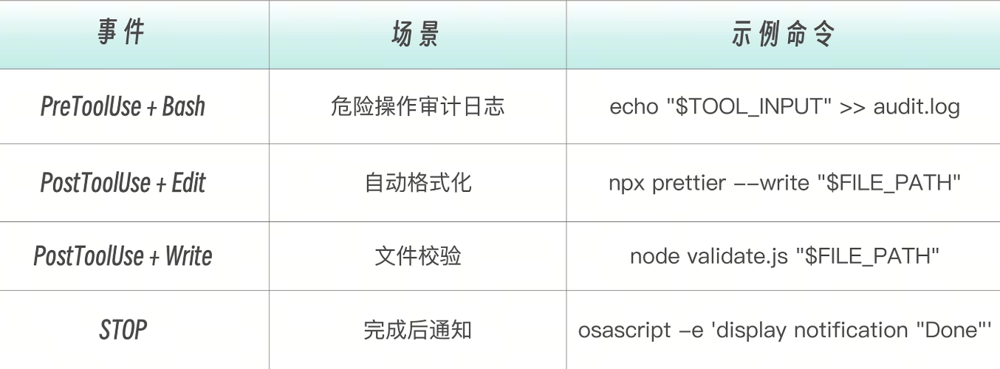
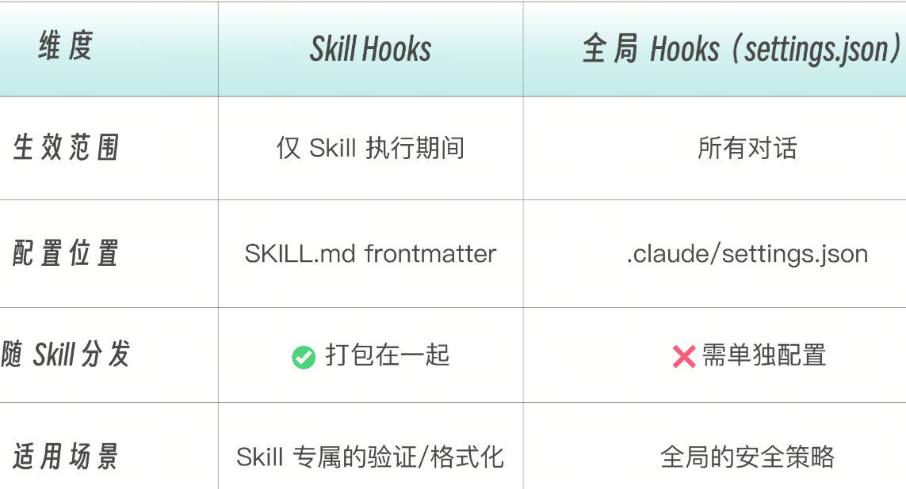
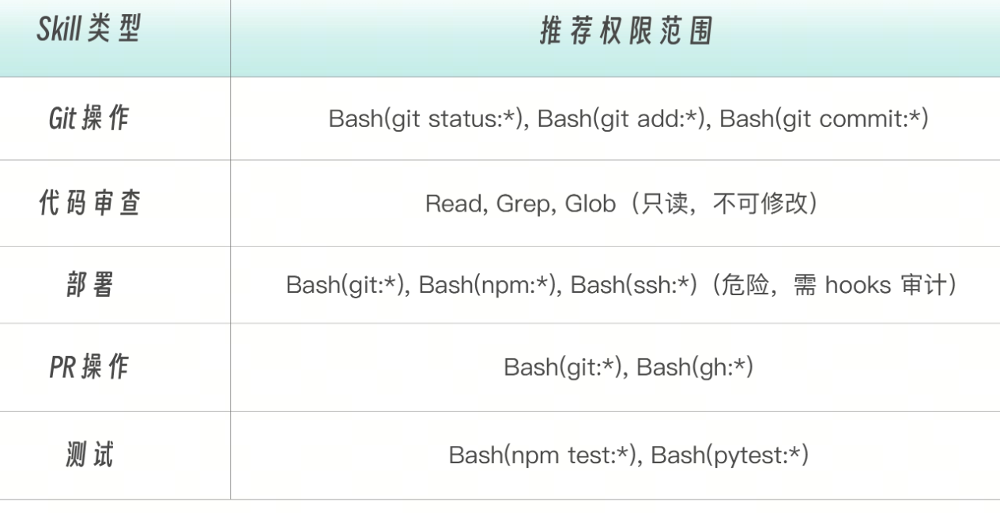

任务型 Skill（也可以称为命令型 Skill 吧）。

对于喜欢“偷懒”的程序员，创建了一个斜杠命令来取代简单工作步骤，是再自然不过的事情，比如“检查一下 git 状态，然后提交代码，消息是 “fix login bug” 这种任务，用这样一个命令，直达目标。不需要每次都解释。

这就是任务型 Skill 的价值：把重复的对话模式，变成可复用的快捷方式。


# Skills vs Commands
早期，斜杠命令 /Comands 和 Skills 是两个独立组件。但在新版 Claude Code 中，Commands 已合并到 Skills，成为 Skills 的子集。
因此，在 .claude/commands/review.md  和  .claude/skills/review/SKILL.md  两个不同目录的文件，都会创建  /review。Skills 目录的额外优势是支持辅助文件目录（模板、示例、脚本等）。如果同名 Skill 和 Command 共存，Skill 优先。


什么时候用 Commands 目录？已有的  .claude/commands/  文件继续有效，不需要迁移。什么时候用 Skills 目录？新建命令推荐使用 Skills 目录，因为支持辅助文件和更完整的 frontmatter。

# 任务型 Skill 的核心机制
任务型 Skill 就是设了 disable-model-invocation: true 的 Skill。
```
# 参考型——Claude 自动选择是否使用
name: api-conventions
description: API design patterns for this codebase. Use when writing or reviewing API endpoints.

# 任务型——必须用户手动触发
name: deploy
description: Deploy the application to production
disable-model-invocation: true
```
有两种类型的命令。内置命令是 Claude Code 自带的，用于控制会话和工具，你无法修改。 自定义命令是你创建的任务型 Skill，用于执行特定的工作流程，完全由你掌控。


任务型 Skill 可以放在两个目录下：
```
.claude/skills/<name>/SKILL.md      # 推荐：Skills 目录（完整能力）
.claude/commands/<name>.md           # 兼容：Commands 目录（简单命令）
```
任务型 Skill 作用域如下
```
项目级：  .claude/skills/   或 .claude/commands/       → 随项目 git 分发
用户级：  ~/.claude/skills/  或 ~/.claude/commands/      → 跨项目个人使用
```

# 通过 ARGUMENTS 给 Skill 传参
当你通过  /skill-name args  调用 Skill 时，args  会通过  $ARGUMENTS  注入到 Skill 内容中。

举例来说，当运行  /fix-issue 123  时，Claude 收到的内容是“Fix GitHub issue 123 following our coding standards…”。
```
---
name: fix-issue
description: Fix a GitHub issue
disable-model-invocation: true
---

Fix GitHub issue $ARGUMENTS following our coding standards.

1. Read the issue description
2. Understand the requirements
3. Implement the fix
4. Write tests
5. Create a commit
```
注意，传参并不仅仅限于任务型 Skill，但是，需要明确传参的场景，对于任务型 Skill 自然是显得更加常见。Skill 支持两种参数传递方式。
单参数——$ARGUMENTS  接收所有参数。
```
---
description: Quick git commit
argument-hint: [commit message]
disable-model-invocation: true
---

Create a git commit with message: $ARGUMENTS
```
多参数—— $1，$2 接收位置参数：
```
---
description: Create a pull request
argument-hint: [title] [description]
disable-model-invocation: true
---

Title: $1
Description: $2
```
用法示例如下。/commit fix login bug # $ARGUMENTS = "fix login bug"/pr-create "Add auth" "JWT" # $1 = "Add auth", $2 = "J

可以用 $ARGUMENTS[N]   或简写  $N  访问特定位置的参数：

```
---
name: migrate-component
description: Migrate a component from one framework to another
---

Migrate the $0 component from $1 to $2.
Preserve all existing behavior and tests.

```

例如，/migrate-component SearchBar React Vue 中，$0 被替换为 SearchBar,  $1 为 React, $2 为 Vue。

Claude Code 是非常灵活的，如果 Skill 中根本就没有定义 $ARGUMENTS，而你在调用 Skill 的时候又偏偏传递了参数进去。那也不怕，Claude Code 会自动在内容末尾追加  ARGUMENTS: <用户输入>，确保参数不会丢失。

Claude Code 是非常灵活的，如果 Skill 中根本就没有定义 $ARGUMENTS，而你在调用 Skill 的时候又偏偏传递了参数进去。那也不怕，Claude Code 会自动在内容末尾追加  ARGUMENTS: <用户输入>，确保参数不会丢失。


```# ! `command` 动态上下文注入```
，Skills 中那么多文字和信息，其实归根结底还是 Prompt，需要 Claude Code（工具）发给 Claude 或者 GLM/Qwen 等模型来处理。而模型启动时并不知道和当前技能相关的上下文，这一功能刚好可以解决该问题。

当用户输入  /pr-create "Add auth"  时，模型收到的只是 Prompt 文本。它不知道：当前在哪个分支有哪些 commit 待合并改了哪些文件

如果不预注入上下文，其实模型也会先花多轮工具调用去收集这些信息，任务虽然还是能完成，但浪费 token 和时间
```
而 ! `command` 是 Skill 文件的预处理器——在文件内容发送给模型  之前，先在 shell 中执行这些预设的命令，然后把它们的输出结果内联替换到 Prompt 中，再去执行新的命令。
```


```
## Current Context (Auto-detected)

Current branch:
!`git branch --show-current`

Recent commits on this branch:
!`git log origin/main..HEAD --oneline 2>/dev/null || echo "No commits ahead of main"`

Files changed:
!`git diff --stat origin/main 2>/dev/null || git diff --stat HEAD~3`
```
Claude 实际收到的 Prompt（替换后）：

```
## Current Context (Auto-detected)

Current branch:
feature/auth

Recent commits on this branch:
a1b2c3d Add JWT middleware
d4e5f6g Add login endpoint
g7h8i9j Add user model

Files changed:
 src/auth/middleware.ts | 45 +++
 src/auth/login.ts     | 82 +++
 src/models/user.ts    | 34 +++
 3 files changed, 161 insertions(+)
```

这样，Claude 启动 /pr-create "Add auth" 时就拥有了完整上下文，可以直接生成 PR 标题和描述，无需额外再进行多一次工具调用。


```
! `command` 可以与  $ARGUMENTS  组合，在动态注入时使用参数值。
```
```
---
description: Show git blame for a file
argument-hint: [file path]
disable-model-invocation: true
allowed-tools: Bash(git:*)
---

Analyze the git history for: $ARGUMENTS

File blame:
!`git blame $ARGUMENTS 2>/dev/null | head -30 || echo "File not found"`

Recent changes:
!`git log --oneline -5 -- $ARGUMENTS 2>/dev/null || echo "No history"`
```
```
$ARGUMENTS  参数会先被替换，再执行 ! `command`。这意味着用户输入会进入 shell 命令——因此务必在 allowed-tools 中严格限制可执行范围。
```
动态注入的工程价值和优势列表分析如下。


# Skill 内的 Hooks
任务型 Skill 执行的是有“副作用”(side-effect）的操作——提交代码、部署应用、修改文件。这类操作需要自动化的安全网。
Hooks 配置很简单，只需要在 frontmatter 的  hooks  字段中定义：

```
---
description: Safe deployment command
disable-model-invocation: true
allowed-tools: Bash(git:*), Bash(npm:*), Bash(ssh:*)
hooks:
  PreToolUse:
    - matcher: Bash
      hooks:
        - type: "command"           
          command: echo "About to run: $TOOL_INPUT" >> /tmp/deploy.log
  PostToolUse:
    - matcher: Edit
      hooks:
        - type: "command"           
          command: npx prettier --write "$FILE_PATH"
---

Deploy the application to staging environment.
```
Skill 内的 Hooks 不是一条一条平铺写的，而是按“事件 → 匹配规则 → 要执行的命令列表”一层一层包起来。也就是一个三层树形结构，而不是一行一个 Hook —— 这是为了支持多事件 × 多工具 × 多动作的组合扩展


Skill Hooks 与全局 Hooks 的区别如下。



# 任务型 Skill 设计方法论
设计一个任务型 Skill 时，我给你提供一个七步设计清单，引导你按顺序回答后面的问题。
1. 动作是什么？ → 命名（commit、deplo，y、review）
2. 谁能触发？   → disable-model-invocation: true
3. 需要什么权限？→ allowed-tools 精确到命令级
4. 启动时需要什么上下文？→ !`command` 预注入
5. 执行过程需要什么安全网？→ hooks
6. 输出量大不大？→ 大则 context: fork
7. 用什么模型？ → model（简单 haiku，复杂 sonnet）

任务型 Skill 的几个重要设计原则如下：

单一职责原则：一个命令做一件事。
✅ /commit, /push, /review
❌ /git-all-in-one

清晰命名原则：从命令名就能知道它做什么。
✅ /test:unit, /deploy:staging, /pr-create
❌ /do-stuff, /cmd1, /x

有意义的参数提示：让使用者了解如何传参。
✅ argument-hint: [commit message]
✅ argument-hint: [source file] [target directory]
❌ argument-hint: [args]

权限最小化原则：严格控制每个任务的权限边界。
# ✅ 精确授权——只允许 git 的特定子命令
allowed-tools: Bash(git status:*), Bash(git add:*), Bash(git commit:*)

# ❌ 过于宽泛——等于授权所有 shell 命令
allowed-tools: Bash(*)



错误处理也非常重要，不可忽视。应该在说明中显式处理错误路径
## Steps

1. Check if we're in a git repository
   - If not, inform the user and stop
2. Check for uncommitted changes
   - If none, inform the user that there's nothing to commit
3. Otherwise, proceed with the commit

# 实战项目：团队标准命令集

.claude/skills/                    # 推荐：Skills 目录
├── committing/SKILL.md            # /committing  快速提交
├── reviewing/SKILL.md             # /reviewing   代码审查
├── pr-creating/SKILL.md           # /pr-creating 创建 PR
└── testing/SKILL.md               # /testing     运行测试

.claude/commands/                   # 兼容：Commands 目录
└── git/
    ├── status.md                  # /git:status
    └── log.md                     # /git:log

Skills 目录名即命令名。包括简单的查询类命令（git:status、git:log）以及包含动作的命令建议。建议你把它们迁移到 Skills 目录以获得  disable-model-invocation  等高级能力。

# 命令一：智能提交 /commit
.claude/skills/committing/SKILL.md（或  .claude/commands/commit.md）：
```
---
description: Quick git commit with auto-generated or specified message
argument-hint: [optional: commit message]
disable-model-invocation: true
allowed-tools: Bash(git status:*), Bash(git add:*), Bash(git commit:*), Bash(git diff:*)
model: haiku
---

Create a git commit.

If a message is provided: $ARGUMENTS
- Use that as the commit message

If no message is provided:
- Analyze the changes with `git diff --staged` (or `git diff` if nothing staged)
- Generate a concise, meaningful commit message

## Steps

1. Check `git status` to see current state
2. If nothing staged, run `git add .` to stage all changes
3. Review what will be committed with `git diff --staged`
4. Create commit:
   - If `$ARGUMENTS` is provided, use it as the message
   - Otherwise, generate a message based on the diff
5. Show the commit result

## Commit Message Format

- Start with type: `feat:`, `fix:`, `docs:`, `refactor:`, `test:`, `chore:`
- Be concise but descriptive (max 72 chars for first line)
- Example: `feat: add user authentication with JWT`

## Output

Show a brief confirmation:
✓ Committed: [commit message] [number] files changed
```

# 命令二：代码审查 /review
用于自动进行代码的审查
.claude/skills/reviewing/SKILL.md（或  .claude/commands/review.md）：

```
---
description: Review code for quality, bugs, and improvements
argument-hint: [optional: file path]
disable-model-invocation: true
allowed-tools: Read, Grep, Glob, Bash(git diff:*)
---

Review code and provide feedback.

Target: $ARGUMENTS (or current git diff if not specified)

## Review Focus Areas

1. **Bugs & Errors**: Logic errors, null checks, edge cases
2. **Security**: Input validation, injection risks, sensitive data exposure
3. **Performance**: Obvious inefficiencies, N+1 queries, memory leaks
4. **Readability**: Naming, complexity, documentation needs

## Steps

1. If file path provided, read that file
2. If no path, run `git diff` to see current changes
3. Analyze the code against the focus areas
4. Provide structured feedback

## Output Format

```markdown
## Code Review

### Summary
[One sentence overall assessment]

### Issues Found

#### Critical (Must Fix)
- [issue]: [location] - [brief explanation]

#### Warnings (Should Fix)
- [issue]: [location] - [brief explanation]

#### Suggestions (Nice to Have)
- [suggestion]: [location] - [brief explanation]

### What's Good
- [positive observation]

## Guidelines
Be specific about locations (file:line if possible)
Provide actionable feedback, not just criticism
Don't nitpick style unless it impacts readability
Acknowledge good patterns you see
```
使用方式如下：
```
```bash
# 审查当前 git diff
/review

# 审查特定文件
/review src/auth/login.ts
```
该命令只授权 Read、Grep、Glob，不能修改代码，统一的反馈格式，便于团队理解。此外还有优先级分类功能：Critical > Warning > Suggestion。

# 命令三：创建 PR /pr-create
.claude/skills/pr-creating/SKILL.md

```
---
description: Create a pull request with auto-detected context
argument-hint: [title] [description]
disable-model-invocation: true
allowed-tools: Bash(git:*), Bash(gh:*)
---

Create a pull request.

Title: $1
Description: $2

## Current Context (Auto-detected)

Current branch:
!`git branch --show-current`

Recent commits on this branch:
!`git log origin/main..HEAD --oneline 2>/dev/null || echo "No commits ahead of main"`

Files changed:
!`git diff --stat origin/main 2>/dev/null || git diff --stat HEAD~3`

## Steps

1. Ensure we're not on main/master branch
2. Push current branch to remote (if not already)
3. Create PR using `gh pr create`:
   - Title: $1 (or auto-generate from branch name)
   - Body: $2 (or auto-generate from commits)
4. Return the PR URL

## PR Body Template

If $2 is not provided, generate:

```markdown
## Summary
[Auto-generated from commit messages]

## Changes
[List of changed files with brief descriptions]

## Testing
- [ ] Tests pass locally
- [ ] Manual testing completed

---
Created with `/pr-create`

## Output
✓ PR Created: [URL]

Title: [title]
Branch: [branch] → main
Changes: [n] files

```
其中的  !`…`  就是我们刚才学过的 ! \command` 动态上下文注入，Claude 启动时就拿到了当前分支、commit 记录和文件变更。

使用方式如下：
```
```bash
# 自动生成标题和描述
/pr-create

# 指定标题
/pr-create "Add user authentication"

# 指定标题和描述
/pr-create "Add user authentication" "Implements JWT-based auth with refresh tokens"

```
当命令越来越多时，可以用目录结构组织它们：

```
.claude/commands/
├── commit.md           →  /commit
├── review.md           →  /review
├── git/
│   ├── status.md       →  /git:status
│   ├── log.md          →  /git:log
│   └── sync.md         →  /git:sync
└── test/
    ├── unit.md         →  /test:unit
    └── e2e.md          →  /test:e2e
```
命名规则是当目录名成为前缀，用冒号  :  分隔。这样做的好处是相关命令归类在一起，避免命令名冲突，而且输入  /git:  会提示所有 git 相关命令。
