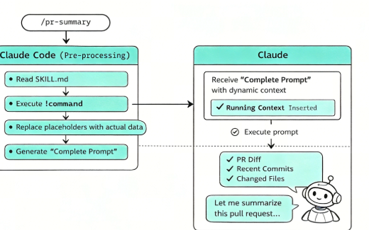
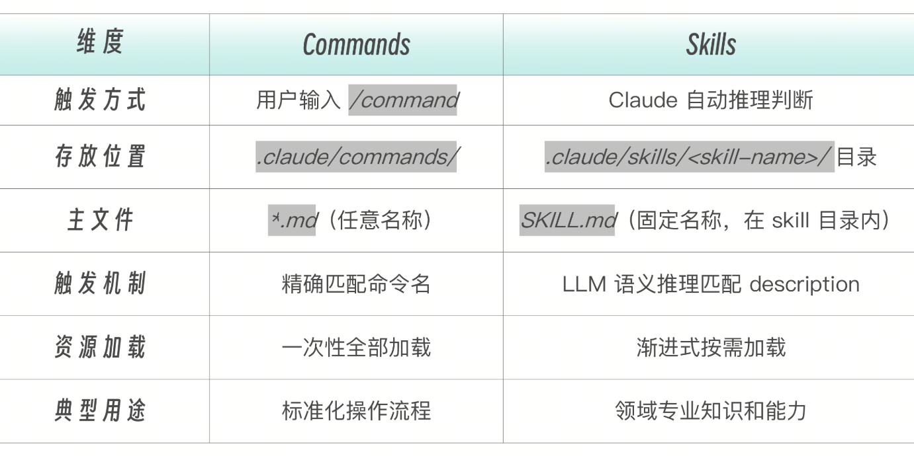
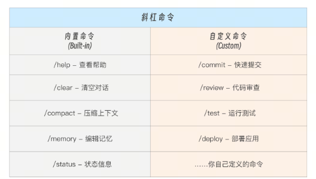
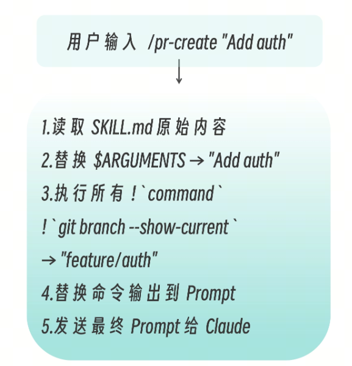
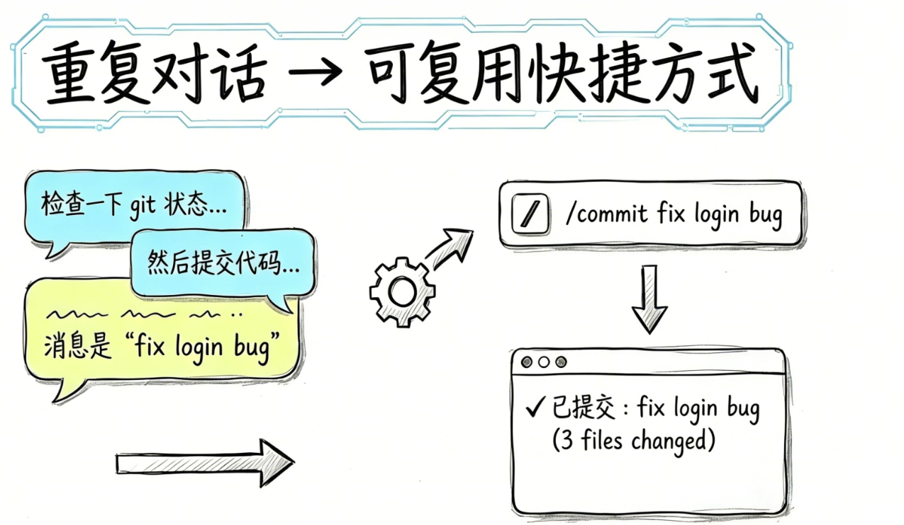
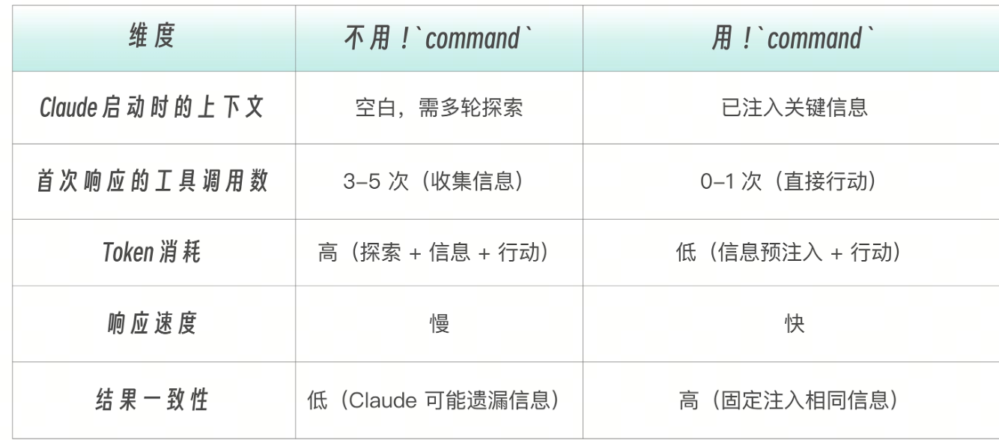

任务型 Skill（也可以称为命令型 Skill 吧）。

对于喜欢“偷懒”的程序员，创建了一个斜杠命令来取代简单工作步骤，是再自然不过的事情，比如“检查一下 git 状态，然后提交代码，消息是 “fix login bug” 这种任务，用这样一个命令，直达目标。不需要每次都解释。

这就是任务型 Skill 的价值：把重复的对话模式，变成可复用的快捷方式。



# Skills vs Commands
早期，斜杠命令 /Comands 和 Skills 是两个独立组件。但在新版 Claude Code 中，Commands 已合并到 Skills，成为 Skills 的子集。
因此，在 .claude/commands/review.md  和  .claude/skills/review/SKILL.md  两个不同目录的文件，都会创建  /review。Skills 目录的额外优势是支持辅助文件目录（模板、示例、脚本等）。如果同名 Skill 和 Command 共存，Skill 优先。



什么时候用 Commands 目录？已有的  .claude/commands/  文件继续有效，不需要迁移。什么时候用 Skills 目录？新建命令推荐使用 Skills 目录，因为支持辅助文件和更完整的 frontmatter。

# 任务型 Skill 的核心机制
任务型 Skill 就是设了 disable-model-invocation: true 的 Skill。
```
# 参考型——Claude 自动选择是否使用
name: api-conventions
description: API design patterns for this codebase. Use when writing or reviewing API endpoints.

# 任务型——必须用户手动触发
name: deploy
description: Deploy the application to production
disable-model-invocation: true
```
有两种类型的命令。内置命令是 Claude Code 自带的，用于控制会话和工具，你无法修改。 自定义命令是你创建的任务型 Skill，用于执行特定的工作流程，完全由你掌控。


任务型 Skill 可以放在两个目录下：
```
.claude/skills/<name>/SKILL.md      # 推荐：Skills 目录（完整能力）
.claude/commands/<name>.md           # 兼容：Commands 目录（简单命令）
```
任务型 Skill 作用域如下
```
项目级：  .claude/skills/   或 .claude/commands/       → 随项目 git 分发
用户级：  ~/.claude/skills/  或 ~/.claude/commands/      → 跨项目个人使用
```

# 通过 ARGUMENTS 给 Skill 传参
当你通过  /skill-name args  调用 Skill 时，args  会通过  $ARGUMENTS  注入到 Skill 内容中。

举例来说，当运行  /fix-issue 123  时，Claude 收到的内容是“Fix GitHub issue 123 following our coding standards…”。
```
---
name: fix-issue
description: Fix a GitHub issue
disable-model-invocation: true
---

Fix GitHub issue $ARGUMENTS following our coding standards.

1. Read the issue description
2. Understand the requirements
3. Implement the fix
4. Write tests
5. Create a commit
```
注意，传参并不仅仅限于任务型 Skill，但是，需要明确传参的场景，对于任务型 Skill 自然是显得更加常见。Skill 支持两种参数传递方式。
单参数——$ARGUMENTS  接收所有参数。
```
---
description: Quick git commit
argument-hint: [commit message]
disable-model-invocation: true
---

Create a git commit with message: $ARGUMENTS
```
多参数—— $1，$2 接收位置参数：
```
---
description: Create a pull request
argument-hint: [title] [description]
disable-model-invocation: true
---

Title: $1
Description: $2
```
用法示例如下。/commit fix login bug # $ARGUMENTS = "fix login bug"/pr-create "Add auth" "JWT" # $1 = "Add auth", $2 = "J

可以用 $ARGUMENTS[N]   或简写  $N  访问特定位置的参数：

```
---
name: migrate-component
description: Migrate a component from one framework to another
---

Migrate the $0 component from $1 to $2.
Preserve all existing behavior and tests.

```

例如，/migrate-component SearchBar React Vue 中，$0 被替换为 SearchBar,  $1 为 React, $2 为 Vue。

Claude Code 是非常灵活的，如果 Skill 中根本就没有定义 $ARGUMENTS，而你在调用 Skill 的时候又偏偏传递了参数进去。那也不怕，Claude Code 会自动在内容末尾追加  ARGUMENTS: <用户输入>，确保参数不会丢失。

Claude Code 是非常灵活的，如果 Skill 中根本就没有定义 $ARGUMENTS，而你在调用 Skill 的时候又偏偏传递了参数进去。那也不怕，Claude Code 会自动在内容末尾追加  ARGUMENTS: <用户输入>，确保参数不会丢失。


```# ! `command` 动态上下文注入```
，Skills 中那么多文字和信息，其实归根结底还是 Prompt，需要 Claude Code（工具）发给 Claude 或者 GLM/Qwen 等模型来处理。而模型启动时并不知道和当前技能相关的上下文，这一功能刚好可以解决该问题。

当用户输入  /pr-create "Add auth"  时，模型收到的只是 Prompt 文本。它不知道：当前在哪个分支有哪些 commit 待合并改了哪些文件

如果不预注入上下文，其实模型也会先花多轮工具调用去收集这些信息，任务虽然还是能完成，但浪费 token 和时间
```
而 ! `command` 是 Skill 文件的预处理器——在文件内容发送给模型  之前，先在 shell 中执行这些预设的命令，然后把它们的输出结果内联替换到 Prompt 中，再去执行新的命令。
```


```
## Current Context (Auto-detected)

Current branch:
!`git branch --show-current`

Recent commits on this branch:
!`git log origin/main..HEAD --oneline 2>/dev/null || echo "No commits ahead of main"`

Files changed:
!`git diff --stat origin/main 2>/dev/null || git diff --stat HEAD~3`
```
Claude 实际收到的 Prompt（替换后）：

```
## Current Context (Auto-detected)

Current branch:
feature/auth

Recent commits on this branch:
a1b2c3d Add JWT middleware
d4e5f6g Add login endpoint
g7h8i9j Add user model

Files changed:
 src/auth/middleware.ts | 45 +++
 src/auth/login.ts     | 82 +++
 src/models/user.ts    | 34 +++
 3 files changed, 161 insertions(+)
```

这样，Claude 启动 /pr-create "Add auth" 时就拥有了完整上下文，可以直接生成 PR 标题和描述，无需额外再进行多一次工具调用。


```
! `command` 可以与  $ARGUMENTS  组合，在动态注入时使用参数值。
```
```
---
description: Show git blame for a file
argument-hint: [file path]
disable-model-invocation: true
allowed-tools: Bash(git:*)
---

Analyze the git history for: $ARGUMENTS

File blame:
!`git blame $ARGUMENTS 2>/dev/null | head -30 || echo "File not found"`

Recent changes:
!`git log --oneline -5 -- $ARGUMENTS 2>/dev/null || echo "No history"`
```
```
$ARGUMENTS  参数会先被替换，再执行 ! `command`。这意味着用户输入会进入 shell 命令——因此务必在 allowed-tools 中严格限制可执行范围。
```
动态注入的工程价值和优势列表分析如下。


