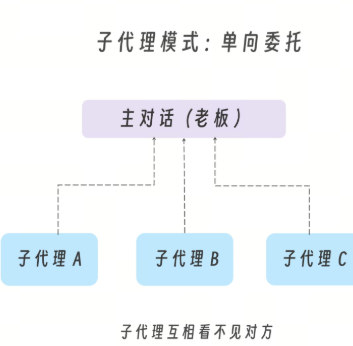
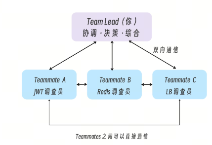
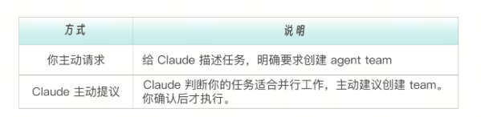
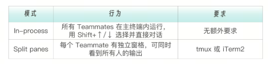

Sub-Agents vs Agent Teams：从“任务委托”到“团队协作”

在前几讲中介绍的子代理工作模式虽然也各有差异，但是基本模式一致。都是主对话像老板一样，把任务委派给各个专职员工（子代理）。这种模式解决了上下文污染、权限边界、任务并行等问题。但它有一个根本性的限制：子代理只能向主对话汇报，不能互相交流。


这在很多场景下足够好用。但我们在实际生产环境中可能会遇到更复杂、更诡异的场景：比如多假设并行验证。你的系统出现了一个奇怪 bug——用户登录后偶尔会话丢失，没有明确的规律。你怀疑可能是：假设 A：JWT token 过期时间计算有问题假设 B：Redis session 存储的竞态条件假设 C：负载均衡器的 sticky session 配置


如果子代理 B 能看到子代理 C 的发现，它可能会说：等等，Redis 连接数上限问题可能是因为 sticky session 5 分钟后切换了服务器，导致新的 Redis 连接被创建。

这正是 Agent Teams 要解决的问题——让代理之间能够直接交流、互相挑战、协作推进

Agent Teams 让你可以协调多个 Claude Code 实例作为一个团队工作。一个会话作为  Team Lead（团队领导），协调工作、分配任务、综合结果。Teammates（队友）各自独立工作，每个都有自己的上下文窗口，并且可以直接互相通信。



因此我们说，“Agent Teams 模式”与“主会话 - 子代理模式”最本质的区别是，Teammates 可以互相发消息、共享发现、挑战彼此的结论。

# 创建和使用 Agent Teams
刚才说了，Agent Teams 默认是关闭的，启用方式是在 settings.json 中设置环境变量：
```
{
  "env": {
    "CLAUDE_CODE_EXPERIMENTAL_AGENT_TEAMS": "1"
  }
}
```
或者在 shell 环境中设置：
```
export CLAUDE_CODE_EXPERIMENTAL_AGENT_TEAMS=1
```
在 Claude Code 中可以通过下面两种方式创建团队。


启用后，用自然语言告诉 Claude 创建团队并描述任务：

```
我在设计一个 CLI 工具来追踪代码库中的 TODO 注释。
创建一个 agent team 从不同角度探索这个问题：
一个 teammate 负责 UX，一个负责技术架构（用最好的模型），一个扮演审评质疑者（用普通模型）。
```
Claude 会建团队，生成指定的 Teammates 让它们探索问题，然后综合各方发现，完成后清理团队。
团队成功创建后，一个 Agent Team 由以下组件构成。


团队和任务相关的数据会存储在本地。
团队配置：~/.claude/teams/{team-name}/config.json
任务列表：~/.claude/tasks/{team-name}/
团队配置包含  members  数组，记录每个 Teammate 的名称、agent ID 和类型。Teammates 可以读取这个文件来发现其他团队成员。这些都是 Claude Code 自行搞定的，不需要我们操心去存放。Agent Teams 支持两种显示模式：

完成工作后，Lead 会向 Teammate 发送关闭请求，Teammate 可以批准（优雅退出）或拒绝（并解释原因）。
最后，全部工作收尾，Lead 会清理团队，移除共享的团队资源。需要注意，如果出现需要用户人工指示清理的化，清理前先关闭所有 Teammates，而且应该只让 Lead 执行清理（Teammates 的 team 上下文可能不正确）。
# 实战项目：全栈 Bug 猎人
项目场景是一个 Express.js 电商应用（ShopStream），其中刻意植入了多个相互关联 bug。用户报告了三个看似独立的症状：会话丢失、API 变慢、数据泄漏。真相是这些症状由相互 bug 的级联故障造成：
```
Bug 1: DB 连接池太小（db.js）
    ↓ 连接耗尽
Bug 2: Redis Session 不处理重连（middleware/session.js）
    ↓ Session 写入静默失败
Bug 3: 订单查询 N+1 问题（routes/orders.js）
    ↓ 大量连接被占用 → 加剧 Bug 1
Bug 4: 缓存竞态条件（middleware/cache.js）
    ↓ 缓存 key 缺少用户标识 → 数据泄漏
    ... ...
```
