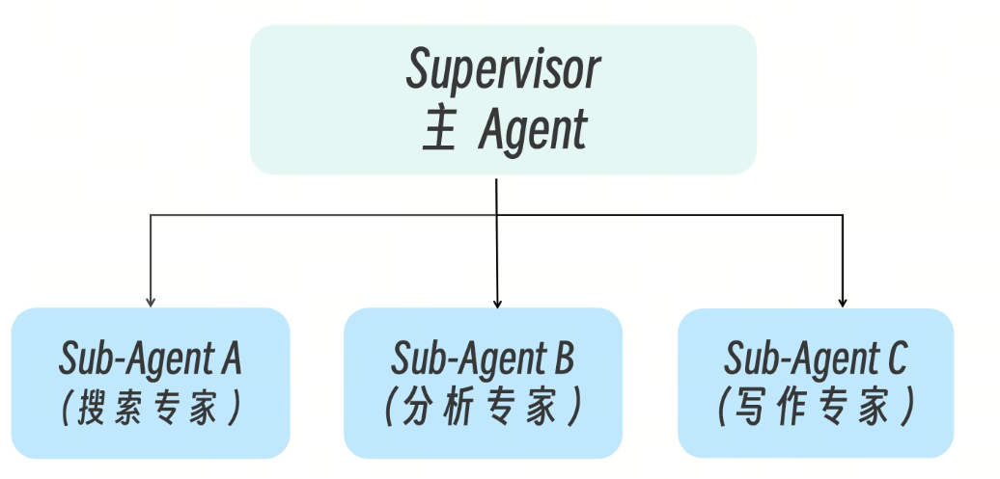
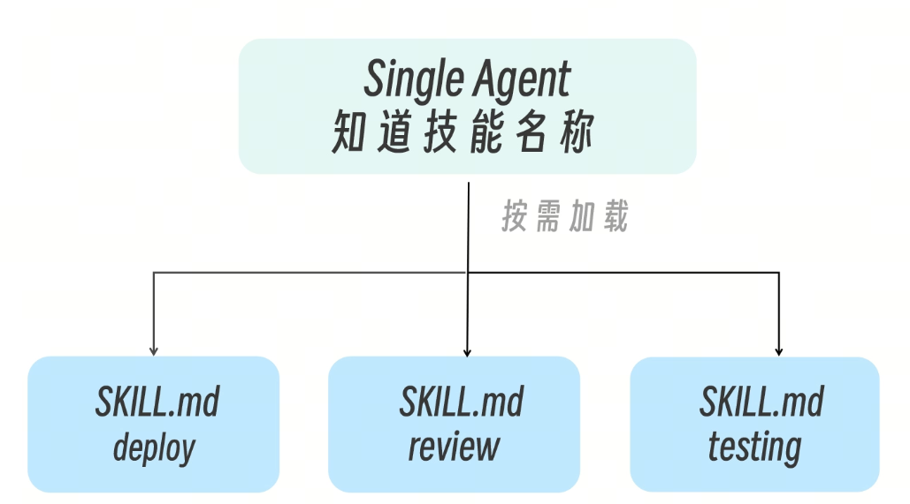
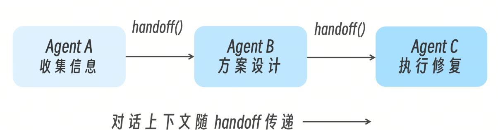
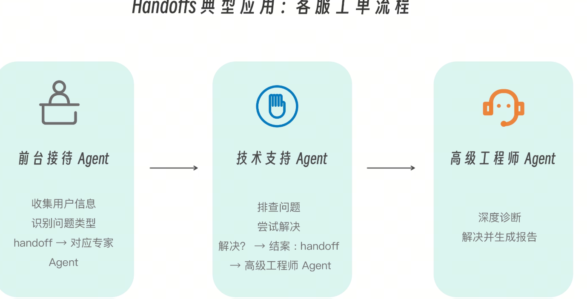
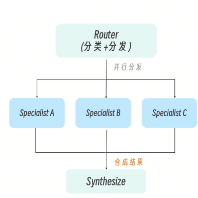

何时该升级到多 Agent？

先从单 Agent 起步，优先通过引入工具扩展能力； 只有当系统确实触及单 Agent 的架构边界时， 才考虑采用多 Agent 的设计模式

每增加一个 Agent，你就增加了一层调试复杂度、一份 token 成本、和一个潜在的失败点。但当你的任务真的跨越了单 Agent 的能力边界时，正确的多 Agent 架构会带来巨大性能提升——Anthropic 的多 Agent 研究系统在内部评测中，比单 Agent Claude Opus 4 性能提升了 90.2%。

你的场景真的需要多 Agent 吗？

# 两个核心触发条件

## 信号一：上下文管理挑战
当多个能力领域的专业知识无法舒适地塞进单一 prompt 中时——你需要策略性地分发上下文，而不是把所有东西堆在一起。当 Agent 的上下文窗口接近满载时，模型在任务完成上的表现会显著下降，进入所谓的  dumb zone（迟钝区）

## 信号二：分布式开发需求
当多个团队需要独立拥有和维护各自的 Agent 能力时。比如安全团队维护审计 Agent，测试团队维护测试 Agent，各团队可以独立迭代而不互相干扰。

```
单 Agent 的困境：
┌─────────────────────────────────────────────────┐
│ System Prompt:                                  │
│   - 你是代码专家（200行指令）                    │
│   - 你也是测试专家（150行指令）                  │
│   - 你还是安全审计专家（180行指令）              │
│   - 你同时是文档撰写专家（100行指令）            │
│   ...                                           │
│   Token 爆炸，模型注意力分散                     │
└─────────────────────────────────────────────────┘
```

系统梳理 Sub-Agent 到 Multi-Agent 的四种核心设计模式，并给出性能、成本、可控性三个维度的决策框架

# 四种核心设计模式

## 模式一：Sub-Agents（子代理委派 / 集中式编排）
ub-Agents 的核心设计思想是一个 Supervisor Agent 充当老板，将任务分解后委派给专门的 Sub-Agent。每个 Sub-Agent 解决一个特定的任务。



在 Sub-Agent 架构中，上下文隔离能力非常强，每个 Sub-Agent 都拥有独立的上下文窗口，从根本上避免了信息相互污染。Sub-Agent 本身通常设计为无状态组件，专注于完成被委派的单次任务，而整体对话状态与流程控制则由 Supervisor 统一维护。这种结构天然支持并行执行，多个 Sub-Agent 可以同时展开工作，从而显著提升复杂任务的吞吐效率。用户并不直接与各个 Sub-Agent 交互，而是始终通过 Supervisor 间接沟通，由其负责任务拆解、结果汇总与最终输出。在调试和可控性层面，该模式的复杂度处于中等水平，工程上需要重点关注 Supervisor 的委派逻辑与决策路径，以便在出现偏差时能够准确定位问题来源。

在 Anthropic 的真实生产系统中，Research 功能采用的就是一种典型的 Sub-Agent 架构。Anthropic 的 Research 功能采用了经典的 Sub-Agent 模式：LeadResearcher（Claude Opus 4）分析查询、制定策略并行派出  3-5 个 SubAgent（Claude Sonnet 4），各自独立搜索每个 SubAgent 执行 3+ 个并行工具调用CitationAgent  处理引用和来源归属结果汇聚回 LeadResearcher 综合输出

为了在不同复杂度任务中控制资源消耗，Anthropic 在 Prompt 层引入了明确的“努力分配规则（Effort Scaling）”，例如对简单问题仅启用单个 Agent 和有限次数的工具调用，而在复杂研究场景下则调度更多 Sub-Agent 全面并行执行

## 模式二：Skills（技能 / 渐进式能力加载）

LangChain 把 Skills 也视为一种多智能体模式。其实此时仍然是单个 Agent（或 SubAgent），但通过 SKILL.md 文件（或类似配置）实现能力的渐进式加载。Agent 一开始只知道技能的名称和描述，当判断需要某个技能时，才加载完整的指令。

这是一种“准多 Agent”方案——用更轻量的 prompt 切换替代完整的 Agent 切换。



在 Skills 模式下，系统仍然由单一 Agent 负责全部推理与执行，所有技能共享同一个上下文窗口，因此在上下文隔离能力上相对较弱，但换来的好处是对话状态可以自然连续地保留在同一个 Agent 内部，无需额外的状态协调机制。

由于不存在多个 Agent 的并行调度，整体执行过程以顺序方式展开，并行能力相对有限，但在多数交互式场景下已经足够。用户始终与同一个 Agent 直接交互，交互路径最短，体验也最为流畅。

```
.claude/skills/           
├── deploy/
│   └── SKILL.md          # 部署技能的完整指令
├── review-pr/
│   └── SKILL.md          # PR 审查技能的指令
└── database-migration/
    └── SKILL.md          # 数据库迁移技能的指令

```
```
Sub-Agent：独立的上下文 → 适合大量信息过滤
Skill：共享的上下文 → 适合需要连贯对话的场景
```
## 模式三：Handoffs（交接 / 状态驱动的 Agent 切换）

Handoffs 的核心思想是活跃的 Agent 根据对话状态动态切换。Agent A 完成自己的阶段后，通过调用  handoff()  工具将控制权（和上下文）传递给 Agent B。



在 Handoffs 模式下，不同 Agent 之间通过显式的交接机制完成角色切换，上下文并非整体共享，而是可以根据需要选择性地传递。这样能在保持必要信息连续性的同时，避免无关内容的扩散。系统状态在 Agent 切换过程中被持续保存和传递，使得多阶段流程能够自然推进而不会丢失关键信息。由于各阶段之间存在明确的先后依赖关系，该模式采用严格的顺序执行，不支持并行展开。对用户而言，Agent 的切换过程通常是透明的，用户可以像与单一 Agent 交互一样完成整个流程。在工程调试层面，这种模式的复杂度处于中等水平，需要重点关注状态在不同阶段之间的流转路径，以便在出现异常时准确定位问题发生的环节。

Handoffs 的典型应用是客服工单流程：



： Handoffs 是一种“工程模式”，不是一个“框架特性”。我们来看看在 Claude Code 中实现 Handoffs 的三大工程要素。1. 明确的阶段状态（State）—— 你需要显式定义流程阶段。2. 每个阶段都是一个“角色约束的 Agent 视角”，比如：阶段一：信息收集（前台接待）；阶段二：技术诊断；阶段三：执行与修复。3. 显式的阶段完成条件（Handoff Trigger）。这是 Handoffs 能稳定运行的核心。每个阶段都必须有完成条件（Exit Criteria）， 否则就会“卡在阶段里出不来”。

Handoffs 示例：

```
系统规则：
你将按照以下阶段顺序工作：
1. 信息收集（intake）
2. 问题诊断（diagnosis）
3. 解决方案（resolution）

当前阶段：intake

规则：
- 只能提问
- 不要给解决方案
- 当信息完整时，明确声明：`进入 diagnosis 阶段`
```
Handoffs 模式最适用于具有明确阶段划分的流程型场景，例如从信息收集到问题诊断再到解决方案输出的多阶段客服或工单系统，尤其适合那些需要在满足前置条件后才能逐步解锁能力的业务流程。在多轮对话中，该模式能够自然地完成角色切换而不打断用户体验，是对话连续性要求最高的架构选择。

## 模式四：Router（路由器 / 并行分发与合成）
Router 模式的核心在于对输入进行语义拆分与职责分流。系统首先由 Router 对用户请求进行分类和分解，然后将子查询并行分发给各自负责的专业 Agent，最后再将多个结果统一合成为一个对用户友好的响应。


这种架构天然适合处理跨多个知识域或数据源的查询，例如在企业知识库场景中，用户一次提问可能同时涉及政策文档、业务数据和实时指标，Router 可以将“退货政策”交由政策文档 Agent 处理，将“销售数据”交由数据分析 Agent 处理，并在上层完成结果整合后统一返回。

```
用户提问：「我们的退货政策是什么？最近的销售数据如何？」

Router 分解：
├── 查询 1：退货政策 → 政策文档 Agent
├── 查询 2：销售数据 → 数据分析 Agent
└── 合成结果 → 统一回答
```

在 Claude Code 中，Router 通常以下面三种形态之一存在。主 Agent 中的一段路由决策逻辑（最常见）一个可调用的 Tool（Router-as-Tool）一个轻量的 Sub-Agent（只负责分类，不负责执行）

本质都是同一件事：先判断“这是什么问题”，再决定“交给谁处理”。Router 模式的工程优势在于极强的并行能力和清晰的职责边界，各处理分支彼此独立、上下文完全隔离，既有利于扩展，也便于独立观测和调试。其代价在于该模式通常是无状态的，无法充分利用历史对话上下文来减少重复计算；在需要连续对话的场景中，往往需要将 Router 作为一个工具嵌入到有状态的主 Agent 中，以在并行效率和对话连续性之间取得平衡。

可控性和工程调整的角度，Anthropic 也分享了它们在将多 Agent 系统推向生产时，遇到了四个关键挑战。状态性带来的复杂度。Agent 在多轮对话中维持状态，微小的失败会级联放大。一个 SubAgent 的轻微错误可能导致后续所有 Agent 的行为偏离。这种情况的应对策略是在每个 Agent 的输出端设置“检查点”，验证输出质量再传递。非确定性调试。Agent 的动态决策使得传统的日志分析不够用。你需要完整的生产链路追踪（Production Tracing），记录每个 Agent 的输入、决策过程和输出。可以引入 Observability 工具，记录完整的 Agent 调用链。部署复杂度。多 Agent 系统的部署不能简单地“停机更新”。因为 Agent 可能正在执行中，打断它会导致不可预测的行为。可以考虑采用新旧版本共存迁移的渐进式部署策略（Rainbow Deployment），让旧版本的 Agent 完成当前任务后自然退出，新版本接管后续请求。同步瓶颈。当前大多数 SubAgent 是同步执行的，SubAgent 之间的信息流受限。未来的方向是打通异步执行 + Agent 间消息通道，让 SubAgent 在执行过程中可以相互共享发现

```
你的任务需要多 Agent 吗？
├─ 单一领域、工具 < 5 个、上下文 < 50K tokens
│  └─→ 不需要。用单 Agent + 好的 prompt 即可
│
├─ 单一领域、但工具 > 10 个
│  └─→ 考虑 Skills 模式（渐进式能力加载）
│
├─ 多领域、各领域需要独立上下文
│  └─→ 使用 Sub-Agents 模式
│
├─ 需要多步骤状态流转（如客服工单流程）
│  └─→ 使用 Handoffs 模式
│
└─ 需要跨多个数据源并行查询
   └─→ 使用 Router 模式
```


第一阶段：单 Agent + Tools适合大多数初期场景。不要过早引入多 Agent。

第二阶段：单 Agent + Skills当工具数量增多、prompt 变得臃肿时，用 Skills 实现渐进式加载。

第三阶段：Supervisor + Sub-Agents当不同领域需要独立的上下文空间和专业知识时引入。

第四阶段：混合架构成熟系统中，不同类型的任务流可能采用不同的模式。Router 处理分类，Sub-Agent 处理并行研究，Handoff 处理顺序流程。

从单一 Agent 到复杂智能体系统设计的一系列黄金法则：

```
1. 从单 Agent 开始 → 只在遇到明确瓶颈时才升级
2. 先加工具，再加 Agent → Tools 是最小的扩展单位
3. 选对模型 > 堆更多 token → 升级模型的效果超过翻倍预算
4. 上下文隔离是核心价值 → 多 Agent 的第一价值不是并行，是隔离
5. Token 成本要求高价值任务 → 不是所有场景都值得多 Agent
```
从 Sub-Agent 到 Multi-Agent，不是一个线性的“升级”过程，而是一个根据任务特征选择合适架构的工程决策。最好的架构不是最复杂的架构，而是恰好满足需求的最简架构。当你能用一个 Agent + 几个好 Tool 解决问题时，就不需要引入 Supervisor + SubAgents 的复杂度。但当任务的并行性、专业性和上下文管理需求确实超越了单 Agent 的能力边界时，正确的多 Agent 架构会带来显著的质量提升。