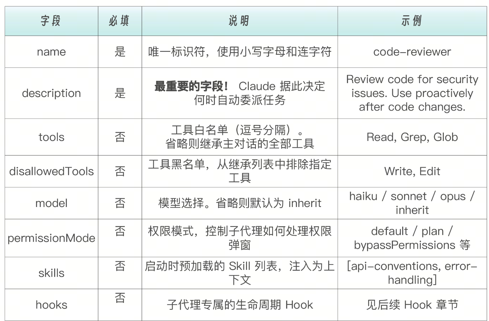
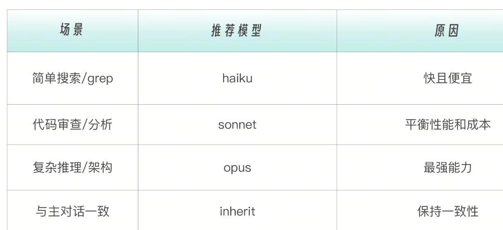
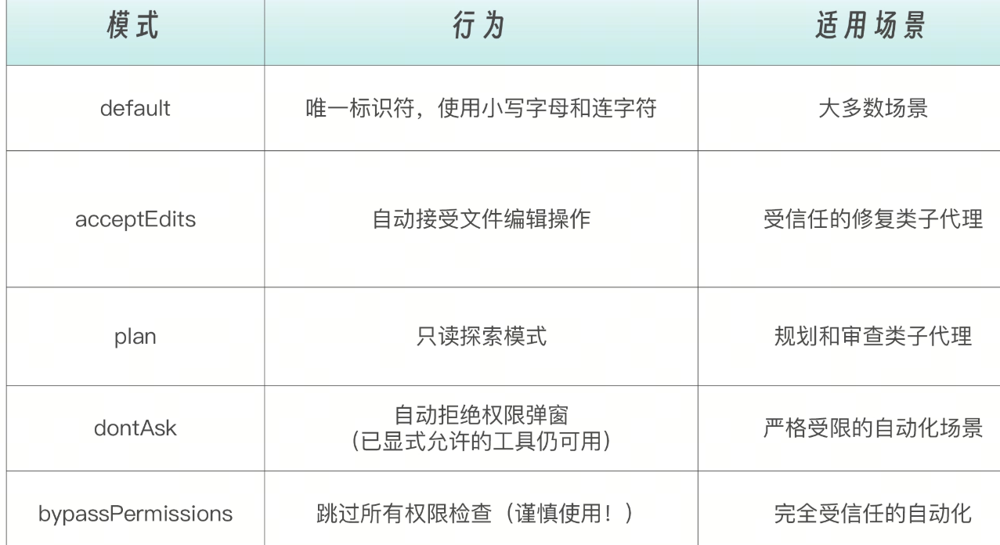
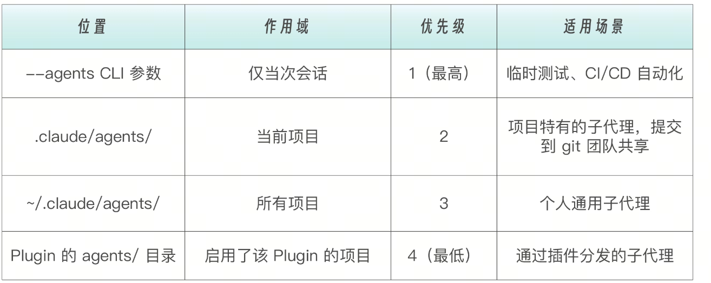

# 为什么要有 Sub-Agents？

某天，你让 Claude Code 帮你跑一个测试套件，结果输出了 500 行日志；然后你想让它分析一下代码结构，又输出了 200 行；接着你想让它改一个 bug……这时候，你的对话上下文已经被各种“中间过程”塞满了，真正重要的信息被淹没在茫茫的输出海洋里。其实，究其根本。如果你觉得 Claude Code 越用越“健忘”，并不是模型退化了，而是你的对话上下文，已经被一次次中间过程污染了。这正是子代理要解决的核心问题。


只有子代理，才在系统层面天然拥有一个独立的上下文窗口。不是因为它“聪明”，不是因为它“更强”， 而是因为它是 Claude Code 里唯一一个，结构上允许“执行完即丢弃”的东西


到底什么是“上下文污染”？在前面的现象里，上下文里充斥着这些内容。跑测试 → 500 行日志。搜索代码 → 200 行 grep。分析错误 → 一堆中间推理过程……这些信息有一个共同特征：它们对“当下执行”是必要的，但对“后续决策”是噪声。

子代理，通过上下文隔离，让专业的 Agent 做专业的事儿，不是为了让 Claude 做得更多， 而是为了让 Claude 记得更少，但记得对。

代理相当于一个“专职小助手”，带着自己的规则、工具权限、上下文窗口，去完成某一类任务，然后把“结果摘要”带回来。你可以把它理解成：把一个大脑拆成多个岗位角色，每个岗位只做一件事，并且有明确的权限边界。

那肯定要先有主 Agent，Claude Code 的主 Agent 在何处？其实，主 Agent 就是你当前操作的主对话。而主对话 vs 子代理，就是老板和员工的关系。

# 子代理的核心价值

子代理的工程价值，本质上就是三件事：隔离、约束、复用，下面我们分别说说。隔离，解决的是上下文污染问题——大量对当前执行有用、但对后续决策毫无价值的日志、搜索结果和中间推理，不应该进入主对话的长期记忆；子代理天然拥有独立上下文，执行完即丢弃，只把结论带回来，让 Claude 记得更少、但记得对。

示例: 

```
主对话的上下文：
┌─────────────────────────────────────────┐
│ 用户：帮我分析一下这个 bug              │
│ Claude：好的，让我看看...               │
│ [子代理去执行，产生 500 行日志]         │
│ [子代理返回：发现 3 个相关文件]         │
│ Claude：我发现问题在这三个文件...       │
└─────────────────────────────────────────┘

子代理的上下文（独立的，执行完就释放）：
┌─────────────────────────────────────────┐
│ 任务：查找 bug 相关文件                 │
│ [搜索输出 500 行日志]                   │
│ [分析过程...]                           │
│ 结论：3 个相关文件                      │
└─────────────────────────────────────────┘
```

主对话只看到子代理所返回的结论，不需要承载 500 行的搜索过程。这意味着你的对话不会因为一次大搜索就把 token 配额用光，重要的讨论内容不会被中间输出淹没，Claude 在后续对话中能更好地“记住”关键信息。约束，解决的是行为不可控问题——通过工具权限边界，把“我希望你别这么做”变成“你物理上做不到”，让代码审查只能读、修 bug 才能写，角色职责不再依赖提示词自觉。

子代理可以有精确的工具权限控制。

```
# 只读型子代理（代码审查）
tools: Read, Grep, Glob
# 它只能看，不能改任何东西

# 开发型子代理（bug 修复）
tools: Read, Write, Edit, Bash
# 它可以读写文件和执行命令

# 研究型子代理（技术调研）
tools: Read, WebFetch, WebSearch
# 它可以读本地文件和搜索网络
```

复用，解决的是经验无法沉淀的问题——当子代理被定义成文件、放进版本控制后，好的使用方式就从一次性对话，变成了可共享、可迭代的工程资产。子代理的配置保存在文件中，有这样几个好处。

版本控制：放进 git，团队共享。跨项目复用：好用的配置可以复制到其他项目。渐进优化：根据实际使用情况不断调整 prompt，持续优化改善。

```
.claude/agents/
├── test-runner.md      # 测试运行专员
├── code-reviewer.md    # 代码审查专员
├── log-analyzer.md     # 日志分析专员
└── bug-fixer.md        # Bug 修复专员
```

# 内置子代理：开箱即用的“好员工”

你可能已经在使用子代理，只是没意识到而已。Claude Code 内置了一系列子代理（以后也许会有更多），当你问 Claude——“给我解释解释这个 Github 代码库”时，在不知不觉间，Claude Code 就会自动调用内置子代理。

# Explore 子代理

Explore 子代理负责“翻项目、找位置”，专注快速只读搜索，把成百上千行 grep 和分析过程吞进去，只告诉你结论在哪里。

# Plan 子代理

Plan 子代理负责“动手前先想清楚”，在真正修改代码之前，收集上下文、梳理依赖、生成实施路径，避免一上来就盲目修改。

# General-purpose 子代理

General-purpose 子代理则是“能探索、能修改、能推进”的全能型员工，适合需要多步骤协作的复杂任务。

# 什么时候该用子代理？

需要提醒你的事，并不是所有任务都值得动用子代理。子代理的价值，不在于“能不能用”，而在于“该不该用”。一个最直观的判断标准是：主对话到底需不需要承载执行过程本身。

第一类非常适合用子代理的，是高噪声输出的任务。这类任务的共同特点是：执行过程中会产生大量中间信息，但主对话真正关心的，往往只有一个结论

例如跑一次测试会输出几百行日志，但你只想知道通过还是失败；扫描日志和错误栈时，真正有价值的可能只是一两条关键错误；在整个代码库里做搜索，最终只需要知道相关文件在哪里；生成一份长报告，主对话只需要摘要。

这些场景中，执行过程本身就是噪声，用子代理把过程隔离起来，只把结论带回来，是最自然、也最干净的做法。

第二类适合用子代理的，是角色边界必须非常明确的任务。有些事情，你只希望 Claude “看”，而不希望它“动手”；有些操作，只能在特定目录、特定范围内发生；还有一些敏感操作，本身就需要和其他任务隔离开来。

如果没有子代理，这些约束只能靠提示词和使用者的心理预期维持。而一旦通过子代理定义工具权限，边界就从不稳定的“希望如此”，变成了明确的“系统级约束”。没有写权限，就无法修改文件；没有执行权限，就无法运行命令。


第三类适合用子代理的，是可以并行展开的研究型任务。当你需要同时调研认证逻辑、数据库设计和 API 接口，或者对比几种技术方案、从多个视角分析同一个问题时，这些探索之间往往是相互独立的。与其在主对话里来回切换，不如让多个子代理各自去完成自己的探索，再把结果汇总回来。子代理在这里的价值，不只是隔离上下文，更是天然的并行加速器。

第四类适合用子代理的，是可以拆成清晰阶段的流水线式任务。比如先定位代码位置，再做代码审查，然后进行修改，最后跑测试验证。

这类任务的关键在于每一个阶段的目标、权限和输出都是明确的。用子代理把每一段责任固定下来，不但让流程更清晰，也让每一步的上下文更加干净。这不是为了复杂化流程，而是为了避免不同阶段的信息互相污染。

当然，也有一些情况并不适合使用子代理。如果任务需要频繁来回确认需求、不断调整方向，那子代理这种“派出去干活再回来汇报”的模式反而会拖慢节奏；如果任务的各个阶段高度耦合，每一步都强依赖上一阶段的详细过程，那强行隔离上下文只会增加认知负担；还有非常简单的小任务，启动子代理本身就有开销，直接在主对话中完成，反而更高效。

子代理不能再嵌套调用子代理。也就是说，你的 code-reviewer 子代理不能在执行过程中再派出一个 security-scanner 子代理。

所有编排必须由主对话完成：如果你需要“先审查再修复”，必须由主对话依次调用两个子代理，而不是让第一个子代理去调用第二个

流水线的“调度中心”只有一个：就是主对话本身

如果需要在子代理内复用知识：用  skills  字段预加载（而非再嵌套一个子代理）

# 子代理配置文件详解

子代理使用  Markdown + YAML frontmatter  格式：

```---
name: code-reviewer
description: Review code for security issues and best practices. Use after code changes.
tools: Read, Grep, Glob
model: sonnet
---

你是一个代码审查专家。

当被调用时：

1. 首先理解代码变更的范围
2. 检查安全问题
3. 检查代码规范
4. 提供改进建议

输出格式：
## 审查结果
- 安全问题：[列表]
- 规范问题：[列表]
- 建议：[列表]
```

rontmatter 部分（---  之间）定义子代理的元数据和配置，下方的 Markdown 正文就是子代理的系统提示词（system prompt）。子代理只会收到这段系统提示词和基本环境信息（如工作目录），不会继承主对话的完整系统提示词。


# description 的设计艺术

description  字段决定了 Claude 何时自动调用你的子代理——这是配置中最重要的设计决策。

```# 写的太模糊，Claude 不知道什么时候该用它
description: A code reviewer

# 好的 description：说明做什么 + 什么时候用
description: Review code changes for quality, security vulnerabilities, and best practices. Use proactively after code is modified or when user asks for code review.

```

优点：说明了做什么（审查代码质量、安全、规范）和什么时候用（代码修改后，或用户请求时）。“Proactively” 这个关键词会鼓励 Claude 在合适的时机主动委派任务。


tools vs disallowedTools：白名单与黑名单控制子代理能使用哪些工具有两种方式：
```
# 方式一：白名单 (tools) — "只能用这些"
# 适合：需要严格限制的场景（如只读审查）
tools: Read, Grep, Glob

# 方式二：黑名单 (disallowedTools) — “继承所有，但排除这些”
# 适合：需要大部分工具但排除少数危险工具的场景
disallowedTools: Write, Edit
```
不要同时使用两者——选一种即可。
工具权限应遵循最小权限原则——只开放必要的工具，能用 Read 完成的任务，就不要给 Edit。以下是根据用途划分的典型工具组合：

```
只读型（审计/检查）         研究型（信息收集）         开发型（读写改）
├── Read                    ├── Read                   ├── Read
├── Grep                    ├── Grep                   ├── Write
└── Glob                    ├── Glob                   ├── Edit
                            ├── WebFetch               ├── Bash
                            └── WebSearch              ├── Glob
                                                       └── Grep
```

# model：模型选择与默认值


# permissionMode：权限模式
permissionMode  控制子代理在执行过程中遇到需要权限的操作时如何处理。子代理会继承主对话的权限上下文，但可以通过此字段覆盖行为：


举个例子，如果你希望子代理能跑  git diff  但绝不能修改文件，可以这样配置：
```
---
name: code-reviewer
tools: Read, Grep, Glob, Bash
permissionMode: plan          # 强制只读模式，即使有 Bash 也无法写入
---
```
permissionMode: plan  是系统级的只读保障。

# 子代理的存放位置与优先级

子代理可以被设置为不同的作用域。当多个作用域存在同名子代理时，高优先级的会覆盖低优先级的。


子代理可以被设置为项目级或用户级，项目级（仅当前项目可用）存放位置如下所示，适合项目特有的角色，比如针对特定框架的测试运行器

```
your-project/
└── .claude/
    └── agents/
        ├── test-runner.md
        └── code-reviewer.md

```
用户级（所有项目可用）子代理适合通用角色，比如日志分析器、通用代码审查器。

```
~/.claude/
└── agents/
    ├── general-reviewer.md
    └── log-analyzer.md
```

# 创建子代理的三种方式

方式一：交互式创建（推荐新手使用）。在 Claude Code 中输入  /agents

```
步骤 1：输入 /agents
步骤 2：选择 "Create new agent"
步骤 3：选择存放位置（User-level 或 Project-level）
步骤 4：选择 "Generate with Claude" 并描述功能
步骤 5：选择需要的工具
步骤 6：选择模型
步骤 7：保存
```
方式二：手写配置文件，直接创建  .claude/agents/your-agent.md  文件。其优势是更精细的控制，方便版本管理，可以从其他项目复制。

方式三：CLI 参数临时创建，通过  --agents  参数，可以在启动 Claude Code 时传入 JSON 格式的子代理定义。这种方式创建的子代理仅在当前会话中存在，不会保存到磁盘。这种方式特别适合 CI/CD 自动化时在流水线中临时创建任务专用的子代理。


# 子代理的运行模式

代理不只是“派出去，等回来”这么简单。了解它的运行模式，能让你更高效地使用。子代理可以在前台或后台运行

claude 会根据任务自动选择前台或后台。你也可以手动控制。对 Claude 说 “run this in the background”正在运行的前台子代理可以按  Ctrl+B  切换到后台
启动前，Claude Code 会预先请求子代理可能需要的所有权限——因为后台运行时无法弹出交互式确认。如果后台子代理因权限不足而失败，你可以恢复它到前台重试。

每个子代理执行完成后，Claude 会自动收到它的  agent ID。如果你需要在之前的子代理基础上继续工作，可以让 Claude 恢复（Resume）它：

