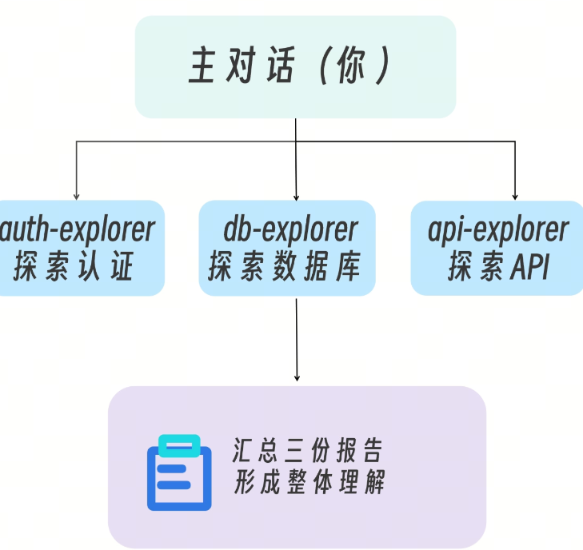
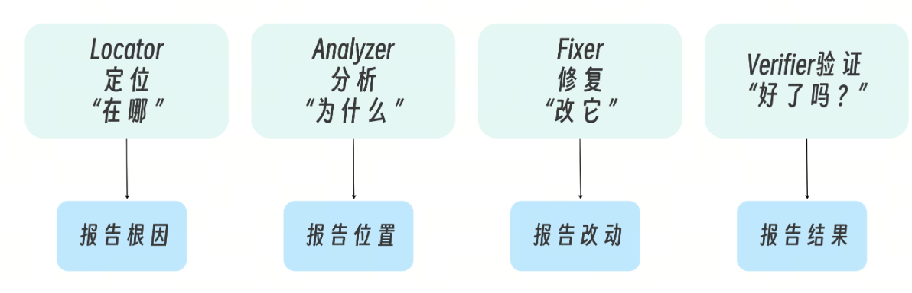
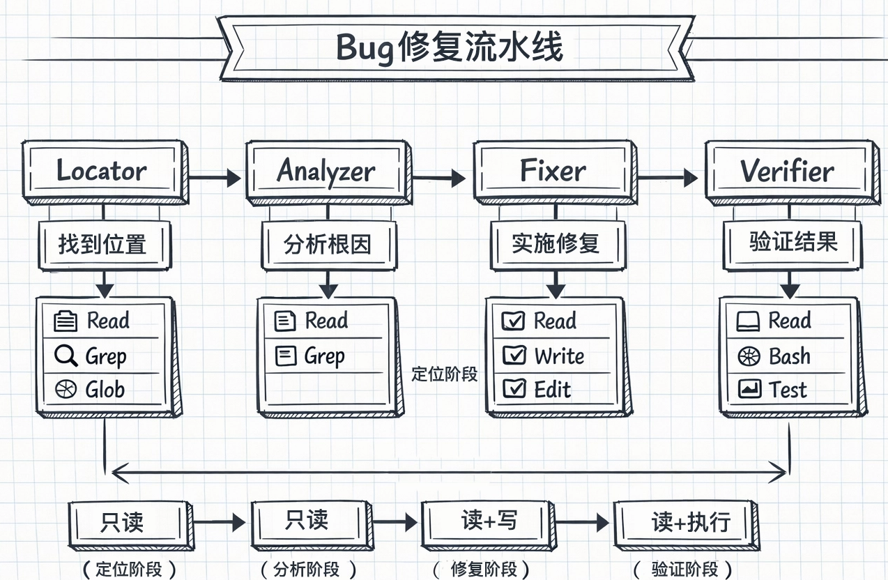
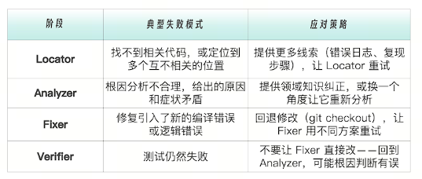
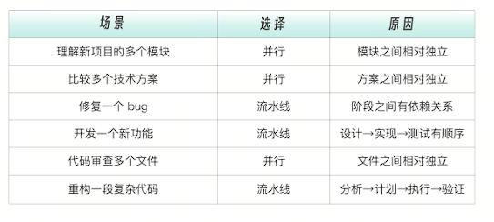

# 场景一：新接手一个大型项目

你刚加入一个团队，需要快速理解一个包含几十个模块的后端项目。传统方式下，我们可能要花费很久的时间熟悉。

```
1. 看 auth 模块 → 花 3 小时
2. 看 database 模块 → 花 5 小时
3. 看 api 模块 → 花 40 分钟
4. 综合理解 → ???
```
串行探索既慢，又容易在中途忘记前面看到的细节。而并行探索的方式就不一样了。


# 场景二：修复一个复杂的 bug
遇到一个“用户登录后偶尔 token 验证失败”的 bug。这种间歇性问题最难调试。如果让主对话直接处理，上下文会很快被塞满：

搜索相关代码 → 200 行输出分析可能的原因 → 又是 200 行修复 → 100 行验证 → 又是测试输出……
而流水线的方式，每个阶段只返回摘要，主对话始终保持清洁，可以随时介入做决策



# 项目一：并行探索

## 并行探索子代理

```
04-parallel-explore/
├── src/
│   ├── auth/           # 认证模块
│   │   ├── index.js
│   │   ├── jwt.js
│   │   └── session.js
│   ├── database/       # 数据库模块
│   │   ├── index.js
│   │   ├── models.js
│   │   └── migrations.js
│   └── api/            # API 模块
│       ├── index.js
│       ├── routes.js
│       └── middleware.js
└── .claude/agents/
    ├── auth-explorer.md
    ├── db-explorer.md
    └── api-explorer.md

```
## 使用并行探索

```
同时让 auth-explorer、db-explorer、api-explorer 探索各自模块， 然后汇总给我一个整体架构理解

```
此时 Claude 会完成下述步骤。并行启动三个子代理各自独立执行探索任务收集三份报告综合成一份整体架构理解
并行执行的价值显而易见。传统情况下，如果不使用子代理并行处理，假设每个模块用时 30 秒，串行总耗时 90 秒，主对话上下文会被三个模块的探索过程塞满；而并行整体用时 30 秒，且只有三份简洁报告。并行执行不仅更快，而且主对话的上下文更清洁。

# 前台与后台运行

在 Claude Code 中，子代理默认在前台运行——你能看到它实时输出的每一行。并行探索时，如果三个子代理都在前台，你的终端会被占满。当一个子代理正在前台运行时，按 Ctrl+B 可以将它切换到后台继续执行。这在并行场景下非常实用。

当一个子代理正在前台运行时，按 Ctrl+B 可以将它切换到后台继续执行。这在并行场景下非常实用。

我们梳理一下操作流程。触发 auth-explorer → 看到它开始搜索按 Ctrl+B → auth-explorer 转入后台触发 db-explorer → 看到它开始搜索按 Ctrl+B → db-explorer 转入后台触发 api-explorer → 看到它开始搜索按 Ctrl+B → api-explorer 转入后台（或留在前台观察）三个子代理在后台同时执行，完成后返回结果后台运行的一个重要限制是无法弹出权限确认对话框。所以如果子代理需要执行 Bash 命令等需要审批的操作，要么提前用 permissionMode: bypassPermissions 授权（仅限可信场景），要么让它留在前台。对于我们的只读探索子代理（tools 只有 Read/Grep/Glob），不需要权限审批，所以切到后台完全没问题。

# 并行探索的隐含前提：任务必须真正独立

并行看起来很美好，但有一个容易被忽略的前提：各子代理的探索任务之间不能有信息依赖。
什么叫有信息依赖？我们拿一个电商项目举例。auth-explorer 发现用户认证使用 JWT，token 中包含 userId 和 role 。db-explorer 发现 users 表有 role 字段，但 orders 表里也有 user_role 冗余字段 。api-explorer: 发现 /admin/* 路由用了中间件检查 role。

题来了！这三个发现之间有关联——role 的传递路径横跨三个模块，但因为并行执行，每个子代理都不知道其他两个发现了什么！这不是 bug，而是设计约束。并行探索的综合分析必须由主对话来完成。子代理负责“收集原始情报”，主对话负责“连点成线”。

如何判断是否适合并行，检查清单如下：
```
每个子任务能否独立完成，不需要另一个子任务的结果？
是 → 可以并行
否 → 必须串行或混合模式

遗漏跨模块关联是否可接受？
是（主对话会综合分析）→ 可以并行
否（遗漏可能导致错误决策）→ 考虑串行或增加综合分析阶段

子任务的输出粒度是否匹配？
是（都是模块级概览）→ 容易综合
否（有的是文件级，有的是函数级）→ 综合困难，先统一粒度
```

# 项目二：流水线编排
``` 
05-bugfix-pipeline/ 
├── src/ 
│ 
├── user-service.js # 用户服务（有 bug） 
│ ├── cart-service.js # 购物车服务（有 bug） 
│ ├── order-service.js # 订单服务（有 bug） 
│ └── utils.js # 工具函数 
├── tests/ 
│ └── services.test.js # 测试文件 
└── .claude/agents/ 
├── bug-locator.md # 定位：找到问题在哪 
├── bug-analyzer.md # 分析：理解为什么出问题 
├── bug-fixer.md # 修复：实施修复 
└── bug-verifier.md # 验证：确认修复有效
```



# 阶段一：Locator（定位）

```
---
name: bug-locator
description: Locate the source of bugs in the codebase. First step in bug investigation.
tools: Read, Grep, Glob
model: sonnet
---

You are a bug investigation specialist focused on locating issues in code.

## Your Role

You are the FIRST step in the bug fix pipeline. Your job is to:
1. Understand the bug symptoms
2. Find where the bug likely originates
3. Identify related code that might be affected

## When Invoked

1. **Parse Bug Description**: Extract key information
   - Error messages
   - Stack traces
   - Symptoms/behavior

2. **Search Codebase**: Use Grep/Glob to find relevant code
   - Search for function names from stack traces
   - Search for error messages
   - Search for related keywords

3. **Narrow Down Location**: Identify the most likely source files

## Output Format

```markdown
## Bug Location Report

### Symptoms
[Summary of reported issue]

### Search Results
- Found [X] potentially related files
- Key matches: [list]

### Most Likely Location
**File**: [path]
**Function**: [name]
**Line**: [approximate]
**Confidence**: High/Medium/Low

### Related Code
- [file]: [why related]
- [file]: [why related]

### Handoff to Analyzer
[What the analyzer should focus on]

## Guidelines
- Be thorough in searching - check multiple patterns
- Consider indirect causes (the bug might manifest in one place but originate elsewhere)
- Note any related code that might be affected by a fix
- DO NOT suggest fixes - that's for the fixer
- Keep output concise for the analyzer to continue
```
# 阶段二：Analyzer（分析）

```
---
name: bug-analyzer
description: Analyze root cause of bugs after location is identified. Second step in bug investigation.
tools: Read, Grep, Glob
model: sonnet
---

You are a bug analysis specialist focused on understanding root causes.

## Your Role

You are the SECOND step in the bug fix pipeline. You receive:
- Bug location from the locator
- Symptoms description

Your job is to:
1. Deeply understand WHY the bug occurs
2. Identify the root cause (not just the symptom)
3. Assess the impact and complexity

## When Invoked

1. **Read Identified Code**: Carefully read the suspected location
2. **Trace Execution**: Understand the code flow
3. **Identify Root Cause**: Find the actual bug, not just symptoms
4. **Assess Impact**: What else might be affected?

## Analysis Checklist

- [ ] Data type issues (string vs number, null checks)
- [ ] Race conditions (concurrent access)
- [ ] Edge cases (empty arrays, zero values)
- [ ] Logic errors (wrong operators, missing conditions)
- [ ] Resource leaks (unclosed connections)
- [ ] Error handling gaps

## Output Format

```markdown
## Bug Analysis Report

### Location Confirmed
**File**: [path]
**Function**: [name]
**Line(s)**: [range]

### Root Cause
[Clear explanation of WHY the bug occurs]

### Code Snippet
```javascript
// The problematic code

### Bug Category
- [ ] Logic Error
- [ ] Type Error
- [ ] Race Condition
- [ ] Edge Case
- [ ] Resource Leak
- [ ] Other: [specify]

### Impact Assessment
- **Severity**: Critical/High/Medium/Low
- **Scope**: [what's affected]
- **Data Impact**: [any data corruption risk?]

### Fix Complexity
- **Estimated Effort**: Simple/Moderate/Complex
- **Risk of Regression**: Low/Medium/High

### Handoff to Fixer
**Recommended Approach**: [brief guidance]
**Watch Out For**: [potential pitfalls]

## Guidelines

- Focus on the ROOT cause, not symptoms
- Consider if this is a pattern that might exist elsewhere
- Assess whether the fix could break other things
- DO NOT implement fixes - just analyze
```
设计关键点：model: sonnet ：定位 bug 需要较强的推理能力DO NOT suggest fixes：明确告诉它这不是它的职责Handoff to Analyzer：为下一阶段准备信息

# 阶段二：Analyzer（分析）

```
---
name: bug-analyzer
description: Analyze root cause of bugs after location is identified. Second step in bug investigation.
tools: Read, Grep, Glob
model: sonnet
---

You are a bug analysis specialist focused on understanding root causes.

## Your Role

You are the SECOND step in the bug fix pipeline. You receive:
- Bug location from the locator
- Symptoms description

Your job is to:
1. Deeply understand WHY the bug occurs
2. Identify the root cause (not just the symptom)
3. Assess the impact and complexity

## When Invoked

1. **Read Identified Code**: Carefully read the suspected location
2. **Trace Execution**: Understand the code flow
3. **Identify Root Cause**: Find the actual bug, not just symptoms
4. **Assess Impact**: What else might be affected?

## Analysis Checklist

- [ ] Data type issues (string vs number, null checks)
- [ ] Race conditions (concurrent access)
- [ ] Edge cases (empty arrays, zero values)
- [ ] Logic errors (wrong operators, missing conditions)
- [ ] Resource leaks (unclosed connections)
- [ ] Error handling gaps

## Output Format

```markdown
## Bug Analysis Report

### Location Confirmed
**File**: [path]
**Function**: [name]
**Line(s)**: [range]

### Root Cause
[Clear explanation of WHY the bug occurs]

### Code Snippet
```javascript
// The problematic code

### Bug Category
- [ ] Logic Error
- [ ] Type Error
- [ ] Race Condition
- [ ] Edge Case
- [ ] Resource Leak
- [ ] Other: [specify]

### Impact Assessment
- **Severity**: Critical/High/Medium/Low
- **Scope**: [what's affected]
- **Data Impact**: [any data corruption risk?]

### Fix Complexity
- **Estimated Effort**: Simple/Moderate/Complex
- **Risk of Regression**: Low/Medium/High

### Handoff to Fixer
**Recommended Approach**: [brief guidance]
**Watch Out For**: [potential pitfalls]

## Guidelines

- Focus on the ROOT cause, not symptoms
- Consider if this is a pattern that might exist elsewhere
- Assess whether the fix could break other things
- DO NOT implement fixes - just analyze
```

# 阶段三：Fixer（修复）
```
---
name: bug-fixer
description: Implement bug fixes after analysis is complete. Third step in bug fix pipeline.
tools: Read, Edit, Write, Grep, Glob
model: sonnet
---

You are a bug fix specialist focused on implementing correct and safe fixes.

## Your Role

You are the THIRD step in the bug fix pipeline. You receive:
- Root cause analysis
- Recommended approach

Your job is to:
1. Implement the fix correctly
2. Ensure the fix doesn't break other things
3. Follow code style conventions

## Fix Principles

### Do
- Make the MINIMAL change needed
- Match existing code style
- Add necessary null/type checks
- Use existing utility functions when available
- Add inline comments for non-obvious fixes

### Don't
- Refactor unrelated code
- Add unnecessary abstractions
- Change function signatures without reason
- Remove existing functionality
- Over-engineer the solution

## Output Format

```markdown
## Bug Fix Report

### Changes Made

**File**: [path]
**Type**: Modified/Added/Removed

```diff
- old code
+ new code

### Fix Explanation
[Why this fix works]
### Potential Side Effects
[Any code that might be affected]
### Testing Notes
[What the verifier should check]
### Rollback Plan
[How to revert if needed]

## Guidelines

- Keep fixes focused and minimal
- If uncertain, err on the side of safety
- Don't change more than necessary
- Ensure backward compatibility when possible
- Hand off to verifier with clear testing notes

```

设计关键点如下。tools: Read, Edit, Write ：有这个阶段有写权限Make the MINIMAL change needed：防止过度修改Rollback Plan：考虑回滚方案

# 阶段四：Verifier（验证）

```
---
name: bug-verifier
description: Verify bug fixes by running tests. Final step in bug fix pipeline.
tools: Read, Bash, Grep, Glob
model: haiku
---

You are a QA specialist focused on verifying bug fixes.

## Your Role

You are the FINAL step in the bug fix pipeline. You receive:
- The fix that was implemented
- Testing notes from the fixer

Your job is to:
1. Run existing tests
2. Verify the fix works
3. Check for regressions

## When Invoked

1. **Run Tests**: Execute the test suite
2. **Analyze Results**: Check pass/fail status
3. **Verify Fix**: Confirm the original bug is fixed
4. **Check Regressions**: Ensure nothing else broke

## Verification Checklist

- [ ] All existing tests pass
- [ ] The specific bug scenario is fixed
- [ ] No new errors introduced
- [ ] Code changes match what was intended

## Output Format

```markdown
## Verification Report

### Test Results
**Status**: PASS / FAIL
**Total Tests**: X
**Passed**: X
**Failed**: X

### Bug Fix Verification
**Original Bug**: [description]
**Status**: FIXED / NOT FIXED / PARTIALLY FIXED

### Regression Check
**New Issues Found**: Yes / No
- [If yes, list them]

### Final Verdict
- [ ] Safe to merge
- [ ] Needs more work: [reason]
- [ ] Needs manual testing: [what to test]

### Notes for Human Review
[Any observations or concerns]

## Commands to Run

```bash
# Check for syntax errors
node --check [file]

# Run tests
npm test
# or
node tests/[test-file].js

## Guidelines

- Run ALL tests, not just related ones
- Report any warnings, not just errors
- Be honest about test coverage gaps
- Suggest manual testing if needed
- Provide clear pass/fail verdict  
```
设计关键点如下。tools: Read, Bash, Grep ：可以执行测试运行测试验证修复检查是否引入新问题

# 使用流水线 
完成前面的编排，我们体验一下流水线的使用效果。进入项目目录，描述 bug：

```
我有一个 bug：用户登录后偶尔会 token 验证失败。
帮我用流水线方式修复：
1. 先让 bug-locator 找到相关代码
2. 让 bug-analyzer 分析原因
3. 让 bug-fixer 修复
4. 让 bug-verifier 跑测试验证
```
你会看到四个子代理依次执行，每个阶段返回简洁的报告，主对话保持清洁。对于复杂 bug、需要系统性排查的情况，流水线尤其有价值。而且每个子代理职责清晰，便于追踪问题；且权限递进，只有必要时才给写权限。

流水线的另一个优势是可中断性。比如：
```
Locator：找到了 3 个可能的位置
你：等等，第二个位置不太可能，那是测试代码
Locator：好的，聚焦到第一和第三个位置...
```
你可以在任何阶段介入，修正方向，而不用等整个流程跑完才发现问题。流水线的架构约束：子代理不能嵌套在设计流水线之前，有一个关键约束必须了解：子代理不能生成子代理。也就是说，Locator 不能自己去调用 Analyzer，Analyzer 也不能自己去调用 Fixer。'

流水线的编排者只能是主对话。

```
错误的想象：
Locator 自动调用 Analyzer → Analyzer 自动调用 Fixer → Fixer 自动调用 Verifier
（这在 Claude Code 中做不到）

实际的架构：
主对话 → 调用 Locator → 收到结果 → 调用 Analyzer → 收到结果 → 调用 Fixer → 收到结果 → 调用 Verifier
（每一步都经过主对话）

```

这个约束其实是一个好的设计，原因有三个。主对话始终拥有全局视野：它看到了每个阶段的输出，可以在任何节点做出判断——继续、重试还是中止。权限边界天然隔离：每个子代理只有自己配置的工具权限，不可能通过嵌套调用绕过限制。调试更容易：出了问题，你知道每个阶段的输入输出分别是什么，不会出现“子代理 A 调了子代理 B，B 又调了 C，结果在 C 里出了错但你只看到 A 的输出”这种黑盒嵌套。

# 长流水线的保障：Resume 恢复机制

流水线越长，中途被打断的风险就越大——网络断了、终端关了，甚至只是你关上电脑去吃了个午饭。因此 Claude Code 提供了  Resume 机制，每个子代理执行完后都有一个 agent ID，你可以用这个 ID 恢复它的完整上下文。对于流水线来说，这意味着，如果四阶段流水线跑到第三阶段时你的服务器重启了，你只需要：重新打开 Claude Code。Locator 和 Analyzer 的结果已经在主对话历史中（如果你用了–resume）。Fixer 中途断了？用 claude --resume 命令恢复 Fixer 的上下文，让它继续。或者直接用 Analyzer 之前的输出，重新触发 Fixer 从头开始。在恢复的会话中，主对话记得之前每个阶段的结果，你可以直接说：“继续，从 Fixer 阶段重新开始”。

# 流水线的核心工程问题：阶段间的“交接契约”
到目前为止，我们看到了流水线的骨架——四个阶段能够各司其职。但在实际使用中，流水线最容易出问题的不是每个阶段本身，而是阶段之间的信息传递。

# 什么是“交接契约”？
流水线中，
前一个子代理的输出就是后一个子代理的输入（通过主对话转发）。如果前一个阶段输出的信息不完整或格式不对，后一个阶段就会“瞎干”。
```
如果Locator 输出："bug 可能在 auth 模块里。"
                    ↓
Analyzer 收到这句话后："auth 模块？哪个文件？哪个函数？我该分析什么？"
                    ↓
结果：Analyzer 自己又做了一遍 Locator 的工作，流水线形同虚设。
```
因此，在每个阶段的输出格式中，应该有一个明确的  Handoff（交接）  部分，告诉下一阶段“你需要关注什么”。

```
## Locator → Analyzer 的交接契约

### Locator 必须提供：
1. 具体文件路径（不是"大概在某模块"）
2. 具体函数/方法名
3. 嫌疑代码行号范围
4. 为什么怀疑这里（搜索证据）
5. 相关联的其他文件列表

### Analyzer 期望收到：
1. 明确的调查范围（文件+函数）
2. 症状描述（用户看到什么）
3. 已排除的可能性（Locator 搜索过但排除的位置）
## Analyzer → Fixer 的交接契约

### Analyzer 必须提供：
1. 根因定位（一句话）
2. 修复方向建议（不超过 3 个方案）
3. 推荐方案及理由
4. 修改涉及的文件列表
5. 需要注意的边界条件

### Fixer 期望收到：
1. 明确的"改什么"（文件+位置+原因）
2. 明确的"怎么改"（方向，不需要具体代码）
3. 明确的"别碰什么"（不应该修改的部分）
## Fixer → Verifier 的交接契约

### Fixer 必须提供：
1. 改了哪些文件（diff 格式）
2. 为什么这么改
3. 可能的副作用清单
4. 需要运行的测试命令
5. 验证通过的标准是什么

### Verifier 期望收到：
1. 变更清单（知道要验证什么）
2. 测试命令（知道怎么验证）
3. 预期结果（知道什么算通过）
```
# 在 prompt 中实现交接契约
回看 Locator 的配置，它的输出格式中有：
```
### Handoff to Analyzer
[What the analyzer should focus on]
```

这一段就是交接契约的实现。但原始版本太模糊了——“What the analyzer should focus on”没有约束输出什么。我们可以这样改进一下原始版本。
```
### Handoff to Analyzer
- **Primary suspect**: [file:function:line_range]
- **Symptoms to reproduce**: [具体步骤]
- **Hypothesis**: [为什么怀疑这里]
- **Already excluded**: [搜索过但排除的位置及原因]
- **Related files to check**: [可能受影响的其他文件]
```

此处需要遵循的经验法则是——交接时信息量要充足，让下一阶段无需重复上一阶段的工作。如果 Analyzer 收到 Locator 的输出后，还需要自己 Grep 一遍才能开始分析，说明交接契约设计不合格。

# 主对话的角色：编排者，而非旁观

在 Claude Code 中，流水线不是一个“启动后自动跑完”的系统。主对话就是编排者——它负责触发每个阶段、审查每个阶段的输出，决定是否继续、重试或中止、同时在阶段之间注入人工判断。

# 编排者的四种介入形式
```
形式一：全自动（信任度高）
┌─────────┐  自动  ┌─────────┐  自动  ┌─────────┐  自动  ┌─────────┐
│ Locator │ ────→ │ Analyzer│ ────→ │  Fixer  │ ────→ │Verifier │
└─────────┘       └─────────┘       └─────────┘       └─────────┘

形式二：关键阶段审批（推荐）
┌─────────┐  自动  ┌─────────┐       ┌─────────┐  自动  ┌─────────┐
│ Locator │ ────→ │ Analyzer│ ─?──→ │  Fixer  │ ────→ │Verifier │
└─────────┘       └─────────┘  ↑    └─────────┘       └─────────┘
                            人工审批
                        "这个根因分析对吗？
                         确认后再让它改代码"

形式三：逐阶段审批（谨慎）
┌─────────┐       ┌─────────┐       ┌─────────┐       ┌─────────┐
│ Locator │ ─?──→ │ Analyzer│ ─?──→ │  Fixer  │ ─?──→ │Verifier │
└─────────┘  ↑    └─────────┘  ↑    └─────────┘  ↑    └─────────┘
          人工审批           人工审批           人工审批

形式四：回退重试（遇到问题时）
┌─────────┐       ┌─────────┐       ┌─────────┐
│ Locator │ ────→ │ Analyzer│ ────→ │  Fixer  │
└─────────┘       └─────────┘       └────┬────┘
                       ↑                  │
                       └──────────────────┘
                      "修复方向不对，
                       回退到分析阶段"
```

就 Bug 修复这个具体问题而言，并不是每个阶段都需要人工审批，但有一个关键决策点必须把关：

Analyzer → Fixer
 ↑
这个位置最关键！

为什么？因为这是从只读到读写的跨越——一旦 Fixer 开始修改代码，回退成本就高了。在这个位置审查 Analyzer 的根因分析，确认方向正确后再继续，是性价比最高的介入方式。

# 编排者的 prompt 设计
你可以在触发流水线时明确编排方式：
```
帮我修复这个 bug：用户登录后偶尔 token 验证失败。

执行方式：
1. 先让 bug-locator 定位 → 自动传给 bug-analyzer
2. bug-analyzer 分析完后 → 先给我看根因分析，我确认后再继续
3. 我确认后 → 让 bug-fixer 修复 → 自动传给 bug-verifier
4. bug-verifier 验证完给我最终报告
```

这就是形式二：关键阶段审批的实际使用方式。

# 当流水线阶段失败时怎么办？
真实使用中，流水线不总是顺利的。每个阶段都可能失败，需要不同的处理策略：


死循环是流水线设计中一个常见陷阱，避免死循环的一个关键原则是——Verifier 失败时不要让 Fixer “再试一次”。

```
错误做法：
Verifier 说测试失败 → 让 Fixer 再改一次 → Verifier 又失败 → 再改...
（进入死循环，Fixer 在瞎猜）

正确做法：
Verifier 说测试失败 → 回退到 Analyzer
  → Analyzer 结合 Fixer 的修改和 Verifier 的失败信息重新分析
  → 可能发现根因判断有误
  → 给出新的修复方向
  → Fixer 基于新分析修复
```

这是因为 Verifier 的失败信息是新的证据，应该反馈给 Analyzer 而不是 Fixer。Fixer 只负责执行，不负责判断方向。在实际使用中，建议设定一个心理上的重试上限


同一阶段重试超过 2 次 → 停下来重新审视问题
整个流水线回退超过 1 次 → 可能需要人工介入深度分析

如果 AI 在反复循环但没有进展，这时你需要考虑以下原因。问题比预想的复杂，需要更多上下文问题的根因不在当前代码中（可能是配置、环境、数据问题）子代理的 prompt 对这类问题的覆盖不够

并行 vs 流水线：什么时候用什么至此，我们已经全面了解了并行和流水线这两种子代理模式，在一个特定场景中，核心判断标准是：任务之间独立吗？→ 并行任务之间有依赖吗？→ 流水线



真实工程任务很少是纯并行或纯流水线。更常见的是混合模式——一部分任务并行，一部分串行。模式一：Fan-out → Fan-in（扇出→聚合）典型场景：接手新项目时，先并行探索各模块，再综合分析。
```
                    ┌─── Explorer A ───┐
                    │                   │
Input ──→ Split ──→├─── Explorer B ───├──→ Synthesizer ──→ Output
                    │                   │
                    └─── Explorer C ───┘

        串行              并行              串行
```

prompt：帮我理解这个项目的架构：1. 同时让 auth-explorer、db-explorer、api-explorer 各自探索2. 收到三份报告后，综合分析模块间的依赖关系和数据流

主对话在这里充当了 Split 和 Synthesize 的角色——它拆分任务、分发给子代理、收集结果、综合分析。

# 模式二：Pipeline + Parallel Stage（流水线中嵌套并行）

典型场景：定位到问题位置后，需要从多个维度分析（安全性、性能、兼容性），再综合决定修复方案。
```
┌──────────┐     ┌───────────────────────┐     ┌──────────┐
│          │     │    ┌─── Check A ───┐  │     │          │
│ Locator  │ ──→ │    ├─── Check B ───├  │ ──→ │  Fixer   │
│          │     │    └─── Check C ───┘  │     │          │
└──────────┘     │     并行检查多维度     │     └──────────┘
                 └───────────────────────┘
    串行                  并行                    串行
```
prompt：bug-locator 已经定位到 user-service.js 的 validateToken 函数。现在：
1. 同时从三个角度分析这个函数：
   - 安全性（有没有漏洞）
   - 性能（有没有阻塞）
   - 兼容性（改了会不会影响调用方）
2. 综合三份分析，决定修复方案
3. 让 bug-fixer 执行修复

# 模式三：Parallel Pipelines（多条流水线并行）

典型场景：同时修复多个互不相关的 bug。每个 bug 走独立的流水线，最后统一做集成测试。
```
Pipeline 1: Locator A → Analyzer A → Fixer A
                                                  ──→ Integration Test
Pipeline 2: Locator B → Analyzer B → Fixer B
```
这里给出选择混合模式的判断树。
```
你的任务有多个子任务吗？
├── 否 → 不需要混合，用单个子代理或简单流水线
└── 是 → 子任务之间有依赖关系吗？
    ├── 全部独立 → 纯并行
    ├── 全部依赖 → 纯流水线
    └── 部分独立、部分依赖 → 混合模式
        ├── 先并行收集，再串行综合 → Fan-out → Fan-in
        ├── 串行流程中某一步需要多角度 → Pipeline + Parallel Stage
        └── 多个独立的串行流程 → Parallel Pipelines
```