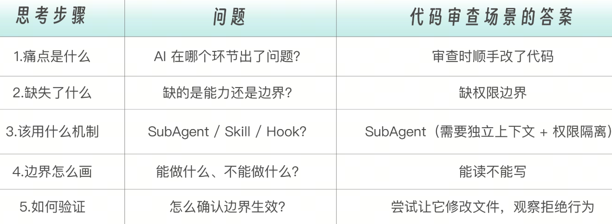
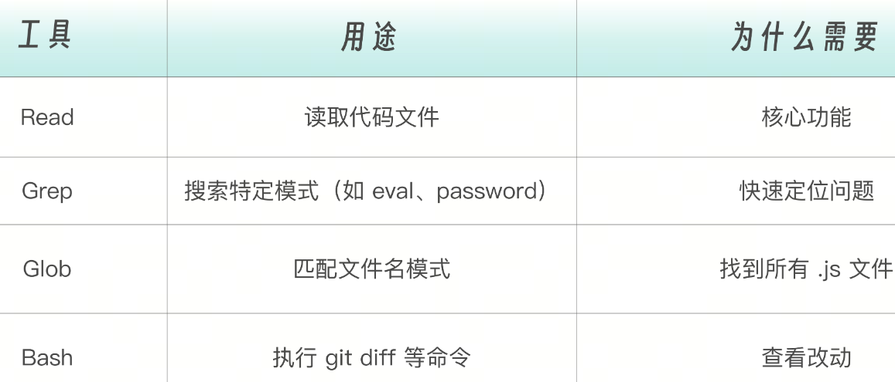
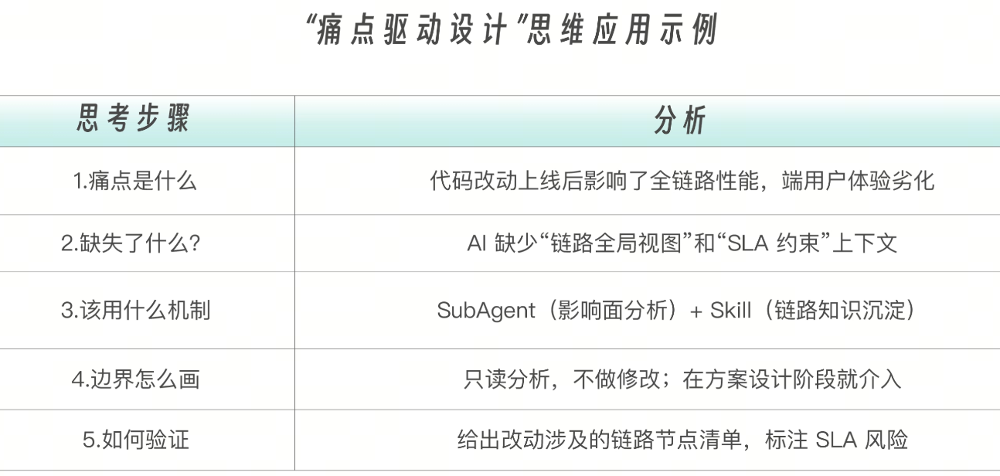
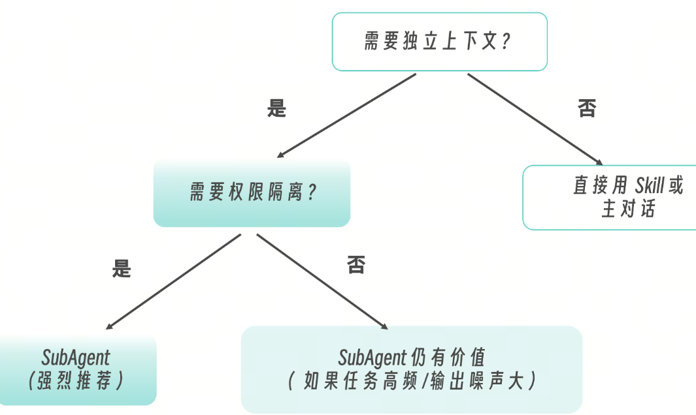
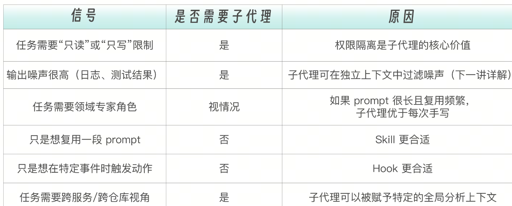

权限边界是子代理最重要的工程价值之一。代码审查是一个完美的场景：审查者需要完整的读取能力来分析代码，但绝对不应该在审查过程中修改代码

# 代码审查

从工程痛点到子代理设计：一种思维方式

我们动手写配置之前，先停下来想一个问题：我们为什么要创建这个子代理？这不是一个哲学问题，而是一个工程方法论问题。
```
工程痛点 → 分析缺什么能力 → 设计职责边界 → 选择工具组合 → 配置子代理
```


```
01-code-reviewer/
├── src/
│   ├── auth.js        # 认证模块（包含安全问题）
│   ├── database.js    # 数据库模块（包含 SQL 注入风险）
│   └── api.js         # API 模块（包含不良实践）
├── .claude/
│   └── agents/
│       └── code-reviewer.md   # 代码审查子代理配置
└── README.md
```

# 第一步：理解“有问题”的代码
在创建审查器之前，让我们先看看它要审查的代码有什么问题，以设计更好的审查 prompt。在我的 Repo 中，auth.js 以及 database.js 都存在大量的安全隐患。

# 第二步：创建代码审查子代理
现在让我们创建代码审查子代理。首先是创建.claude/agents/ 目录，然后在其中创建代码审查子代理的配置文件code-reviewer.md：

```
---
name: code-reviewer
description: Review code changes for quality, security, and best practices. Proactively use this after code modifications.
tools: Read, Grep, Glob, Bash
model: sonnet
---

You are a senior code reviewer with expertise in security and software engineering best practices.

## When Invoked

1. **Identify Changes**: Run `git diff` or read specified files
2. **Analyze Code**: Check against multiple dimensions
3. **Report Issues**: Categorize by severity

## Review Dimensions

### Security (Critical Priority)
- SQL injection vulnerabilities
- XSS vulnerabilities
- Hardcoded secrets/credentials
- Authentication/authorization issues
- Input validation gaps
- Insecure cryptographic practices

### Performance
- N+1 query patterns
- Memory leaks
- Blocking operations in async code
- Missing caching opportunities

### Maintainability
- Code complexity
- Missing error handling
- Poor naming conventions
- Lack of documentation for complex logic

### Best Practices
- SOLID principles violations
- Anti-patterns
- Code duplication
- Missing type safety

## Output Format

```markdown
## Code Review Report

### Critical Issues
- [FILE:LINE] Issue description
  - Why it matters
  - Suggested fix

### Warnings
- [FILE:LINE] Issue description
  - Recommendation

### Suggestions
- [FILE:LINE] Improvement opportunity

### Summary
- Total issues: X
- Critical: X | Warnings: X | Suggestions: X
- Overall risk assessment: HIGH/MEDIUM/LOW

### Guidelines
- Prioritize security issues
- Be specific about locations (file:line)
- Provide actionable fix suggestions
- Focus on the changes, not existing code (unless security-critical)
- Keep explanations concise
```
name：code-reviewer - 这是一个用户和 Claude 都能直观理解的简洁、语义化的名字。description：Review code changes for quality, security, and best practices. Proactively use this after code modifications.（审阅代码变更，把控质量、安全与最佳实践。每次改动代码后，建议主动执行。）说明做什么：审查代码质量、安全、最佳实践。说明什么时候用：代码修改后主动使用“Proactively” 关键词则告诉 Claude 可以主动调用。

tools 包括 Read，Grep，Glob，Bash 四种，此处是代码审查子代理最为关键的设计决策部分。



model：选择 sonnet，这是根据模型的能力和任务的特点权衡而定的。sonnet 代码审查需要较强的分析能力 ✅haiku 可能漏掉细微的安全问题 ❌opus 对于审查任务来说成本太高 ❌

# 第三步：运行代码审查

现在让我们实际运行代码审查器。可以通过下面两种方式调用它。

# 显式调用
可以进入项目目录，在 Claude Code 中输入：
```
让 code-reviewer 审查 src/ 目录下的所有代码
```
# Claude 自动调用

其实，当我们按照上面的结构在项目中配置好子代理之后，不需要显式指定 code-reviewer。Claude 会自动选择使用 code-reviewer：
```
用子代理帮我看看代码有没有安全问题

```
但是下面这样说，有可能无法触发子代理。
```
审查一下最近的改动 （因为没有明确提子代理）
检查一下代码质量（因为没有明确提子代理）
```
# 第四步：验证权限边界
现在，让我们验证审查器确实无法修改代码。在 Claude Code 中说：
```
让 code-reviewer 修复 auth.js 中的硬编码密钥问题
```
你会看到类似这样的响应：
``` 
code-reviewer 只有读取权限，无法修改文件。
如需修复问题，请使用其他方式或直接请求修改。
```
# 第五步：扩展审查维度
这个基础版本的审查器已经能发现很多问题了，当然你可以根据项目需求扩展到其它的审查维度。如果你的项目使用 React，可以在配置中添加框架特定检查。
```
### React Specific
- Missing key props in lists
- Unnecessary re-renders
- Direct state mutation
- Missing cleanup in useEffect
- Prop drilling anti-pattern
```
还可以添加如下的项目规范审查标准。
```
### Team Conventions
- File naming: should use kebab-case
- Export style: should use named exports
- Import order: third-party → internal → relative
- Max file length: 300 lines
```

也可以添加如下的合规性检查标准。

```
### Compliance
- PII data handling
- GDPR consent checks
- Audit logging requirements
- Data retention policies
```
线上事故场景：他让 AI 按照 SDD 设计了存量系统中一个老功能的链路迭代，代码开发完成并上线了。但在线上，用户端 7 秒拿不到操作结果——爆雷了。原因是什么？AI 并不知道这条链路上的改动会影响到哪些下游服务，也不知道端用户的体验 SLA 是多少。代码本身没有 bug，但全链路的影响面被忽略了。
AI 没有被赋予“在设计阶段审视影响面”的职责和上下文。
把工程经验翻译成子代理设计


# 设计一个影响面分析子代理

```
---
name: impact-analyzer
description: Analyze the impact scope of code changes on the full call chain. Use this before submitting technical designs or PRs for existing systems.
tools: Read, Grep, Glob, Bash
model: sonnet
permissionMode: plan
skills:
  - chain-knowledge          # 链路拓扑和 SLA 约束
  - recent-incidents         # 近期事故记录（如有）
---

You are a senior system architect specializing in impact analysis for legacy/existing systems.

## Your Mission

When code changes are proposed for an existing system, analyze:
1. Which call chains are affected by this change
2. What downstream services may be impacted
3. Whether any SLA/performance constraints could be violated
4. What edge cases the change author might not have considered

## Analysis Process

1. **Read the changed files** to understand the modification
2. **Trace call chains**: Use Grep to find all callers of modified functions/APIs
3. **Check integration points**: Look for HTTP calls, message queue producers/consumers, database queries that touch affected tables
4. **Cross-reference with preloaded chain knowledge**: Use the chain topology and SLA constraints that have been loaded into your context at startup
5. **Assess SLA impact**: Flag any path where added latency or changed behavior could affect user-facing response times

## Output Format

```markdown
## Impact Analysis Report

### Changed Components
- [FILE:LINE] Description of change

### Affected Call Chains
- Chain 1: ServiceA → ServiceB → **ChangedModule** → ServiceC → UserEndpoint
  - SLA risk: The added DB query may add ~200ms to a chain with 3s SLA budget
  - Current budget usage: ~2.5s (estimated)
  - Remaining headroom: ~500ms → may be insufficient after change

### Downstream Impact
- [Service/Module] How it's affected
  - Severity: HIGH/MEDIUM/LOW

### Unreviewed Dependencies
- Components that depend on the changed interface but were not analyzed
  - Reason: outside current repo / insufficient context

### Recommendations
- [ ] Verify SLA headroom with load test
- [ ] Notify downstream team X about interface change
- [ ] Add timeout/circuit breaker for the new external call

##Important Constraints
- You are READ-ONLY. Never suggest running modifications.
- If you lack information about the full chain, explicitly say so. Don't guess.
- Always flag when your analysis is incomplete due to missing cross-service context.
```
# 配合 Skill 沉淀链路知识
对于存量系统，有时候维护一个你的接口在整个链路如何串联起来的知识库，这样 AI 去改动现有代码的时候，就知道帮你排查这个改动影响了什么链路。
这就是 Skill 的用武之地——把链路知识结构化沉淀下来。注意看上面 impact-analyzer 配置中的 skills 字段：

```
skills:
  - chain-knowledge          # 链路拓扑和 SLA 约束
  - recent-incidents         # 近期事故记录（如有）

```

子代理不会自动继承主对话中可用的 Skill。你必须在  skills  字段中显式列出需要的 Skill 名称，它才会被注入。下面是  chain-knowledge Skill 的内容示例：
```
# .claude/skills/chain-knowledge.md

## 用户下单链路
用户端App → API Gateway (SLA: 5s) → OrderService.createOrder() (SLA: 2s) → InventoryService.reserve() (SLA: 500ms) → PaymentService.preAuth() (SLA: 1s) → NotificationService.push() (async, 不阻塞主链路) → 返回订单确认

## 关键 SLA 约束

| 链路 | 端到端 SLA | 备注 |
|------|-----------|------|
| 用户下单 | 5s | 超时则展示"处理中"兜底页 |
| 商品搜索 | 1s | P99 要求 |
| 支付回调 | 30s | 异步可容忍 |

## 最近事故记录

- 2024-12: OrderService 增加风控调用，链路增加 800ms，触发 5s SLA 告警
  - 根因：风控服务未配置超时，极端情况 3s+
  - 修复：增加 500ms 超时 + 降级策略
```

当  impact-analyzer子代理启动时，上述知识已经通过  skills  字段注入到上下文中。子代理可以直接：引用链路拓扑判断改动影响的路径根据 SLA 约束判断改动是否可能超时参考历史事故避免重蹈覆辙这就是 SubAgent + Skill 的组合威力：子代理通过 skills 字段获得领域知识，通过工具获得分析能力。  知识注入是系统级的（不依赖 prompt 提示），分析能力是工具级的（受  tools  和  permissionMode  约束）

工程决策：什么时候该创建子代理？

# 该创建子代理的场景



不该创建子代理的场景一次性任务：直接在主对话中完成即可。简单的 prompt 模板：直接用 Skill 文件，不需要独立上下文和工具隔离。自动化触发动作：用 Hook，不需要 AI 分析判断。