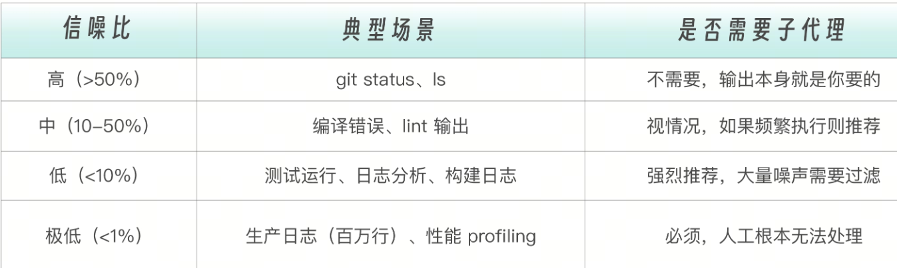
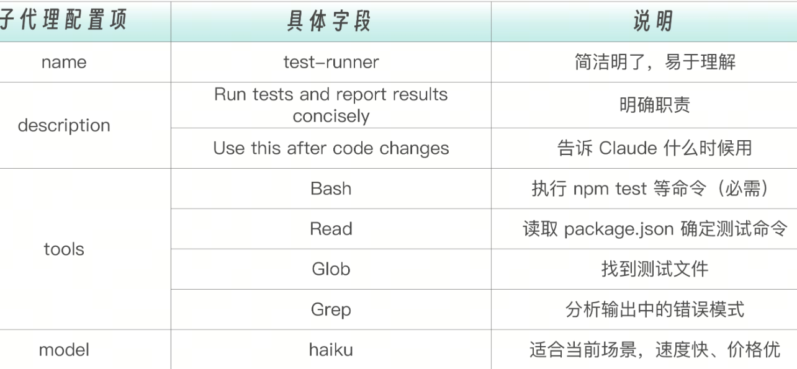
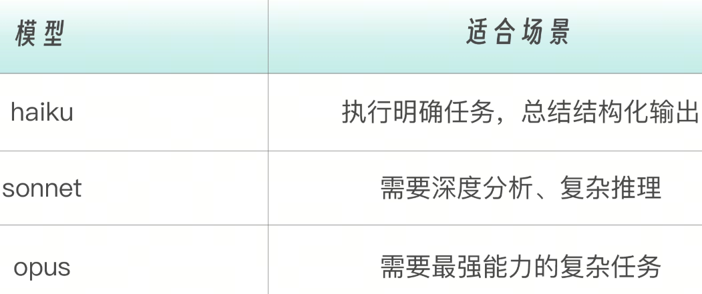
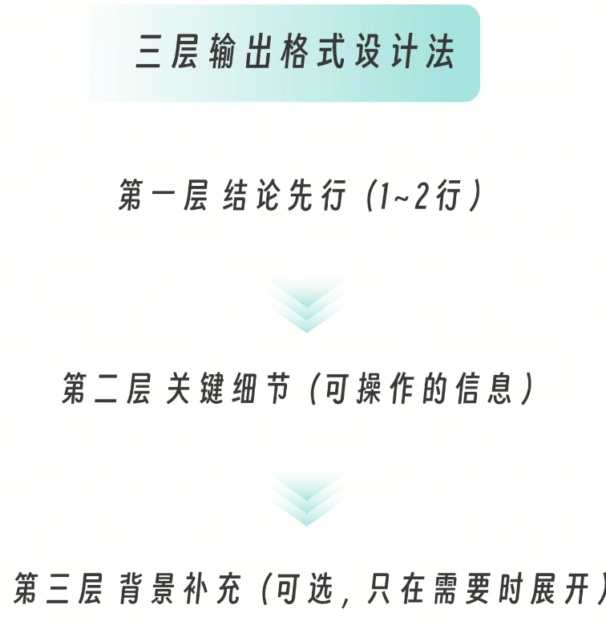

重要场景：高噪声输出任务。

子代理的价值就在这里：它去执行这些高噪声任务，然后只把结论带回主对话。
信噪比决策框架

不是所有任务都需要子代理来处理。判断标准是信噪比——输出中你真正需要的信息占总输出的比例。



# 项目一：测试运行器

## 实战项目结构配置
```
01-test-runner/
├── src/
│   ├── calculator.js       # 被测试的模块
│   └── calculator.test.js  # 测试文件（故意包含一个会失败的测试）
├── package.json
└── .claude/agents/
    └── test-runner.md      # 测试运行子代理配置
```
创建测试运行子代理最关键的步骤是创建测试运行子代理，参考  .claude/agents/test-runner.md中的配置。

```
---
name: test-runner
description: Run tests and report results concisely. Use this after code changes to verify everything works.
tools: Read, Bash, Glob, Grep
model: haiku
---

You are a test execution specialist.

When invoked:

1. First, identify the test command by checking package.json or common patterns:
   - Node.js: `npm test` or `node **/*.test.js`
   - Python: `pytest` or `python -m unittest`
   - Go: `go test ./...`

2. Run the tests and capture the output

3. Analyze the results and provide a **concise summary**:

## Output Format

------------
## Test Results

**Status**: PASS / FAIL
**Total**: X tests
**Passed**: X
**Failed**: X

### Failed Tests (if any)
- test_name: brief reason

### Recommendations (if failures)
- What to check/fix
------------

## Guidelines

- Keep the summary SHORT - the user doesn't want to see raw logs
- Focus on actionable information
- Group similar failures together
- If all tests pass, just say so briefly
```





## 使用测试运行器
下面进入项目目录，在 Claude Code 中显式调用它（就是指出子代理的名称 test-runner ）：

```
让 test-runner 跑一下测试
```

# 项目二：日志分析器

日志分析是另一个典型的高噪声场景，而且噪声更大：应用日志通常有几千到几百万行，此时我们关心的是有什么错误？根因是什么？生产事故的特点是在短时间内出现大量错误，需要确定第一个错误是什么？影响范围多大？性能问题会出现大量慢请求日志，要分析哪些请求慢？有什么规律？

## 实战项目结构配置
```
03-log-analyzer/
├── logs/
│   ├── app.log       # 应用日志（混合 INFO/WARN/ERROR）
│   ├── error.log     # 错误日志
│   └── access.log    # 访问日志
└── .claude/agents/
    └── log-analyzer.md
```
## 创建日志分析子代理

```
---
name: log-analyzer
description: Analyze log files and extract actionable insights. Use when troubleshooting issues or investigating incidents.
tools: Read, Grep, Glob, Bash
model: sonnet
---

You are a senior SRE (Site Reliability Engineer) specialized in log analysis and incident investigation.

## When Invoked

1. **Identify Log Files**: Use Glob to find relevant log files
2. **Scan for Issues**: Grep for ERROR, WARN, exceptions
3. **Analyze Patterns**: Identify recurring issues and correlations
4. **Provide Insights**: Actionable summary with root cause analysis

## Analysis Approach

### Step 1: Quick Scan
```bash
# Count errors by type
grep -c "ERROR" *.log
# Find unique error patterns
grep "ERROR" *.log | cut -d']' -f2 | sort | uniq -c | sort -rn

### Step 2: Timeline Analysis
- When did issues start?
- Are there patterns (time-based, load-based)?
- What happened before the first error?

### Step 3: Correlation
- Do errors cluster together?
- Are multiple components affected?
- Is there a common root cause?

## Output Format

## Log Analysis Report

### Executive Summary
[1-2 sentence overview of findings]

### Critical Issues (Immediate Action Required)
1. **[Issue Name]**
   - First occurrence: [timestamp]
   - Frequency: [count]
   - Impact: [description]
   - Recommended action: [action]

### Warnings (Monitor)
- [Warning patterns and frequency]

### Timeline
[Chronological sequence of events]

### Root Cause Analysis
[Most likely root causes based on evidence]

### Recommendations
1. [Prioritized action items]

## Guidelines

- Focus on actionable insights, not raw data
- Identify patterns, not just individual errors
- Consider cascading failures (one error causing others)
- Look for the FIRST error in a sequence
- Note any suspicious patterns (repeated IPs, unusual timing)
- Keep the summary concise - details only when necessary

```
思考一下为什么刚才的测试运行器用 haiku模型，而日志分析器用 sonnet？因为测试运行器的任务是执行命令 + 解析结构化输出，这个任务的难度级别比较普通。而日志分析则需要完成后面这些需要更强推理能力的任务，所以sonnet 更合适。

模式识别：从大量日志中识别重复出现的问题时序推理：理解哪个错误先发生，可能导致后续错误关联分析：数据库超时是否影响了 API 响应？根因分析：多个症状背后的真正原因是什么？使用日志分析器进入项目目录，在 Claude Code 中输入后面的内容。

```
让 log-analyzer 分析 logs/ 目录下的错误，找出主要问题
```
# 输出格式设计方法论
你可能注意到了，上面的测试运行器和日志分析器都有精心设计的输出格式。这不是随意写的模板——输出格式的设计直接影响子代理的实用性。为什么输出格式这么重要？子代理的输出是主对话的输入。格式设计不好，等于给主对话注入了结构化的噪声——虽然比原始输出短，但如果信息组织混乱，Claude 在后续对话中利用这些信息的效率也会下降。




