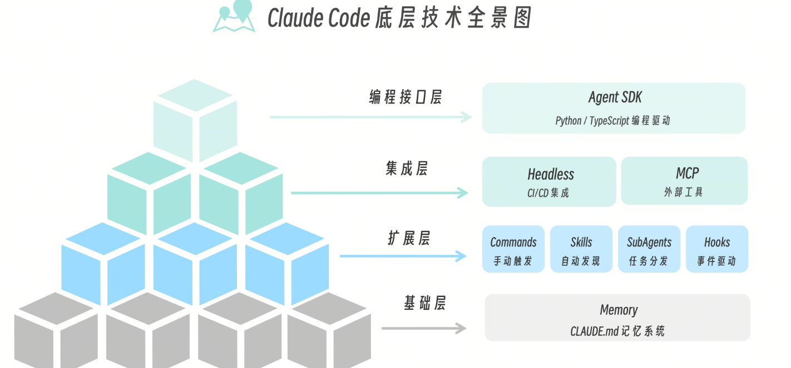
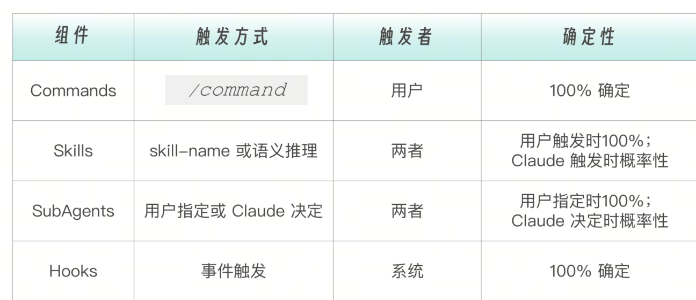
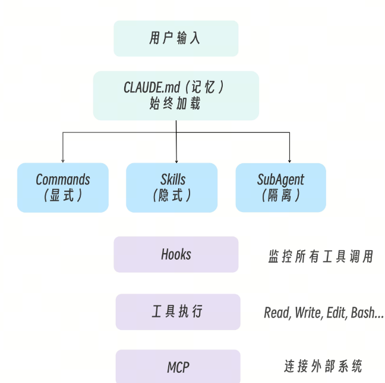
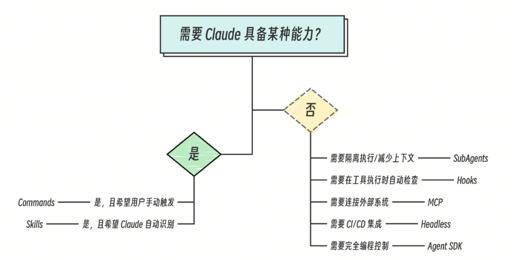
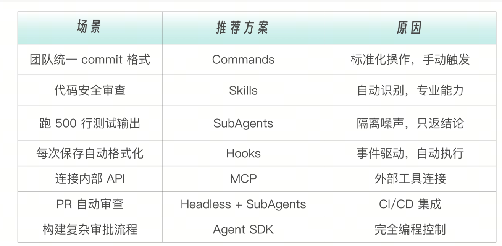
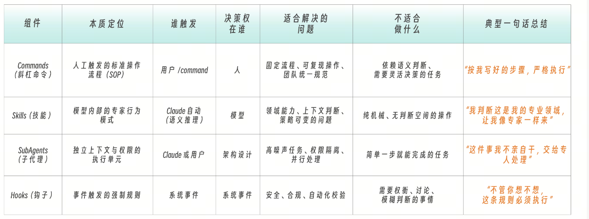

安装claude code
```
# macOS / Linux / WSL（推荐，自动更新）
curl -fsSL https://claude.ai/install.sh | bash

# Windows PowerShell
irm https://claude.ai/install.ps1 | iex

# 或使用 Homebrew（需手动更新）
brew install --cask claude-code
```

基本命令行
```
cd /path/to/your/project   # 进入项目目录
claude                      # 启动交互模式

# 然后你可以：
> 这个项目是做什么的？              # 了解项目
> 帮我加一个 hello world 函数      # 修改代码（会请求确认）
> 提交我的更改                      # Git 操作

claude -任务描述                #单此任务
claude -p 问题                  # 执行查询后退出
claude -c                       # 快速查询后退出


```

Claude Code 的底层能力从技术上拆解可以分为四个层次：基础层、扩展层、集成层和编程接口层。


# 基础层：Memory（记忆系统）
比如入职一家新公司，第一天你会收到一份新员工手册，告诉你：公司的代码风格是什么。Git 提交信息怎么写。项目的架构是怎样的。有哪些不能碰的“禁区”。而CLAUDE.md  就是 Claude 的“新员工手册”。因此，我强烈建议每一个人都为你的 Claude 创建 CLAUDE.md，以提供给它一系列最基本的信息。
例子：
```
# Project: E-commerce Platform

## Tech Stack
- Frontend: React + TypeScript
- Backend: Node.js + Express
- Database: PostgreSQL

## Code Style
- Use functional components
- Prefer async/await over .then()
- Maximum line length: 100 characters

## Important Rules
- NEVER commit to main directly
- Always run tests before pushing
```

Claude Code 并不是只有一个CLAUDE.md记忆文件，全局、项目和项目的特定模块都可以拥有属于自己的记忆文件（或者也可以叫配置文件）。

```
~/.claude/CLAUDE.md           # 全局（所有项目共用）
    ↓
项目根目录/CLAUDE.md          # 项目级（当前项目）
    ↓
项目根目录/.claude/rules/*.md # 模块级（特定目录）
```
# 扩展层：四大核心组件

这一层是 Claude Code 的能力中心，包含 Commands（斜杠命令）、Skills（技能）、SubAgents（子代理）、Hooks（钩子）四个核心组件。

# Commands（斜杠命令）
斜杠命令是 Claude Code 内置或用户自定义的一系列核心能力，其触发方式是用户手动输入  /command
```
用户输入: /review

Claude 执行: 根据 .claude/commands/review.md 的指令审查代码
```
Commands 适合标准化操作——团队统一的 commit 格式、固定的部署流程等

# Skills（技能）
技能则代表着 AI 的一系列专属能力组合，其触发方式是 Claude 自动判断（语义推理）是否激活相应技能。Skills 可以是 Claude Code 内置的，也可以由用户自己设定。


```
用户说: "帮我看看这段代码有没有安全问题"

Claude 思考: 这是代码安全审查任务 → 激活 security-review Skill

Claude 执行: 按照 Skill 中定义的流程审查代码
```
如果说 Tool 解决的是我能不能做；而 Skill 解决的是我该不该做、怎么做、做到什么程度。那么又一个问题来了：什么时候该用 Skill？什么时候该用 Commands？

Commands 是显式、可复用、可审计、通过斜杠命令固定触发的操作指令集，是相对固化的标准流程。而当一个能力具备强烈的“领域感”（安全、架构、性能）、判断依赖上下文而非关键词 ，执行路径可能变化 ，需要“像专家一样行事”时，就用 Skill，而不是 Command。


# SubAgents（子代理）
子代理是除了 Skills 之外的另一个大杀器，用于独立完成专项任务。其触发方式可以由 Claude 决定或用户指定。

```
主 Claude: 这个任务需要跑大量测试，让我创建一个子代理来处理。

子代理（test-runner）: 执行测试，只把结果汇报给主 Claude
```

SubAgents 适合隔离执行——高噪声任务（比如在大量日志中寻找出错信息，在大量文档中检索相关资源）、需要特定权限的任务。

# Hooks（钩子）
钩子是在特定事件触发时自动执行的脚本，其触发方式是事件自动触发。
```
事件: Claude 即将执行 Edit 工具

Hook: 自动检查是否有安全敏感内容

结果: 如果发现问题，阻止执行并警告
```
Hooks 适合自动化检查——格式化、安全检查、日志记录等。

# 集成层：连接外部世界

上面这四大核心组件之上，是集成层，负责链接外部世界。集成层包含 Headless（无头模式）和 MCP（Model Context Protocol）两大技术。

# Headless（无头模式）

无头模式让 Claude Code 在没有人工交互的情况下运行，适合  CI/CD 集成——自动代码审查、自动修复、自动生成变更日志等。

```
# GitHub Actions 中
- name: Auto-fix code issues
  run: claude --headless "Fix all linting errors in src/"
```

# MCP（Model Context Protocol）

MCP 让 Claude 连接外部工具和服务，适合工具连接——可以把任何外部系统变成 Claude 可调用的工具。

```
Claude → MCP → 数据库
Claude → MCP → Jira
Claude → MCP → 自定义 API
```
# 编程接口层：Agent SDK

当配置式的扩展不够用时，你可以用代码来驱动 Claude。这种方式适合构建自定义 Agent——完全控制执行流程、自定义工具、复杂工作流。

```
from claude_sdk import ClaudeSDKClient

client = ClaudeSDKClient()

# 执行任务
result = client.query(
    prompt="Review this code for security issues",
    tools=["Read", "Grep"],
    max_turns=10
)
```


# 数据流向



结合一个具体场景来解释这个流程——当用户输入“帮我修复 src/api.js 中的安全漏洞”之后，Claude 可能的处理流程如下。Memory 层：Claude 首先加载  CLAUDE.md，了解到这是一个 Node.js 项目，团队要求所有安全修复必须附带测试。扩展层分发：a 用户没有输入斜杠命令，所以 Commands 不参与。b. Claude 识别出“安全漏洞”关键词，激活  security-review Skill。c. Skill 指示 Claude 创建一个子代理来执行测试。Hooks 监控：Claude 准备执行  Edit  工具修改代码时，Hooks 自动运行预检查脚本，确保没有引入新的安全问题。工具执行：通过 Read、Edit 等工具完成代码修改。MCP 连接：如果配置了 Jira MCP，还可以自动更新相关的 ticket 状态。

关键洞察：Memory 是基础设施，始终存在；扩展层是能力中心，按需激活；Hooks 是守门人，监控一切。

# Plugins：打包容器

当你开发了一套好用的 Commands、Skills、Hooks 组合，想要分享给团队或社区时，就需要 Plugins。Plugins 不是一种新能力，而是打包机制——就像 npm 包把一堆 JavaScript 文件打包在一起，Plugin 把一组相关的 Claude Code 扩展打包在一起。

```
my-team-plugin/
├── commands/           # 斜杠命令
│   └── review.md
├── skills/             # 技能
│   └── security-check/
│       └── SKILL.md
├── agents/             # 子代理
│   └── test-runner.md
├── hooks/              # 钩子
│   └── pre-edit.sh
└── plugin.json         # 插件配置
```
# 下面是一个典型的 Plugins 使用场景：

你是团队的技术 Lead，花了两周时间打磨出一套完美的代码审查流程：一个  /review  命令触发审查，一个  code-quality Skill 自动分析代码质量，一个  test-runner  子代理执行测试，还有一个 Hook 确保所有修改都有对应的测试。与其让团队成员手动复制这些文件，不如打包成一个 Plugin，新成员只需一条命令就能获得完整的工作流



