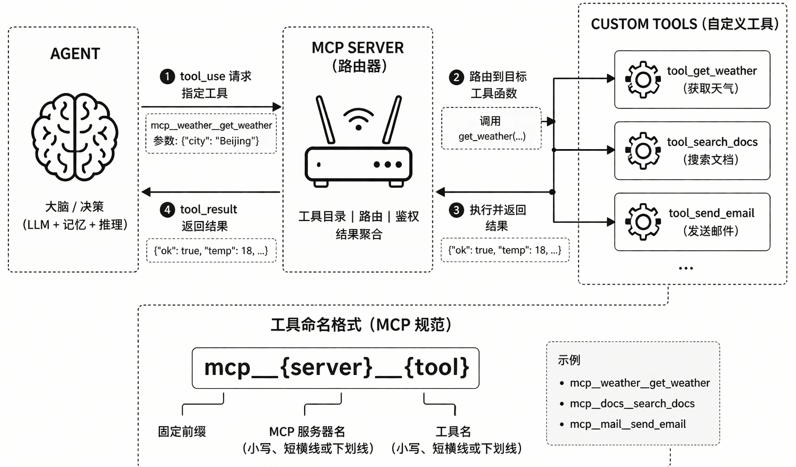
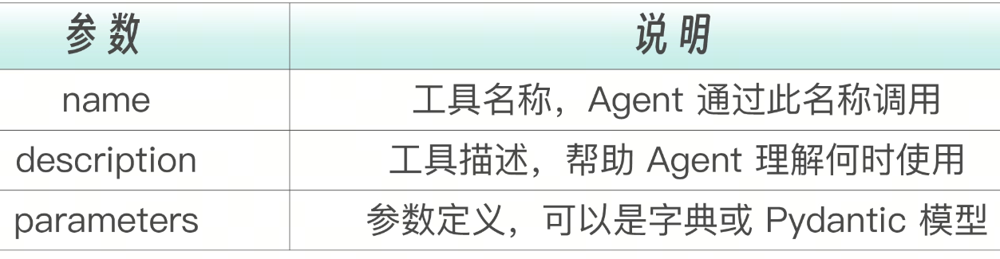
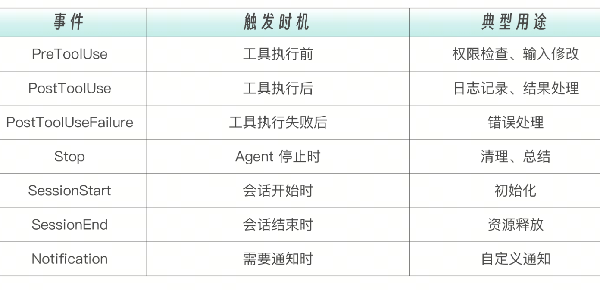
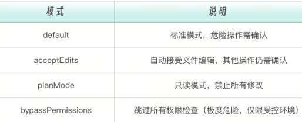

## 在 Agent 中注入和使用自定义工具

Claude Agent SDK 内置了文件操作、命令执行、网络搜索等工具。但在实际项目中，你往往需要领域特定的能力：
查询数据库
调用内部 API
发送通知
执行特定的业务逻辑

这就是自定义工具的价值，让 Agent 能够调用你定义的函数。SDK 的自定义工具本质上是运行在你应用进程内的 MCP 服务器。与需要单独进程的常规 MCP 服务器不同，SDK 工具直接在你的 Python 应用中运行，消除了进程管理和 IPC 开销。这种设计让工具调用的延迟极低，同时还能共享应用的内存空间和数据库连接池等资源。



上图中的架构就是 Agent → MCP Server → Tools 的三层解耦调用链。

左侧的 Agent（大模型 + 记忆 + 推理）并不直接调用具体工具，而是通过统一的 tool_use 请求，将意图表达为标准化的工具调用（如 mcp__{server}__{tool}）。中间的 MCP Server 相当于一个“工具路由中枢”，负责根据命名规范解析请求、完成权限控制与路由分发，并调用对应的工具函数。

右侧的各类自定义工具只专注于执行具体能力（如查询、搜索、发送等），执行完成后将结果返回给 MCP Server，再统一回传给 Agent。通过标准命名 + 中间层路由，实现 Agent 与工具的解耦、可扩展和可治理，从而让系统可以像“插 USB 设备”一样动态接入新能力。

## 使用 @tool 装饰器定义工具
@tool  装饰器是定义自定义工具的最简单方式。你只需要指定工具名称、描述和参数，然后把业务逻辑写在函数体内。SDK 会自动将这个函数注册为一个可被 Agent 调用的工具，Agent 在推理过程中会根据工具描述决定何时调用它。

下面的例子定义了一个天气查询工具。注意返回值必须是包含  content  列表的字典，这是 MCP 协议要求的标准格式。

```
from claude_agent_sdk import tool

@tool(
    name="get_weather",
    description="Get current weather for a city",
    parameters={"city": str, "units": str}
)
async def get_weather(args):
    city = args["city"]
    units = args.get("units", "celsius")

    # 调用天气 API（示例）
    weather = await fetch_weather_api(city, units)

    return {
        "content": [
            {"type": "text", "text": f"Weather in {city}: {weather}"}
        ]
    }
```
@tool  装饰器的三个核心参数，每个参数都直接影响 Agent 的调用行为。

其中  description  尤为关键，它不是给人看的注释，而是给 AI 看的使用指南。写得清晰准确，Agent 才能在正确的时机调用正确的工具。

## 创建 SDK MCP 服务器承载工具

定义好工具函数之后，下一步是创建一个 MCP 服务器来承载它们。你可以把多个工具注册到同一个服务器中，服务器会统一管理这些工具的生命周期和调用路由。
下面的例子创建了一个包含两个工具的服务器。注意  @tool  装饰器的简写形式，当参数简单时，可以直接用位置参数传入名称、描述和参数字典。

```
from claude_agent_sdk import tool, create_sdk_mcp_server

@tool("greet", "Greet a user by name", {"name": str})
async def greet_user(args):
    return {
        "content": [
            {"type": "text", "text": f"Hello, {args['name']}!"}
        ]
    }

@tool("calculate", "Perform a calculation", {"expression": str})
async def calculate(args):
    try:
        result = eval(args["expression"])  # 生产环境请用安全的表达式解析器
        return {
            "content": [
                {"type": "text", "text": f"Result: {result}"}
            ]
        }
    except Exception as e:
        return {
            "content": [
                {"type": "text", "text": f"Error: {e}"}
            ],
            "isError": True
        }

# 创建 MCP 服务器
server = create_sdk_mcp_server(
    name="my-tools",
    version="1.0.0",
    tools=[greet_user, calculate]
)
```

服务器创建后，还不能直接使用。你需要把它注入到 Agent 的配置中，Agent 才能“看到”并调用这些工具。


## 注入并使用自定义工具

将 MCP 服务器注入 Agent 的方式很直观，通过  mcp_servers  选项传入服务器实例，然后在  allowed_tools  中声明允许使用的工具。工具名称遵循  mcp__{服务器名}__{工具名}  的命名格式，这个双下划线的命名规则确保了不同服务器之间的工具名不会冲突。

```
from claude_agent_sdk import ClaudeSDKClient, ClaudeAgentOptions

options = ClaudeAgentOptions(
    mcp_servers={"tools": server},
    # 工具名称格式：mcp__{服务器名}__{工具名}
    allowed_tools=[
        "mcp__tools__greet",
        "mcp__tools__calculate"
    ]
)

async with ClaudeSDKClient(options=options) as client:
    await client.query("Say hello to Alice and calculate 2 + 3 * 4")
    async for msg in client.receive_response():
        print(msg)
```

当 Agent 收到上面的提示时，它会自动识别出需要调用两个工具：先用  greet  向 Alice 打招呼，再用  calculate  计算表达式。这种自动编排能力正是 Agent SDK 的核心价值。

## 使用 Pydantic 进行参数验证
对于简单工具，字典式参数定义已经够用。但当参数变得复杂——比如有默认值、范围限制、可选字段时，Pydantic 模型是更好的选择。它不仅提供自动验证，还能生成更详细的 JSON Schema 供 Agent 参考，从而提高参数传递的准确性。

下面的例子定义了一个数据库查询工具。Pydantic 模型中的  Field  描述会被自动转换为工具参数说明，ge  和  le  约束则确保 Agent 传入的  limit  值在合理范围内。

```
from pydantic import BaseModel, Field
from claude_agent_sdk import tool

class DatabaseQueryParams(BaseModel):
    """数据库查询参数"""
    table: str = Field(..., description="Table name")
    columns: list[str] = Field(default=["*"], description="Columns to select")
    where: str | None = Field(default=None, description="WHERE clause")
    limit: int = Field(default=100, ge=1, le=1000, description="Max rows")

@tool(
    name="query_database",
    description="Execute a SELECT query on the database",
    parameters=DatabaseQueryParams
)
async def query_database(args: DatabaseQueryParams):
    # args 已经通过 Pydantic 验证
    query = f"SELECT {', '.join(args.columns)} FROM {args.table}"
    if args.where:
        query += f" WHERE {args.where}"
    query += f" LIMIT {args.limit}"

    # 执行查询
    results = await db.execute(query)

    return {
        "content": [
            {"type": "text", "text": f"Query: {query}\nResults: {results}"}
        ]
    }
```

下面是一个存在 SQL 注入风险的工具调用示例以及相应的调整。

```
# 危险：直接执行 SQL
@tool("run_sql", "Run any SQL", {"sql": str})
async def run_sql(args):
    return await db.execute(args["sql"])  # SQL 注入风险！
```

```
# 安全：限制操作类型
@tool("query_users", "Query user table", {"user_id": int})
async def query_users(args):
    return await db.execute(
        "SELECT * FROM users WHERE id = ?",
        [args["user_id"]]
    )
```
这个安全示例的核心在于，不要把工具当“能力接口”，而要当“受控权限边界”来设计。

危险版本把任意 SQL 执行权直接暴露给 Agent，相当于让一个不完全可信的系统拥有数据库 root 权限，一旦被误导或注入就可能造成严重破坏；而安全版本通过限制操作范围（只允许查询特定表）、使用参数化查询、防止注入，并对参数进行类型约束，把“无限能力”收敛为“可控动作”。本质上，这体现的是 Agent 系统的一个关键原则，模型可以自由推理，但工具必须严格受限。

## Agent SDK Hooks 系统概述

Hooks 让你能够在 Agent 执行的各个阶段插入自定义逻辑。如果说自定义工具是扩展了 Agent 能做什么，那么 Hooks 就是控制 Agent 怎么做。它们提供对 Agent 行为的确定性控制——不是建议 Agent 遵守某个规则，而是在系统层面强制执行。

下表列出了 SDK 支持的所有 Hook 事件。每个事件对应 Agent 执行流程中的一个关键节点，你可以在这些节点插入安全检查、日志记录、数据转换等逻辑。



## PreToolUse Hook：执行前拦截
PreToolUse 是最常用的 Hook，它在工具执行前触发。你可以在这里做三件事，允许执行、拒绝执行、或修改输入参数。这给了你对 Agent 行为的完全控制权。

下面的例子展示了一个 Bash 命令安全检查器。它会拦截所有 Bash 工具调用，检查命令是否包含危险模式（如  rm -rf、sudo），如果发现危险则拒绝执行。对于不在白名单中的命令，它会要求用户手动确认。

```
from claude_agent_sdk import ClaudeAgentOptions, HookMatcher

async def check_bash_command(input_data, tool_use_id, context):
    """检查 Bash 命令是否安全"""
    tool_name = input_data["tool_name"]
    tool_input = input_data["tool_input"]

    if tool_name == "Bash":
        command = tool_input.get("command", "")

        # 阻止危险命令
        dangerous_patterns = ["rm -rf", "sudo", "chmod 777", "> /dev/"]
        for pattern in dangerous_patterns:
            if pattern in command:
                return {
                    "hookSpecificOutput": {
                        "hookEventName": "PreToolUse",
                        "permissionDecision": "deny",
                        "permissionDecisionReason": f"Blocked dangerous command: {pattern}"
                    }
                }

        # 只允许特定命令
        allowed_prefixes = ["npm", "python", "git", "pytest", "ls", "cat"]
        if not any(command.strip().startswith(p) for p in allowed_prefixes):
            return {
                "hookSpecificOutput": {
                    "hookEventName": "PreToolUse",
                    "permissionDecision": "ask",
                    "permissionDecisionReason": f"Command requires approval: {command}"
                }
            }

    return {}  # 允许执行

options = ClaudeAgentOptions(
    hooks={
        "PreToolUse": [
            HookMatcher(matcher="Bash", hooks=[check_bash_command])
        ]
    }
)
```

注意  HookMatcher  的  matcher  参数，它指定这个 Hook 只对  Bash  工具生效。你也可以用  "*"  来匹配所有工具。

## PreToolUse Hook：修改输入参数

一个典型的应用场景是路径规范化。Agent 生成的文件路径有时是相对路径，但你的工具可能要求绝对路径。通过 PreToolUse Hook，你可以在调用发生前自动完成转换，避免工具报错。

```
async def normalize_file_paths(input_data, tool_use_id, context):
    """规范化文件路径"""
    tool_name = input_data["tool_name"]
    tool_input = input_data["tool_input"]

    if tool_name in ["Read", "Write", "Edit"]:
        file_path = tool_input.get("file_path", "")

        # 将相对路径转为绝对路径
        if not file_path.startswith("/"):
            import os
            absolute_path = os.path.abspath(file_path)

            return {
                "hookSpecificOutput": {
                    "hookEventName": "PreToolUse",
                    "permissionDecision": "allow",
                    "updatedInput": {
                        **tool_input,
                        "file_path": absolute_path
                    }
                }
            }

    return {}

options = ClaudeAgentOptions(
    hooks={
        "PreToolUse": [
            HookMatcher(matcher="*", hooks=[normalize_file_paths])
        ]
    }
)
```

返回值中的  updatedInput  字段就是修改后的工具输入。SDK 会用它替换原始输入，然后继续执行工具。

## PostToolUse Hook：执行后处理

PostToolUse 在工具执行成功后触发，适合做日志记录、结果格式化、自动化后处理等工作。与 PreToolUse 不同，PostToolUse 无法改变已经发生的工具调用，但它可以基于调用结果执行额外操作。

下面展示了两个实用的 PostToolUse Hook。第一个记录所有工具的使用日志，用于审计和调试。第二个在文件写入后自动运行代码格式化工具，确保 Agent 生成的代码符合团队代码风格规范。

```
import logging
from datetime import datetime

logger = logging.getLogger(__name__)

async def log_tool_usage(input_data, tool_use_id, context):
    """记录工具使用日志"""
    tool_name = input_data["tool_name"]
    tool_input = input_data.get("tool_input", {})
    tool_response = input_data.get("tool_response", {})

    logger.info(f"[{datetime.now().isoformat()}] Tool: {tool_name}")
    logger.info(f"  Input: {tool_input}")
    logger.info(f"  Response: {str(tool_response)[:200]}...")

    return {}

async def auto_format_code(input_data, tool_use_id, context):
    """文件写入后自动格式化"""
    tool_name = input_data["tool_name"]
    tool_input = input_data.get("tool_input", {})

    if tool_name in ["Write", "Edit"]:
        file_path = tool_input.get("file_path", "")

        # 根据文件类型运行格式化
        if file_path.endswith(".py"):
            import subprocess
            subprocess.run(["black", file_path], capture_output=True)
        elif file_path.endswith((".ts", ".js")):
            import subprocess
            subprocess.run(["prettier", "--write", file_path], capture_output=True)

    return {}

options = ClaudeAgentOptions(
    hooks={
        "PostToolUse": [
            HookMatcher(matcher="*", hooks=[log_tool_usage]),
            HookMatcher(matcher="Write", hooks=[auto_format_code]),
            HookMatcher(matcher="Edit", hooks=[auto_format_code])
        ]
    }
)
```
## canUseTool 回调：运行时权限控制
除了 Hooks，SDK 还提供了  canUseTool  回调作为另一种权限控制方式。它比 Hooks 更简单，只负责回答一个问题：“这个工具调用是否被允许？”不涉及输入修改、日志记录等复杂逻辑，适合纯粹的权限判断场景。
下面的例子展示了一个保护敏感文件和限制网络操作的  canUseTool  回调。当 Agent 试图读写受保护的文件或执行网络命令时，回调会返回拒绝并附带原因说明。

```
# 受保护的文件列表
PROTECTED_FILES = [
    ".env",
    "secrets.json",
    "config/production.yaml",
    "database/migrations/"
]

async def can_use_tool(tool_name: str, tool_input: dict) -> dict:
    """运行时权限检查"""

    # 检查文件操作
    if tool_name in ["Write", "Edit", "Read"]:
        file_path = tool_input.get("file_path", "")

        for protected in PROTECTED_FILES:
            if protected in file_path:
                return {
                    "allowed": False,
                    "reason": f"Access to {protected} is not allowed"
                }

    # 检查 Bash 命令
    if tool_name == "Bash":
        command = tool_input.get("command", "")

        # 禁止网络操作
        network_commands = ["curl", "wget", "nc", "ssh"]
        for cmd in network_commands:
            if cmd in command:
                return {
                    "allowed": False,
                    "reason": f"Network command '{cmd}' is not allowed"
                }

    return {"allowed": True}

options = ClaudeAgentOptions(
    can_use_tool=can_use_tool
)
```

## Hooks 与 canUseTool 的选择
Hooks 和 canUseTool 都能控制工具的使用权限，但它们的能力范围差异很大。理解这个差异对于选择合适的机制至关重要。
简单来说，只需要权限检查，用  canUseTool；需要修改输入、记录日志、执行后处理，用 Hooks。在实际项目中，两者经常配合使用，canUseTool  负责快速的权限判断，Hooks 负责更复杂的拦截和处理逻辑。
## Agent SDK 权限管理：四道防线

安全是构建生产级 Agent 的核心议题。Agent SDK 提供了四种互补的权限控制机制，权限模式、canUseTool 回调、Hooks、settings.json 中的权限规则。它们构成了一个分层防御体系。

### 权限模式：全局基调
权限模式是最粗粒度的控制，它设定了整个会话的安全基调。一共有四种模式可选，从宽松到严格，你需要根据使用场景选择合适的模式。
options = ClaudeAgentOptions(
    permission_mode="acceptEdits"  # 自动接受文件编辑
)


### 工具白名单与黑名单
第二道防线是工具级别的准入控制。通过  allowed_tools  和  disallowed_tools，你可以精确控制 Agent 能使用哪些工具。这比权限模式更细粒度，你可以允许文件读取但禁止网络搜索，或者只允许运行特定的 Bash 命令。
```
options = ClaudeAgentOptions(
    # 只允许这些工具
    allowed_tools=["Read", "Grep", "Glob", "Bash(pytest:*)"],

    # 禁用这些工具
    disallowed_tools=["Task", "WebSearch"]
)
```
注意  Bash(pytest:*)  这个语法，它表示只允许以  pytest  开头的 Bash 命令。这种细粒度的 Bash 命令过滤是生产环境中非常实用的安全特性。

第三道防线是运行时动态权限检查（canUseTool），第四道防线是最细粒度的 Hooks 控制。
在实际项目中，这四道防线应该配合使用，形成纵深防御。下面的代码展示了一个完整的四层安全配置。请注意每一层防线各司其职：权限模式设定基调，白名单限制工具集，canUseTool  保护敏感资源，Hooks 提供细粒度控制和审计。

```
options = ClaudeAgentOptions(
    # 第一道：权限模式
    permission_mode="acceptEdits",

    # 第二道：工具白名单
    allowed_tools=["Read", "Write", "Edit", "Bash", "Grep", "Glob"],
    disallowed_tools=["WebSearch"],  # 禁止网络搜索

    # 第三道：运行时检查
    can_use_tool=can_use_tool,

    # 第四道：Hooks
    hooks={
        "PreToolUse": [
            HookMatcher(matcher="Bash", hooks=[check_bash_command]),
            HookMatcher(matcher="*", hooks=[log_all_tools])
        ],
        "PostToolUse": [
            HookMatcher(matcher="Write", hooks=[auto_format])
        ]
    }
)
```

## 流式会话：为什么以及怎么用

在生产环境中，你往往需要多轮对话、中途干预、动态调整参数。这就是流式会话（Streaming Session）的价值。流式输入模式是使用 Claude Agent SDK 的首选方式。它允许 Agent 作为长时间运行的进程，接收用户输入、处理中断、显示权限请求、管理会话。

流式会话的核心优势是保持上下文。在同一个  async with  块内，你可以发送多次查询，每次查询都能“看到”之前的对话历史。这让 Agent 能够执行复杂的多步骤任务，而不需要你手动管理上下文。

```
from claude_agent_sdk import ClaudeSDKClient, ClaudeAgentOptions

async def streaming_session():
    options = ClaudeAgentOptions(
        allowed_tools=["Read", "Write", "Bash"],
        permission_mode="default"
    )

    async with ClaudeSDKClient(options=options) as client:
        # 第一轮对话
        await client.query("列出当前目录的 Python 文件")
        async for msg in client.receive_response():
            if msg.type == "text":
                print(msg.text)

        # 继续对话（保持上下文）
        await client.query("分析第一个文件的代码质量")
        async for msg in client.receive_response():
            if msg.type == "text":
                print(msg.text)

        # 再次继续
        await client.query("修复发现的问题")
        async for msg in client.receive_response():
            print(msg)
```

这三轮对话共享同一个会话上下文。Agent 在第二轮能引用第一轮列出的文件，在第三轮能基于第二轮的分析结果执行修复。

## 处理权限请求
在流式模式中，当 Agent 试图执行需要权限的操作时，SDK 不会自动处理，而是将权限请求发送给你的代码。你可以根据工具类型、命令内容等信息做出自动决策，也可以将决策权交给用户。

下面的例子展示了一种混合策略：对于测试命令自动批准，对于其他命令则询问用户。
```
async def handle_permission_request(request):
    """处理权限请求"""
    tool_name = request.get("tool_name")
    tool_input = request.get("tool_input")

    print(f"\nPermission Request:")
    print(f"   Tool: {tool_name}")
    print(f"   Input: {tool_input}")

    # 自动决策或询问用户
    if tool_name == "Bash":
        command = tool_input.get("command", "")
        if command.startswith("npm test") or command.startswith("pytest"):
            return {"approved": True}

    # 询问用户
    response = input("   Approve? (y/n): ")
    return {"approved": response.lower() == "y"}

async with ClaudeSDKClient(options=options) as client:
    await client.query("运行测试并修复失败的测试")

    async for msg in client.receive_response():
        if msg.type == "permission_request":
            decision = await handle_permission_request(msg)
            await client.respond_to_permission(msg.id, decision)
        else:
            print(msg)
```

## 中断和取消
流式会话支持在任意时刻中断 Agent 的执行。这在 Agent 陷入无意义循环、执行时间过长、或用户改变主意时非常有用。调用  client.interrupt()  后，Agent 会停止当前操作，但会话上下文仍然保留，你可以继续发送新的查询。

```
import asyncio

async def interruptible_session():
    async with ClaudeSDKClient(options=options) as client:
        await client.query("分析整个代码库")

        try:
            async for msg in client.receive_response():
                print(msg)

                # 检查是否需要中断
                if should_interrupt():
                    await client.interrupt()
                    print("Task interrupted by user")
                    break

        except asyncio.CancelledError:
            print("Session cancelled")
```

## 动态切换设置
流式模式还有一个独特的能力：在会话中途动态切换设置。最典型的场景是“先分析后执行”模式，先用只读模式让 Agent 分析问题并制定计划，用户确认后再切换到可编辑模式执行修改。这种两阶段工作流在生产环境中非常常见，它既保证了安全性，又保持了效率。
```
async with ClaudeSDKClient(options=options) as client:
    # 开始时使用只读模式
    await client.update_options(permission_mode="planMode")
    await client.query("分析代码并制定修复计划")
    async for msg in client.receive_response():
        print(msg)

    # 用户确认后，切换到可编辑模式
    await client.update_options(permission_mode="acceptEdits")
    await client.query("执行刚才的修复计划")
    async for msg in client.receive_response():
        print(msg)
```


## 自动化测试修复 Agent
这个项目的项目需求是构建一个 Agent 来完成下面的任务。
运行测试套件，捕获失败信息
分析失败原因
提出修复方案
在确认后执行修复
重新运行测试验证
### 自定义工具：测试运行器
首先，我们需要一个能够运行测试并返回结构化结果的自定义工具。这个工具会调用 pytest，解析 JSON 报告，提取失败测试的详细信息（测试名称、错误信息），然后以标准 MCP 格式返回给 Agent。

Agent 拿到这些结构化数据后，就能精确定位需要分析的文件和代码行。

我们还额外定义了一个  get_test_history  工具，用于查询最近的测试运行历史。这能帮助 Agent 判断测试失败是偶发性的还是持续性的，从而做出更准确的修复决策。

```
from claude_agent_sdk import tool, create_sdk_mcp_server
import subprocess
import json

@tool(
    name="run_tests",
    description="Run the test suite and return results",
    parameters={
        "test_path": str,  # 可选：指定测试路径
        "verbose": bool    # 可选：详细输出
    }
)
async def run_tests(args):
    """运行 pytest 测试"""
    test_path = args.get("test_path", "tests/")
    verbose = args.get("verbose", False)

    cmd = ["pytest", test_path, "--tb=short", "-q"]
    if verbose:
        cmd.append("-v")

    # 添加 JSON 输出
    cmd.extend(["--json-report", "--json-report-file=test-results.json"])

    try:
        result = subprocess.run(
            cmd,
            capture_output=True,
            text=True,
            timeout=300  # 5 分钟超时
        )

        # 读取 JSON 报告
        try:
            with open("test-results.json") as f:
                report = json.load(f)
        except:
            report = None

        output = {
            "stdout": result.stdout,
            "stderr": result.stderr,
            "return_code": result.returncode,
            "success": result.returncode == 0
        }

        if report:
            output["summary"] = {
                "total": report.get("summary", {}).get("total", 0),
                "passed": report.get("summary", {}).get("passed", 0),
                "failed": report.get("summary", {}).get("failed", 0),
                "errors": report.get("summary", {}).get("errors", 0)
            }
            output["failed_tests"] = [
                {
                    "name": t["nodeid"],
                    "message": t.get("call", {}).get("longrepr", "")
                }
                for t in report.get("tests", [])
                if t.get("outcome") == "failed"
            ]

        return {
            "content": [
                {"type": "text", "text": json.dumps(output, indent=2)}
            ]
        }

    except subprocess.TimeoutExpired:
        return {
            "content": [
                {"type": "text", "text": "Error: Test execution timed out after 5 minutes"}
            ],
            "isError": True
        }
    except Exception as e:
        return {
            "content": [
                {"type": "text", "text": f"Error running tests: {e}"}
            ],
            "isError": True
        }


@tool(
    name="get_test_history",
    description="Get recent test run history",
    parameters={"limit": int}
)
async def get_test_history(args):
    """获取测试历史（示例实现）"""
    limit = args.get("limit", 5)

    # 实际实现中，这里会从数据库或日志读取
    history = [
        {"timestamp": "2025-01-18 10:00", "passed": 198, "failed": 2},
        {"timestamp": "2025-01-18 09:30", "passed": 200, "failed": 0},
        {"timestamp": "2025-01-18 09:00", "passed": 195, "failed": 5}
    ][:limit]

    return {
        "content": [
            {"type": "text", "text": json.dumps(history, indent=2)}
        ]
    }


# 创建测试工具服务器
test_tools_server = create_sdk_mcp_server(
    name="test-tools",
    version="1.0.0",
    tools=[run_tests, get_test_history]
)
```

## Hooks 配置：安全控制
测试修复 Agent 需要修改源代码文件，这是一个高风险操作。我们通过 Hooks 实现两个关键的安全控制：第一，限制 Agent 只能修改  tests/、src/、lib/  目录下的文件，禁止修改  setup.py、pyproject.toml  等项目配置文件；第二，记录所有文件修改操作到日志文件，便于事后审计和回滚。

```
# 允许修改的文件模式
ALLOWED_EDIT_PATTERNS = [
    "tests/",
    "src/",
    "lib/"
]

# 禁止修改的文件
FORBIDDEN_FILES = [
    "setup.py",
    "pyproject.toml",
    "requirements.txt",
    ".github/",
    "conftest.py"
]

async def check_file_modification(input_data, tool_use_id, context):
    """检查文件修改权限"""
    tool_name = input_data["tool_name"]
    tool_input = input_data["tool_input"]

    if tool_name in ["Write", "Edit"]:
        file_path = tool_input.get("file_path", "")

        # 检查禁止列表
        for forbidden in FORBIDDEN_FILES:
            if forbidden in file_path:
                return {
                    "hookSpecificOutput": {
                        "hookEventName": "PreToolUse",
                        "permissionDecision": "deny",
                        "permissionDecisionReason": f"Modification of {forbidden} is not allowed"
                    }
                }

        # 检查允许列表
        allowed = any(file_path.startswith(p) for p in ALLOWED_EDIT_PATTERNS)
        if not allowed:
            return {
                "hookSpecificOutput": {
                    "hookEventName": "PreToolUse",
                    "permissionDecision": "ask",
                    "permissionDecisionReason": f"File {file_path} is outside allowed directories"
                }
            }

    return {}


async def log_modifications(input_data, tool_use_id, context):
    """记录所有修改"""
    tool_name = input_data["tool_name"]
    tool_input = input_data["tool_input"]

    if tool_name in ["Write", "Edit"]:
        file_path = tool_input.get("file_path", "")

        # 记录到修改日志
        with open("modification-log.txt", "a") as f:
            from datetime import datetime
            f.write(f"[{datetime.now().isoformat()}] {tool_name}: {file_path}\n")

    return {}
```
这两个 Hook 分别挂载在  PreToolUse  和  PostToolUse  事件上，前者在文件修改前做准入检查，后者在修改成功后记录审计日志。

下面是完整的测试修复 Agent 代码。它综合运用了自定义工具、Hooks、流式会话和动态权限切换，实现了“先分析后修复”的两阶段工作流。第一阶段使用  default  权限模式，Agent 只分析不修改；用户确认修复方案后，切换到  acceptEdits  模式执行修复。

```
#!/usr/bin/env python3
"""
自动化测试修复 Agent

运行测试、分析失败、修复代码、验证修复。
"""

import asyncio
from claude_agent_sdk import ClaudeSDKClient, ClaudeAgentOptions, HookMatcher

# 导入自定义工具和 Hooks（见上文定义）
# from tools import test_tools_server
# from hooks import check_file_modification, log_modifications


async def run_test_fixer():
    """运行测试修复 Agent"""

    # 配置选项
    options = ClaudeAgentOptions(
        # 模型选择
        model="sonnet",

        # MCP 服务器
        mcp_servers={"test-tools": test_tools_server},

        # 允许的工具
        allowed_tools=[
            "Read",
            "Write",
            "Edit",
            "Grep",
            "Glob",
            "Bash(pytest:*)",  # 只允许 pytest 命令
            "mcp__test-tools__run_tests",
            "mcp__test-tools__get_test_history"
        ],

        # 权限模式：先分析，确认后再修改
        permission_mode="default",

        # 最大轮次
        max_turns=30,

        # Hooks
        hooks={
            "PreToolUse": [
                HookMatcher(matcher="Write", hooks=[check_file_modification]),
                HookMatcher(matcher="Edit", hooks=[check_file_modification])
            ],
            "PostToolUse": [
                HookMatcher(matcher="Write", hooks=[log_modifications]),
                HookMatcher(matcher="Edit", hooks=[log_modifications])
            ]
        }
    )

    # 系统提示
    system_prompt = """你是一个专业的测试修复助手。你的任务是：

1.运行测试套件，识别失败的测试
2.分析每个失败测试的原因
3.确定是代码 bug 还是测试本身的问题
4.提出具体的修复方案
5.在获得确认后执行修复
6.重新运行测试验证修复

修复原则：
- 最小化修改：只改必要的代码
- 优先修复代码：除非测试本身有问题
- 保持测试覆盖：不要删除测试来"修复"问题
- 记录修改：说明每个修改的原因

输出格式：
- 先运行测试，报告结果
- 对每个失败的测试，分析原因
- 提出修复方案，等待确认
- 执行修复后，重新验证
"""

    async with ClaudeSDKClient(options=options) as client:
        print("Test Fixer Agent Started")
        print("=" * 50)

        # 第一阶段：运行测试并分析
        print("\nPhase 1: Running tests and analyzing failures...")

        await client.query(f"""{system_prompt}

请开始：
1. 首先运行测试套件
2. 分析所有失败的测试
3. 为每个失败提出修复方案

注意：在这个阶段只分析，不要修改任何文件。
""")

        analysis_result = []
        async for msg in client.receive_response():
            if msg.type == "text":
                print(msg.text)
                analysis_result.append(msg.text)
            elif msg.type == "tool_use":
                print(f"  [Tool] {msg.tool_name}...")

        # 等待用户确认
        print("\n" + "=" * 50)
        print("Analysis complete. Review the proposed fixes above.")
        confirm = input("Proceed with fixes? (y/n): ")

        if confirm.lower() != "y":
            print("Aborted by user")
            return

        # 第二阶段：执行修复
        print("\nPhase 2: Applying fixes...")

        # 切换到接受编辑模式
        await client.update_options(permission_mode="acceptEdits")

        await client.query("""
现在请执行你提出的修复方案。
修复完成后，重新运行测试验证。
""")

        async for msg in client.receive_response():
            if msg.type == "text":
                print(msg.text)
            elif msg.type == "tool_use":
                print(f"  [Tool] {msg.tool_name}: {msg.tool_input.get('file_path', msg.tool_input.get('command', ''))}")
            elif msg.type == "result":
                print(f"\nCompleted in {msg.duration_ms/1000:.1f}s")
                print(f"   Cost: ${msg.total_cost_usd:.4f}")
                print(f"   Turns: {msg.num_turns}")


if __name__ == "__main__":
    asyncio.run(run_test_fixer())
```

执行测试修复 Agent ，可以看到它自动完成了从运行测试、分析失败、到修复代码、验证结果的完整流程。整个过程中，Agent 精准识别了两个失败测试的根因，一个是模型默认值变更，一个是 API 路径更新，并提出了合理的修复方案。

## 成本控制

将 Agent 部署到生产环境时，成本控制是第一个需要关注的问题。Agent 的每一轮工具调用都会消耗 token，而不受控的 Agent 可能在一次任务中消耗大量 API 额度。以下策略能帮助你有效控制成本：选择合适的模型（简单任务用 Haiku 而非 Sonnet）、限制最大轮次、限制工具集（减少不必要的操作），以及在运行时监控累计成本。

```
from claude_agent_sdk import ClaudeAgentOptions

options = ClaudeAgentOptions(
    # 使用更便宜的模型处理简单任务
    model="haiku",

    # 限制轮次
    max_turns=20,

    # 限制工具（减少不必要的操作）
    allowed_tools=["Read", "Grep", "Glob"],  # 只读
)

# 监控成本
async for msg in client.receive_response():
    if msg.type == "result":
        if msg.total_cost_usd > 0.50:
            logger.warning(f"High cost query: ${msg.total_cost_usd}")
```

## 错误重试

网络波动、API 限流、临时性服务中断——这些问题在生产环境中不可避免。一个健壮的 Agent 应用需要内置重试机制。下面的实现使用指数退避策略：第一次失败后等 1 秒重试，第二次等 2 秒，第三次等 4 秒。这种策略既避免了对 API 的过度请求，又在大多数临时性故障中能自动恢复。

```
import asyncio
from claude_agent_sdk import ClaudeAgentError

async def resilient_query(client, prompt, max_retries=3):
    """带重试的查询"""
    for attempt in range(max_retries):
        try:
            await client.query(prompt)
            results = []
            async for msg in client.receive_response():
                results.append(msg)
                if msg.type == "error":
                    raise ClaudeAgentError(msg.error)
            return results

        except ClaudeAgentError as e:
            if attempt < max_retries - 1:
                wait_time = 2 ** attempt  # 指数退避
                logger.warning(f"Attempt {attempt + 1} failed, retrying in {wait_time}s...")
                await asyncio.sleep(wait_time)
            else:
                raise
```

## 超时处理
Agent 任务可能因为各种原因卡住，等待一个永远不会返回的 API 调用，或者陷入无意义的推理循环。设置合理的超时时间是防止资源浪费的重要手段。Python 3.11 引入的  asyncio.timeout  上下文管理器，让超时处理变得非常优雅。

import asyncio

async def query_with_timeout(client, prompt, timeout=300):
    """带超时的查询"""
    try:
        await client.query(prompt)

        async with asyncio.timeout(timeout):
            results = []
            async for msg in client.receive_response():
                results.append(msg)
            return results

    except asyncio.TimeoutError:
        await client.interrupt()
        logger.error(f"Query timed out after {timeout}s")
        raise


## 审计日志

在企业环境中，所有 Agent 操作都应该被记录下来。审计日志不仅用于调试，更是合规要求。下面的  AuditLogger  以 JSONL 格式（每行一个 JSON 对象）记录所有工具调用，包括时间戳、工具名称、输入参数和调用 ID。这种格式便于后续用 ELK Stack 或 Splunk 等日志分析工具处理。

```
import json
from datetime import datetime

class AuditLogger:
    def __init__(self, log_file="agent-audit.jsonl"):
        self.log_file = log_file

    def log(self, event_type, data):
        entry = {
            "timestamp": datetime.now().isoformat(),
            "event": event_type,
            "data": data
        }
        with open(self.log_file, "a") as f:
            f.write(json.dumps(entry) + "\n")

audit = AuditLogger()

async def audited_tool_usage(input_data, tool_use_id, context):
    """审计所有工具使用"""
    audit.log("tool_use", {
        "tool": input_data["tool_name"],
        "input": input_data["tool_input"],
        "tool_use_id": tool_use_id
    })
    return {}

options = ClaudeAgentOptions(
    hooks={
        "PreToolUse": [
            HookMatcher(matcher="*", hooks=[audited_tool_usage])
        ]
    }
)
```