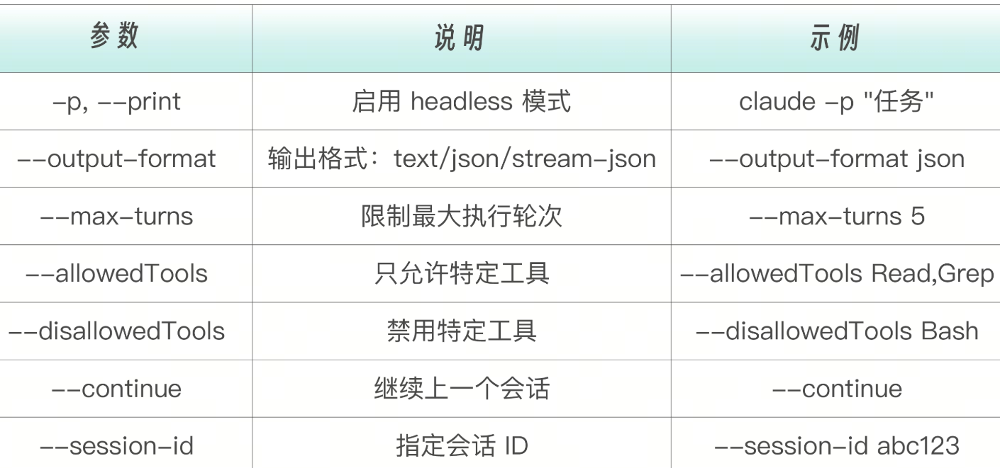
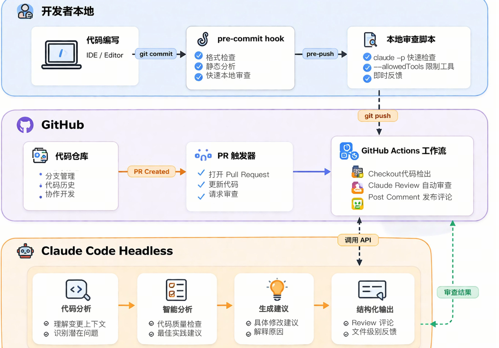

## Headless 模式核心机制

在终端里与 Claude 对话——你输入一句话，Claude 响应，你再输入，它再响应。这是交互模式。交互模式的好处是灵活，你可以随时调整方向、追问细节、确认操作。但它有一个根本限制——需要一个人类一直坐在屏幕前面。
然而，软件工程中有大量任务天然不需要实时对话。CI/CD 流水线在每次提交时自动运行，Pre-commit Hook 在提交前自动检查，定时任务在每天凌晨自动生成报告。这些场景需要的是非交互模式，也就是 Headless 模式。

Headless 这个词来自“无头浏览器”（Headless Browser）的概念——没有图形界面，但功能完整。同样，Headless 模式下的 Claude Code 没有交互式终端界面，但拥有和交互模式完全相同的代码分析能力、工具调用能力和推理能力。唯一的区别是：输入变成了一次性的 prompt，输出变成了 stdout 上的文本或 JSON，不再有来回对话。

启用 Headless 模式的关键是  -p（或  --print）标志。这个标志的名字很直观，print，意思是“把结果打印出来就行，不要打开交互界面”。理解这一点很重要，因为  -p  不只改变了输出方式，更重要的是它改变了 Claude Code 的整个运行模型——从“持续对话”变成了“单次执行”。
```
# 基本 headless 执行
claude -p "解释这段代码是做什么的"

# 从 stdin 读取输入
cat code.py | claude -p "分析这段代码"

# 结合文件内容
claude -p "找出这个文件中的 Bug" < buggy.js
```

Headless 模式提供了一组命令行参数来精细控制执行行为。这些参数是你在自动化脚本和 CI 配置中最常用的控制手段。特别值得注意的是  --allowedTools  和  --max-turns  这两个参数，它们是安全防护的第一道防线，能有效限制 Claude 在无人监管环境中的行为边界。



## 输出格式与管道集成

Headless 模式支持三种输出格式，适用于不同的自动化场景。选择哪种格式，取决于你的下游消费者是谁——是人类读者、是程序解析器、还是实时监控系统。

### Text 格式
Text 是默认格式，也是最简单的格式。适用场景为日志记录、简单脚本、人工审查。它直接输出 Claude 的回复文本，没有任何元数据包装。如果你只是想在终端里看结果，或者将结果写入日志文件，Text 格式就够了。
claude -p "生成一个 Python hello world 函数" --output-format text

### JSON 格式
当你需要在程序中解析 Claude 的输出时，JSON 格式是更好的选择。它不仅包含回复文本本身，还包含执行的元数据——耗时多久、花了多少钱、用了多少 tokens。这些元数据对于成本监控和性能调优至关重要。在生产环境的 CI/CD 流水线中，你几乎总是应该使用 JSON 格式，因为它让你能够用程序化的方式验证执行结果、追踪成本、检测异常。

claude -p "列出当前目录文件" --output-format json

```
{
  "type": "result",
  "subtype": "success",
  "session_id": "abc123",
  "is_error": false,
  "duration_ms": 1500,
  "duration_api_ms": 1200,
  "num_turns": 1,
  "total_cost_usd": 0.005,
  "usage": {
    "input_tokens": 150,
    "output_tokens": 200
  },
  "result": "文件列表：\n- file1.py\n- file2.js\n..."
}
```
下面是一个 Python 解析示例。这段代码展示了如何在脚本中调用 Claude Code 并提取结构化结果。注意  subprocess.run  的用法——它是在 Python 中调用外部命令的标准方式，capture_output=True  确保我们能拿到 stdout 的内容。

```
import subprocess
import json

result = subprocess.run(
    ["claude", "-p", "列出文件", "--output-format", "json"],
    capture_output=True,
    text=True
)

data = json.loads(result.stdout)
print(f"结果: {data['result']}")
print(f"耗时: {data['duration_ms']}ms")
print(f"费用: ${data['total_cost_usd']}")
```
### Stream-JSON 格式

对于长时间运行的任务，你可能不想等到执行完成才看到输出，因此这种格式适用于实时进度显示、长时间任务监控、流式处理。Stream-JSON 格式以 JSONL（每行一个 JSON 对象）的方式实时输出执行过程中的每个事件——Claude 的每段回复、每次工具调用、每个工具返回结果。

这种格式特别适合需要实时进度显示的场景，比如在 CI 日志中实时展示 Claude 正在做什么。

claude -p "分析代码" --output-format stream-json

```
{"type":"assistant","message":{"role":"assistant","content":[{"type":"text","text":"正在分析..."}]}}
{"type":"tool_use","tool":"Read","input":{"file_path":"/path/to/file"}}
{"type":"tool_result","tool":"Read","result":"file content..."}
{"type":"assistant","message":{"role":"assistant","content":[{"type":"text","text":"分析完成。"}]}}
{"type":"result","session_id":"abc123","is_error":false,"result":"最终结果"}
```

下面这段 Bash 脚本展示了如何逐行读取 Stream JSON 输出，并根据事件类型做出不同响应。你可以在此基础上扩展，比如在检测到  tool use  事件时，更新进度条，在检测到  result  事件时触发下游通知。

```
claude -p "分析代码" --output-format stream-json | while IFS= read -r line; do
  type=$(echo "$line" | jq -r '.type')
  if [ "$type" = "result" ]; then
    echo "最终结果: $(echo "$line" | jq -r '.result')"
  elif [ "$type" = "tool_use" ]; then
    echo "正在使用工具: $(echo "$line" | jq -r '.tool')"
  fi
done
``` 

### Unix 管道集成
Claude Code 的一个独特优势是它可以无缝融入 Unix 管道，成为你工具链中的一环。这不是一个附加功能，而是一种设计哲学——Claude Code 遵循 Unix“小工具、大组合”的传统，通过标准输入输出与其他命令行工具互联互通。

管道的核心思想是：前一个命令的输出，成为后一个命令的输入。当 Claude Code 站在管道中间时，它接收上游数据，用 AI 理解和处理这些数据，然后把结果传给下游。这意味着你可以把 Claude 插入到任何现有的 Shell 工作流中，而不需要改变工作流的结构。

```
# 分析日志文件
cat server.log | claude -p "找出所有错误并总结原因"

# 解析 JSON
curl https://api.example.com/data | claude -p "提取所有用户的邮箱地址"

# 代码转换
cat old-code.js | claude -p "将这段 JavaScript 转换为 TypeScript"
```

管道的真正威力在于组合。下面这些例子展示了 Claude Code 如何与  find、git、grep  等经典 Unix 工具协作。每个组合都解决了一个真实的开发场景——批量检查类型提示、总结提交变更、将散落的 TODO 转换为规范的 Issue 格式。

```
# 结合 find 和 xargs 批量处理
find src -name "*.py" | xargs -I {} claude -p "检查 {} 中的类型提示是否完整"

# 结合 git 工作流
git diff HEAD~1 | claude -p "总结这次提交的变更"

# 结合 grep 预过滤
grep -r "TODO" src/ | claude -p "将这些 TODO 转换为 GitHub Issue 格式"
```

Claude 不仅可以接收管道输入，它的输出同样可以通过管道流向下游。这样你就能构建完整的自动化链路：数据获取 -> AI 分析 -> 结果处理 -> 通知或存储。

下面的例子展示了三种典型的下游处理模式——用  jq  解析 JSON 结果、直接写入文件以及发送邮件通知。

```
# Claude 输出 -> jq 解析 -> 下游处理
claude -p "列出所有函数名" --output-format json | jq -r '.result' | sort | uniq

# Claude 生成代码 -> 直接写入文件
claude -p "生成一个 Express 路由处理函数" --output-format text > routes/user.js

# Claude 分析 -> 发送通知
claude -p "检查是否有安全漏洞" --output-format json | \
  jq -r '.result' | \
  mail -s "安全扫描报告" security@company.com
```

### 批量处理模式
当你需要对大量文件执行相同的 AI 分析任务时，批量处理模式就派上用场了。
Claude Code 的批处理（headless 模式）允许你直接从命令行执行 AI 功能，无需使用交互式 UI。通过集成到 CI/CD 流水线和自动化脚本中，你可以高效执行大规模处理任务。

下面是一个批量代码审查脚本。它遍历  src  目录下的所有 TypeScript 文件，对每个文件运行 Claude 审查，并将结果保存到独立的报告文件中。注意  --max-turns 3  的设置——对于单文件审查，3 轮通常就足够了，这样既能保证审查质量，又能控制成本和耗时。

```
#!/bin/bash
# batch-review.sh - 批量代码审查

RESULTS_DIR="review-results"
mkdir -p "$RESULTS_DIR"

# 遍历所有源文件
find src -name "*.ts" | while IFS= read -r file; do
  echo "Reviewing: $file"

  OUTPUT_FILE="$RESULTS_DIR/$(basename "$file").review.md"

  claude -p "Review $file for bugs and best practices. Be concise." \
    --output-format text \
    --max-turns 3 \
    --allowedTools Read > "$OUTPUT_FILE"

  echo "  -> $OUTPUT_FILE"
done

echo "Reviews complete. Results in $RESULTS_DIR/"
```

### GitHub Actions 集成
GitHub Actions 是 Headless 模式最常见的应用场景。GitHub 是最大的代码托管平台，而 Actions 是它的原生 CI/CD 系统。Claude Code 与 GitHub Actions 的集成，让“AI 驱动的代码审查”不再停留于概念，而是几行 YAML 配置就能实现。

Anthropic 提供了官方 GitHub Action，让集成变得极其简单。相比于手动安装 Claude Code 然后编写 Shell 命令调用，官方 Action 封装了安装、认证、权限管理等底层细节，你只需要提供 API Key 和 prompt 就能开始使用。

官方 Action 支持两种模式，分别对应不同的使用场景。Tag Mode 适合开发者主动请求帮助的场景——你在 PR 评论中 @claude，它就会响应。Agent Mode 适合完全自动化的场景——每次 PR 创建时自动触发，不需要人工干预。


Tag Mode 示例：在 PR 评论中输入  @claude 帮我审查这段代码，Claude 会自动响应并提供审查意见。

Agent Mode 示例：
```
- uses: anthropics/claude-code-action@v1
  with:
    anthropic_api_key: ${{ secrets.ANTHROPIC_API_KEY }}
    prompt: "审查这个 PR 的所有变更，检查安全漏洞"
```

最简单的设置方式是在 Claude Code 终端中运行  /install-github-app，它会引导你完成整个配置过程，包括创建 GitHub App、配置 Webhook、设置权限等。

如果你更喜欢手动配置，或者需要定制化的工作流，可以按以下步骤操作。第一步是在 GitHub 仓库的 Settings -> Secrets -> Actions 中添加  ANTHROPIC_API_KEY——这是唯一需要的密钥。第二步是创建工作流文件，定义触发条件和执行步骤。创建  .github/workflows/claude.yml：

```
name: Claude Code

on:
  issue_comment:
    types: [created]
  pull_request_review_comment:
    types: [created]

jobs:
  claude:
    runs-on: ubuntu-latest
    # 只在 @claude 提及时触发
    if: contains(github.event.comment.body, '@claude')

    permissions:
      contents: read
      pull-requests: write
      issues: write

    steps:
      - uses: actions/checkout@v4

      - uses: anthropics/claude-code-action@v1
        with:
          anthropic_api_key: ${{ secrets.ANTHROPIC_API_KEY }}
```
这份配置只有二十几行，但它实现了一个完整的 AI 审查工作流：监听 PR 和 Issue 中的评论，在检测到 @claude 提及时触发，检出代码，然后让 Claude 分析并回复。permissions  部分遵循最小权限原则——contents: read  只允许读取代码，pull-requests: write  和  issues: write  允许发表评论。


## 自动化 PR 审查
自动化 PR 审查是最常见的用例——每次 PR 创建或更新时自动审查。和上面的 Tag Mode 不同，这里不需要任何人工触发，PR 一创建就会自动开始审查。这个工作流稍微复杂一些，因为它需要获取变更文件列表、构建审查 prompt、运行 Claude、然后将结果发布为 PR 评论。

```
name: Claude PR Review

on:
  pull_request:
    types: [opened, synchronize, reopened]

# 取消正在运行的重复工作流
concurrency:
  group: ${{ github.workflow }}-${{ github.event.pull_request.number }}
  cancel-in-progress: true

jobs:
  review:
    runs-on: ubuntu-latest

    permissions:
      contents: read
      pull-requests: write

    steps:
      - name: Checkout code
        uses: actions/checkout@v4
        with:
          fetch-depth: 0  # 需要完整历史以获取 diff

      - name: Setup Node.js
        uses: actions/setup-node@v4
        with:
          node-version: "20"

      - name: Install Claude Code
        run: npm install -g @anthropic-ai/claude-code

      - name: Get changed files
        id: changed
        run: |
          FILES=$(git diff --name-only origin/${{ github.base_ref }}...HEAD)
          echo "files=$(echo "$FILES" | tr '\n' ' ')" >> $GITHUB_OUTPUT

      - name: Run Claude Review
        env:
          ANTHROPIC_API_KEY: ${{ secrets.ANTHROPIC_API_KEY }}
        run: |
          claude -p "Review this PR for code quality, bugs, security issues.

          Changed files: ${{ steps.changed.outputs.files }}

          Provide specific, actionable feedback with file:line references." \
            --output-format json \
            --max-turns 10 \
            --allowedTools Read,Grep,Glob > review.json

      - name: Post Review Comment
        uses: actions/github-script@v7
        with:
          script: |
            const fs = require('fs');
            const review = JSON.parse(fs.readFileSync('review.json', 'utf8'));

            const comment = `## Claude Code Review\n\n${review.result}\n\n---\n*Automated review by Claude Code*`;

            await github.rest.issues.createComment({
              issue_number: context.issue.number,
              owner: context.repo.owner,
              repo: context.repo.repo,
              body: comment
            });
```
这个工作流有几个值得注意的设计决策。

fetch-depth: 0  确保 checkout 时拉取完整的 git 历史，这样才能正确计算 diff。
concurrency  配置确保同一个 PR 上不会同时运行多个审查，当开发者快速连续推送多个 commit 时，旧的审查会被取消，只保留最新的。
--allowedTools Read,Grep,Glob  限制 Claude 只能使用只读工具，确保审查过程不会意外修改任何文件。

## 自动修复 Lint 错误
除了只读审查，Headless 模式还可以用于自动修复。下面的工作流展示了一个更激进的用例：当 lint 检查失败时，让 Claude 自动修复错误并提交。这种模式适合风格类的 lint 规则（缩进、分号、import 排序等），对于逻辑类的 lint 规则则需要更谨慎。注意这里没有设置  --allowedTools，因为 Claude 需要读写文件来完成修复。
```
name: Auto Fix Lint Errors

on:
  push:
    branches: [main, develop]

jobs:
  fix:
    runs-on: ubuntu-latest
    permissions:
      contents: write

    steps:
      - uses: actions/checkout@v4

      - name: Setup
        run: |
          npm ci
          npm install -g @anthropic-ai/claude-code

      - name: Run lint
        id: lint
        continue-on-error: true
        run: npm run lint 2>&1 | tee lint-output.txt

      - name: Fix with Claude
        if: steps.lint.outcome == 'failure'
        env:
          ANTHROPIC_API_KEY: ${{ secrets.ANTHROPIC_API_KEY }}
        run: |
          claude -p "Fix the lint errors in lint-output.txt. Make minimal changes." \
            --max-turns 20

      - name: Commit fixes
        run: |
          git config user.name "Claude Bot"
          git config user.email "claude@bot.local"
          git add -A
          git diff --staged --quiet || git commit -m "fix: auto-fix lint errors"
          git push
```

## Pre-commit Hook 集成


Pre-commit Hook 是另一个常见的 Headless 应用场景。与 CI/CD 流水线不同，Pre-commit Hook 运行在开发者的本地机器上，在代码提交之前进行检查。它的优势是即时反馈——你不需要等到代码推送到远端才知道有问题，在  git commit  的那一刻就能得到 AI 的审查意见。

基本 Pre-commit Hook
下面这个 Hook 脚本在每次  git commit  时自动运行。它获取暂存区的文件列表，让 Claude 快速检查有没有明显问题。如果 Claude 回复“OK”，提交正常进行；如果发现问题，提交会被阻止，并显示问题列表。注意  --max-turns 3  和  --allowedTools Read,Grep  的设置——pre-commit hook 需要快速完成，不能让开发者等太久，所以限制了执行轮次，并且只允许只读操作。

我们创建  .git/hooks/pre-commit。
```
#!/bin/bash
# Pre-commit hook: Claude Code 快速审查

# 获取暂存的文件
STAGED_FILES=$(git diff --cached --name-only --diff-filter=ACM)

if [ -z "$STAGED_FILES" ]; then
  exit 0
fi

echo "Running Claude Code review on staged files..."

# 运行审查（只读工具，快速模式）
RESULT=$(claude -p "Quick review these staged files for obvious issues:
$STAGED_FILES

Focus on: syntax errors, security issues, obvious bugs.
Reply with 'OK' if no issues, or list the problems." \
  --output-format text \
  --max-turns 3 \
  --allowedTools Read,Grep)

# 检查结果
if echo "$RESULT" | grep -qi "OK"; then
  echo "Claude review passed"
  exit 0
else
  echo "Claude found issues:"
  echo "$RESULT"
  echo ""
  echo "Commit blocked. Fix the issues or use --no-verify to skip."
  exit 1
fi
```
然后设置权限：
```
chmod +x .git/hooks/pre-commit
```
## 自动生成 Commit Message

另一个实用的 Hook 是自动生成 commit message。很多开发者在写 commit message 时都很头疼——要么写得太笼统（ix bug），要么干脆放弃思考（update）。这个 Hook 可以利用 Claude 分析 diff 内容，帮我们自动生成符合 Conventional Commits 规范的 commit message。

创建  .git/hooks/prepare-commit-msg：

```
#!/bin/bash
# 自动生成 commit message

# 如果用户通过 -m 提供了 commit message，跳过
# $2 表示 commit message 的来源：message(-m)、template、merge、squash
if [ -n "$2" ]; then
  exit 0
fi

# 获取 diff
DIFF=$(git diff --cached)

if [ -z "$DIFF" ]; then
  exit 0
fi

# 生成 commit message
MESSAGE=$(claude -p "Generate a concise commit message for these changes:

$DIFF

Format: <type>: <description>
Types: feat, fix, docs, style, refactor, test, chore
Reply with ONLY the commit message, nothing else." \
  --output-format text \
  --max-turns 1)

# 将生成的 message 写入文件开头，保留 Git 的注释模板
TEMP_FILE=$(mktemp)
echo "$MESSAGE" > "$TEMP_FILE"
echo "" >> "$TEMP_FILE"
cat "$1" >> "$TEMP_FILE"
mv "$TEMP_FILE" "$1"
```
## 使用 pre-commit 框架

如果你的团队使用  pre-commit  框架来管理 Git hooks，可以将 Claude 审查集成为框架中的一个 hook。这样的好处是，hook 的安装和更新由框架统一管理，团队成员不需要手动拷贝 hook 脚本。


配置  .pre-commit-config.yaml：
```
repos:
  - repo: local
    hooks:
      - id: claude-review
        name: Claude Code Review
        entry: bash -c 'claude -p "Review staged changes for issues" --max-turns 3 --output-format text'
        language: system
        types: [python, javascript, typescript]
        stages: [pre-commit]
```
## 实战项目：完整的 CI/CD 审查系统

下面的目录结构展示了一个完整的 CI/CD 审查系统需要哪些文件。.github/workflows/  下是 GitHub Actions 配置，scripts/  下是本地审查脚本，.git/hooks/  下是 pre-commit hook，CLAUDE.md  则为所有环节提供统一的审查规范。

```
my-project/
├── .github/
│   └── workflows/
│       └── claude-review.yml    # GitHub Action 配置
├── scripts/
│   └── review.sh                # 本地审查脚本
├── .git/
│   └── hooks/
│       └── pre-commit           # Pre-commit Hook
└── CLAUDE.md                    # Claude 记忆文件
```
CLAUDE.md 在 Headless 模式中扮演着关键角色。无论是 pre-commit hook 还是 GitHub Actions 中的 Claude，都会读取项目根目录的 CLAUDE.md 来了解审查规范。这意味着你可以通过一份配置文件，统一所有环节的审查标准。

```
# 代码审查规范

## 审查重点
1. 代码质量：命名规范、DRY 原则、复杂度
2. 安全问题：输入验证、SQL 注入、XSS
3. 性能问题：N+1 查询、内存泄漏
4. 测试覆盖：关键路径必须有测试

## 输出格式
- Critical: 必须修复
- Warning: 应该修复
- Suggestion: 建议改进

## 禁止操作
- 不要修改 .env 文件
- 不要执行 npm publish
- 不要修改数据库迁移文件
```

scripts/review.sh  是一个独立的本地审查脚本，开发者可以在任何时候手动运行它来审查代码。它与 CI 中的审查使用相同的 Claude 能力，但运行在本地环境中。脚本包含了完整的错误处理——检查 API Key 是否设置、Claude Code 是否安装——以及结果保存功能，每次审查的报告都会保存为带时间戳的 Markdown 文件。

