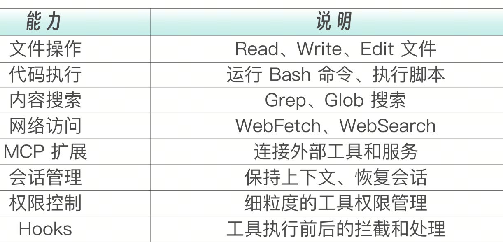
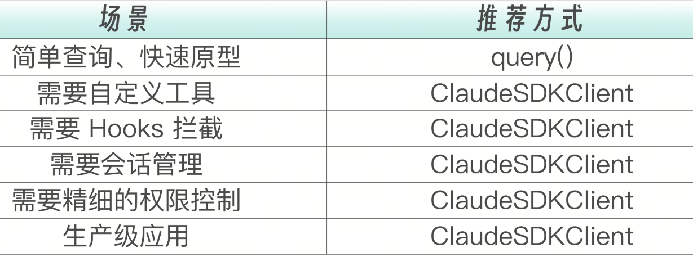
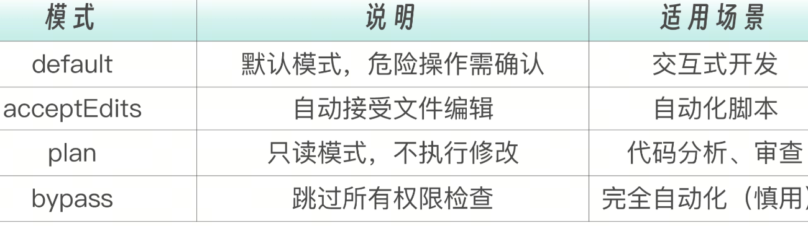
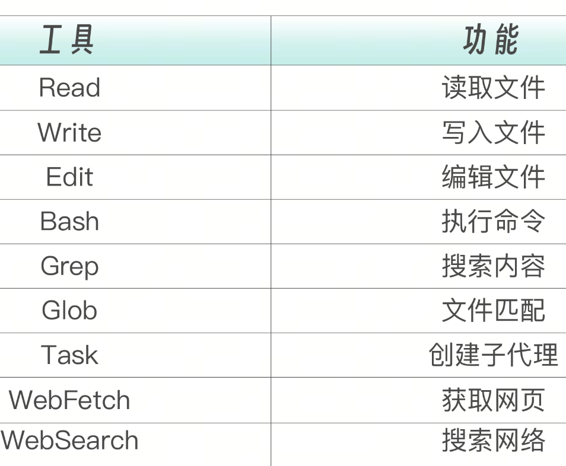

Claude Agent SDK 的价值——它把 Claude Code 的所有能力封装成了可编程的接口。你可以用 Python 或 TypeScript 编写代码，像调用普通函数一样调用 AI Agent。

从配置驱动到代码驱动，是从“使用者”到“构建者”的关键一步。

## 什么是 Agent SDK
Claude Agent SDK 提供了可编程的 Claude Code。它不是一个新的模型 API，而是对 Claude Code 这个 Agent 系统的完整封装。你通过 SDK 调用的不是一个简单的文本生成接口，而是一个完整的 Agent 循环——Claude 会自主决定使用哪些工具、读取哪些文件、执行哪些命令，然后把结果返回给你。

Claude Agent SDK 让你能够构建自主运行的 AI Agent——它们可以读取文件、执行命令、搜索网络、编辑代码等。SDK 提供了驱动 Claude Code 的相同工具、代理循环和上下文管理能力。

简单来说，这三种方式形成了一个递进关系：CLI 是手动操作，Headless 是自动化脚本，SDK 是可编程集成。每一步都在降低人工干预的程度，提升集成的灵活性。

Agent SDK 支持两种语言。
Python：pip install claude-agent-sdk
TypeScript：npm install @anthropic-ai/claude-agent-sdk

## SDK 能力一览


用户上传代码后，Agent 可以用 Read 读取文件、用 Grep 搜索模式、用 Glob 遍历目录、用 Bash 运行测试——所有这些操作都在你的应用后端自动完成，用户只需要等待报告生成。


## 安装与环境配置

在开始编写代码之前，你需要安装 SDK 并配置好环境。这个过程很简单，但有几个关键点需要注意。

Python 安装要求 Python 3.10 及以上版本。之所以有这个版本要求，是因为 SDK 大量使用了async/await  语法和  match/case  模式匹配等现代 Python 特性。如果你的系统 Python 版本较低，建议使用  pyenv  或  conda  管理多个 Python 版本。

```
# 要求 Python 3.10+
pip install claude-agent-sdk
```
安装完成后，用一段简单的代码验证安装是否成功：

```
from claude_agent_sdk import query
print("Claude Agent SDK installed successfully!")
```
TypeScript 方面，SDK 以 npm 包的形式分发，兼容 Node.js 18+ 环境：
npm install @anthropic-ai/claude-agent-sdk

```
import { query } from '@anthropic-ai/claude-agent-sdk';
console.log("Claude Agent SDK installed successfully!");
```
SDK 需要 Anthropic API Key 才能运行。这个 Key 是你与 Anthropic 服务器通信的凭证，所有的模型调用和 Token 消耗都会计入这个 Key 对应的账户。

export ANTHROPIC_API_KEY="sk-ant-api03-..."

或者在代码中设置，适用于需要动态切换 Key 的场景（比如多租户 SaaS 应用，每个客户有自己的 Key）：

```
import os
os.environ["ANTHROPIC_API_KEY"] = "sk-ant-api03-..."
```

如果你在 CI/CD 中使用，可以用 Secrets 管理：

```
env: 
  ANTHROPIC_API_KEY: ${{ secrets.ANTHROPIC_API_KEY }}
```

## 两种使用方式
Agent SDK 提供了两种使用方式，适用于不同场景。理解它们的区别是正确使用 SDK 的第一步。你可以把它们类比为 Python 中的  requests.get()  和  requests.Session()，前者是无状态的一次性调用，后者是有状态的会话管理。

### query() 函数：简洁高效
query()  是最简单的方式，适合轻量级用例。它接收一个 Prompt 字符串，返回一个异步迭代器，你可以逐条接收 Agent 产生的消息。整个过程不需要手动管理连接、配置选项或处理会话状态，SDK 帮你搞定一切。

Python：
```
from claude_agent_sdk import query
import asyncio

async def main():
    # 简单查询
    async for message in query("解释什么是递归"):
        if message.type == "text":
            print(message.text)

asyncio.run(main())
```

TypeScript：

```
import { query } from '@anthropic-ai/claude-agent-sdk';

async function main() {
  for await (const message of query("解释什么是递归")) {
    if (message.type === 'text') {
      console.log(message.text);
    }
  }
}

main();
```
query()  的特点是：
一行代码即可调用  自动处理工具调用循环  适合单次、简单的任务

## ClaudeSDKClient 类：完整控制

当你需要更精细的控制时，比如限制 Agent 只能使用特定工具、设置最大执行轮次、管理多轮会话，就需要使用  ClaudeSDKClient。它提供了完整的配置能力，让你可以像搭积木一样组合 Agent 的行为。


与开箱即用的query()  不同，ClaudeSDKClient  要求你显式地创建客户端、配置选项、管理连接生命周期。这种显式性是刻意为之的，在生产环境中，你需要明确知道 Agent 能做什么、不能做什么、在什么条件下停止。隐式的默认值在生产中往往是 Bug 的温床。

Python：
```
from claude_agent_sdk import ClaudeSDKClient, ClaudeAgentOptions
import asyncio

async def main():
    options = ClaudeAgentOptions(
        allowed_tools=["Read", "Grep", "Glob"],
        max_turns=10,
        permission_mode="plan"  # 只读模式
    )

    async with ClaudeSDKClient(options=options) as client:
        await client.query("分析 src/ 目录的代码结构")

        async for message in client.receive_response():
            if message.type == "text":
                print(message.text)
            elif message.type == "tool_use":
                print(f"Using tool: {message.tool_name}")

asyncio.run(main())
```
TypeScript：
```
import { ClaudeSDKClient, ClaudeAgentOptions } from '@anthropic-ai/claude-agent-sdk';

async function main() {
  const options: ClaudeAgentOptions = {
    allowedTools: ['Read', 'Grep', 'Glob'],
    maxTurns: 10,
    permissionMode: 'plan'
  };

  const client = new ClaudeSDKClient(options);

  try {
    await client.connect();
    await client.query("分析 src/ 目录的代码结构");

    for await (const message of client.receiveResponse()) {
      if (message.type === 'text') {
        console.log(message.text);
      } else if (message.type === 'toolUse') {
        console.log(`Using: ${message.toolName}`);
      }
    }
  } finally {
    await client.disconnect();
  }
}

main();
```
ClaudeSDKClient的特点是：
完整的配置控制 支持自定义工具  支持 Hooks  支持会话恢复


一个简单的经验法则是，如果你在终端里用一行命令就能完成的事情，用query()；如果你需要在代码里做任何“配置”或“控制”，用  ClaudeSDKClient。

在实际项目中，常见的演进路径是先用  query()  快速验证想法，然后在功能成型后迁移到  ClaudeSDKClient  进行工程化。两种方式的消息格式完全兼容，迁移成本很低。

## ClaudeAgentOptions 配置详解
ClaudeAgentOptions  是控制 Agent 行为的核心配置类。你可以把它理解为 Agent 的“说明书”，它告诉 Agent 该用什么模型、能用什么工具、最多跑几轮、在什么目录下工作。每一个配置项都会直接影响 Agent 的行为和成本。
下面是完整的配置项。不需要一次记住所有配置，你可以先关注最常用的四个：allowed_tools、permission_mode、max_turns、model。其余的在需要时查阅即可。

```
from claude_agent_sdk import ClaudeAgentOptions

options = ClaudeAgentOptions(
    # === 模型选择 ===
    model="sonnet",  # "sonnet" | "opus" | "haiku"

    # === 工具控制 ===
    allowed_tools=["Read", "Write", "Bash", "Grep", "Glob"],
    disallowed_tools=["Task"],

    # === 权限模式 ===
    permission_mode="default",  # "default" | "acceptEdits" | "plan" | "bypass"

    # === 执行控制 ===
    max_turns=20,
    cwd="/path/to/project",

    # === 输出格式 ===
    output_format="stream-json",  # "text" | "json" | "stream-json"

    # === 会话管理 ===
    continue_conversation=True,
    resume="session-id",

    # === 系统提示 ===
    system_prompt="You are a helpful coding assistant.",

    # === MCP 服务器 ===
    mcp_servers={
        "my-server": {...}
    },

    # === Hooks ===
    hooks={
        "PreToolUse": [...],
        "PostToolUse": [...]
    }
)
```

## 权限模式详解
权限模式决定了 Agent 执行操作时的确认行为。这是安全性与自动化程度之间的一个权衡——你给 Agent 越多的自主权，它就能越快地完成任务，但风险也越高。

选择权限模式时，问自己一个问题：如果 Agent 做了一件错事，最坏的结果是什么？如果最坏结果“改错了一个文件，我  git checkout  恢复一下”，那可以放宽权限；如果最坏结果是“删除了生产数据库”，那必须严格控制。



下面的代码展示了两种典型场景下的权限配置。代码审查只需要读取代码，不需要任何修改能力，所以用  plan  模式加上只读工具；自动修复则需要编辑文件的能力，但不需要执行任意命令，所以用  acceptEdits  模式搭配  Read/Write/Edit  工具。
```
# 代码审查场景：只读
options = ClaudeAgentOptions(
    permission_mode="plan",
    allowed_tools=["Read", "Grep", "Glob"]
)

# 自动修复场景：接受编辑
options = ClaudeAgentOptions(
    permission_mode="acceptEdits",
    allowed_tools=["Read", "Write", "Edit"]
)
```

你可以精确控制 Agent 能使用哪些工具。SDK 提供了两种控制方式，白名单（allowed_tools）和黑名单（disallowed_tools）。



```
# 只允许读取操作
options = ClaudeAgentOptions(
    allowed_tools=["Read", "Grep", "Glob"]
)

# 禁用危险工具
options = ClaudeAgentOptions(
    disallowed_tools=["Bash", "Write"]
)

# 限制 Bash 命令（只允许 git 和 npm）
options = ClaudeAgentOptions(
    allowed_tools=["Bash(git:*)", "Bash(npm:*)"]
)
```

## 消息类型与响应处理

理解消息类型是正确处理 Agent 响应的关键。Agent 不是一次性返回结果的——它是一个异步流，在执行过程中会源源不断地产生不同类型的消息。你的代码需要根据消息类型分别处理，就像处理不同类型的网络事件一样。

Agent 在执行过程中会产生五种类型的消息。

text  是 Claude 生成的文本内容，比如分析结论、代码解释；tool_use  表示 Agent 正在调用某个工具；tool_result  是工具执行后返回的结果；error  表示执行过程中遇到了错误；result  是最终的汇总消息，包含执行时间、成本等元数据。

```
async for message in client.receive_response():
    match message.type:
        case "text":
            # 文本响应
            print(message.text)

        case "tool_use":
            # 工具调用（Agent 正在使用工具）
            print(f"Tool: {message.tool_name}")
            print(f"Input: {message.tool_input}")

        case "tool_result":
            # 工具执行结果
            print(f"Result: {message.result}")

        case "error":
            # 错误信息
            print(f"Error: {message.error}")

        case "result":
            # 最终结果（任务完成）
            print(f"Final: {message.result}")
            print(f"Cost: ${message.total_cost_usd}")
```

当任务完成时，你会收到一个  result  类型的消息。这是整个 Agent 执行过程的“成绩单”，包含了你在生产环境中最关心的信息：这次调用花了多少钱、用了多少 Token、跑了多少轮、耗时多长。这些数据是你做成本监控和性能优化的基础。

```
{
    "type": "result",
    "subtype": "success",
    "session_id": "abc123",
    "is_error": False,
    "num_turns": 5,
    "duration_ms": 12000,
    "duration_api_ms": 10000,
    "total_cost_usd": 0.05,
    "usage": {
        "input_tokens": 5000,
        "output_tokens": 2000
    },
    "result": "任务完成..."
}
```

在实际项目中，你通常不会只是把消息打印到终端，你需要把它们收集起来，形成结构化的结果，供后续的业务逻辑使用。

下面这个模式是项目中反复验证过的“最佳实践”：把所有消息分类收集到一个字典中，最后返回完整的结构化结果。

```
async def run_agent(prompt: str) -> dict:
    """运行 Agent 并返回结构化结果"""

    result = {
        "output": [],
        "tools_used": [],
        "metadata": {}
    }

    async with ClaudeSDKClient(options) as client:
        await client.query(prompt)

        async for msg in client.receive_response():
            if msg.type == "text":
                result["output"].append(msg.text)

            elif msg.type == "tool_use":
                result["tools_used"].append({
                    "tool": msg.tool_name,
                    "input": msg.tool_input
                })

            elif msg.type == "result":
                result["metadata"] = {
                    "session_id": msg.session_id,
                    "duration_ms": msg.duration_ms,
                    "cost_usd": msg.total_cost_usd,
                    "turns": msg.num_turns
                }

            elif msg.type == "error":
                result["error"] = msg.error

    return result
```

这个模式的好处是，调用方可以直接从  result["output"]  获取 Agent 的文本输出，从  result["tools_used"]  获取工具调用记录（用于审计），从  result["metadata"]  获取成本和性能数据（用于监控）。

## 会话管理

你让 Agent 分析一个项目的代码结构，分析完之后想让它基于分析结果生成文档。如果没有会话管理，Agent 在第二次调用时完全不记得它之前分析过什么，你得重新传一遍所有上下文。

因此，通过会话管理保持对话上下文，或者恢复之前的会话。这对于长时间运行的任务或需要分阶段完成的工作特别有用。

在同一个  ClaudeSDKClient  实例中，你可以进行多轮对话。Agent 会自动记住之前的上下文——它知道自己读过哪些文件、执行过哪些命令、做过哪些分析。每次新的  query()  调用都是在之前的上下文基础上继续，而不是从零开始。
```
async with ClaudeSDKClient() as client:
    # 第一次查询
    await client.query("创建一个 Python 项目结构")
    async for msg in client.receive_response():
        print(msg)

    # 获取会话 ID
    session_id = client.session_id
    print(f"Session ID: {session_id}")

    # 继续对话（Agent 记得之前的上下文）
    await client.query("在项目中添加一个 requirements.txt 文件")
    async for msg in client.receive_response():
        print(msg)
```

有时候你需要在不同的程序运行之间保持对话连续性。比如，你的 Agent 在一次 CI 运行中分析了代码，你想在下一次 CI 运行中让它继续从上次的结论出发。这时候就需要保存  session_id，然后在下次启动时通过  resume  参数恢复会话。

```
# 保存会话 ID
saved_session_id = "abc123"

# 稍后恢复
options = ClaudeAgentOptions(
    resume=saved_session_id
)

async with ClaudeSDKClient(options=options) as client:
    # 在之前的上下文中继续
    await client.query("继续刚才的任务")
    async for msg in client.receive_response():
        print(msg)
```

下面是一个完整的会话持久化方案。它把  session_id  保存到本地 JSON 文件中，支持按名称存取多个会话。这个方案适用于开发环境和小型项目。

在生产环境中，你可能需要把会话 ID 存到 Redis 或数据库中，并设置过期时间——长时间不活跃的会话应该被清理，否则会累积大量上下文，导致 Token 消耗急剧增加。

```
import json
from pathlib import Path

SESSIONS_FILE = Path("sessions.json")

def save_session(name: str, session_id: str):
    """保存会话"""
    sessions = {}
    if SESSIONS_FILE.exists():
        sessions = json.loads(SESSIONS_FILE.read_text())
    sessions[name] = session_id
    SESSIONS_FILE.write_text(json.dumps(sessions, indent=2))

def load_session(name: str) -> str | None:
    """加载会话"""
    if not SESSIONS_FILE.exists():
        return None
    sessions = json.loads(SESSIONS_FILE.read_text())
    return sessions.get(name)

# 使用
async def main():
    # 尝试恢复会话
    session_id = load_session("project-review")

    options = ClaudeAgentOptions(
        resume=session_id  # None 则开始新会话
    )

    async with ClaudeSDKClient(options=options) as client:
        await client.query("继续代码审查")

        async for msg in client.receive_response():
            if msg.type == "result":
                # 保存会话以便下次恢复
                save_session("project-review", msg.session_id)
```

## 实战项目——代码分析 Agent

我们的项目需求是，构建一个 Agent，能够完成以下任务。
扫描指定目录的代码
识别项目结构和技术栈
发现潜在问题
生成分析报告
这是一个典型的“只读分析”场景——Agent 只需要读取代码，不需要修改任何文件。因此我们使用  plan  权限模式，配合  Read/Grep/Glob  三个只读工具。这样即使 Agent 的 Prompt 被注入了恶意指令（比如“删除所有文件”），它也没有能力执行。

下面是完整的代码实现。代码分为三个部分：analyze_codebase()  函数负责调用 Agent 并收集结果，format_report()  函数负责把结果格式化为可读的报告，main()  函数负责处理命令行参数和文件输出。

```
#!/usr/bin/env python3
"""
代码分析 Agent

使用 Claude Agent SDK 构建一个自动代码分析工具。
"""

import asyncio
import sys
from datetime import datetime
from pathlib import Path

from claude_agent_sdk import ClaudeSDKClient, ClaudeAgentOptions


async def analyze_codebase(directory: str) -> dict:
    """
    使用 Claude Agent SDK 分析代码库

    Args:
        directory: 要分析的目录路径

    Returns:
        包含分析结果的字典
    """
    # 配置 Agent 选项
    options = ClaudeAgentOptions(
        # 只允许读取操作，确保安全
        allowed_tools=["Read", "Grep", "Glob"],

        # 使用只读模式
        permission_mode="plan",

        # 限制执行轮次
        max_turns=25,

        # 设置工作目录
        cwd=directory,

        # 使用 Sonnet 模型（平衡性能和成本）
        model="sonnet"
    )

    # 构建分析提示
    prompt = f"""请分析 {directory} 目录中的代码库。

## 分析任务

1. **项目结构**
   - 识别主要目录和文件
   - 确定项目类型（Web 应用、API、CLI 工具等）
   - 列出使用的技术栈

2. **代码质量**
   - 检查代码组织是否合理
   - 识别重复代码
   - 评估命名规范

3. **潜在问题**
   - 查找可能的 bug
   - 识别安全隐患
   - 发现性能问题

4. **改进建议**
   - 提出具体的改进方案
   - 优先级排序

## 输出格式

请以 Markdown 格式输出报告，包含上述所有部分。
在每个问题后注明文件和行号。
"""

    # 收集结果
    result = {
        "directory": directory,
        "timestamp": datetime.now().isoformat(),
        "report": [],
        "tools_used": [],
        "metadata": {}
    }

    try:
        async with ClaudeSDKClient(options=options) as client:
            await client.query(prompt)

            async for message in client.receive_response():
                match message.type:
                    case "text":
                        result["report"].append(message.text)

                    case "tool_use":
                        tool_info = f"{message.tool_name}: {message.tool_input.get('file_path', message.tool_input.get('pattern', ''))}"
                        result["tools_used"].append(tool_info)
                        print(f"  [scanning] {tool_info}")

                    case "result":
                        result["metadata"] = {
                            "duration_ms": message.duration_ms,
                            "total_cost_usd": message.total_cost_usd,
                            "num_turns": message.num_turns,
                            "input_tokens": message.usage.get("input_tokens", 0),
                            "output_tokens": message.usage.get("output_tokens", 0)
                        }

                    case "error":
                        print(f"  [error] {message.error}")
                        result["error"] = message.error

    except Exception as e:
        result["error"] = str(e)
        print(f"Error during analysis: {e}")

    return result


def format_report(result: dict) -> str:
    """格式化分析报告"""
    lines = [
        "=" * 60,
        "           CODE ANALYSIS REPORT",
        "=" * 60,
        "",
        f"Directory: {result['directory']}",
        f"Timestamp: {result['timestamp']}",
        ""
    ]

    if result.get("error"):
        lines.extend([
            "WARNING: Analysis encountered an error:",
            result["error"],
            ""
        ])

    lines.extend([
        "-" * 60,
        "                   REPORT",
        "-" * 60,
        ""
    ])

    # 添加报告内容
    report_text = "\n".join(result.get("report", []))
    lines.append(report_text)

    # 添加元数据
    if result.get("metadata"):
        meta = result["metadata"]
        lines.extend([
            "",
            "-" * 60,
            "                 STATISTICS",
            "-" * 60,
            f"Duration: {meta.get('duration_ms', 0) / 1000:.2f}s",
            f"Cost: ${meta.get('total_cost_usd', 0):.4f}",
            f"Turns: {meta.get('num_turns', 0)}",
            f"Tokens: {meta.get('input_tokens', 0)} in / {meta.get('output_tokens', 0)} out",
            "=" * 60
        ])

    return "\n".join(lines)


async def main():
    """主函数"""
    if len(sys.argv) < 2:
        print("Usage: python code_analyzer.py <directory>")
        print("Example: python code_analyzer.py ./src")
        sys.exit(1)

    directory = sys.argv[1]

    if not Path(directory).is_dir():
        print(f"Error: {directory} is not a valid directory")
        sys.exit(1)

    print(f"Analyzing codebase: {directory}")
    print("   This may take a few minutes...")
    print()

    # 运行分析
    result = await analyze_codebase(directory)

    # 输出报告
    report = format_report(result)
    print(report)

    # 保存报告到文件
    report_file = f"analysis-report-{datetime.now().strftime('%Y%m%d-%H%M%S')}.md"
    with open(report_file, "w") as f:
        f.write(report)

    print(f"\nReport saved to: {report_file}")


if __name__ == "__main__":
    asyncio.run(main())
```

运行这个代码分析 Agent 时，你会看到它逐步扫描文件、搜索模式、阅读代码，最终生成一份结构化的报告。注意 STATISTICS 部分——它告诉你这次分析花了多少钱、用了多少 Token，这些数据对于生产环境的成本预估至关重要。
TypeScript 版本有一个 Python 没有的优势——类型安全。AnalysisResult  接口明确定义了返回值的结构，如果你漏写了某个字段或者类型不匹配，编译器会在运行前就告诉你。这在大型项目中特别有价值。

## 错误处理与监控

在开发阶段，代码能跑通就行。但在生产环境中，错误处理和监控是不可或缺的。Agent 调用涉及网络通信、模型推理、工具执行三个层面，每一层都可能出错。一个健壮的 Agent 应用必须能优雅地处理这些错误，而不是在用户面前崩溃。

Agent SDK 中的错误分为两类：一类是 SDK 层面的错误（如 API Key 无效、网络超时），抛出  ClaudeAgentError  异常；另一类是 Agent 执行层面的错误（如工具调用失败、权限被拒绝），通过消息流中的  error  类型消息返回。你需要同时处理这两类错误。
```
from claude_agent_sdk import ClaudeSDKClient, ClaudeAgentError

async def safe_query(prompt: str):
    """带错误处理的查询"""
    try:
        async with ClaudeSDKClient() as client:
            await client.query(prompt)

            async for msg in client.receive_response():
                if msg.type == "error":
                    # Agent 内部错误
                    print(f"Agent error: {msg.error}")
                    return None
                elif msg.type == "text":
                    print(msg.text)
                elif msg.type == "result":
                    return msg.result

    except ClaudeAgentError as e:
        # SDK 错误（如 API 连接失败）
        print(f"SDK error: {e}")
        return None

    except Exception as e:
        # 未预期的错误
        print(f"Unexpected error: {e}")
        return None
```

## 成本监控与控制

每一次 Agent 调用都会消耗 Token，产生费用。在生产环境中，如果不对成本进行监控，很容易拿到一份让你惊吓的高额账单，一个失控的 Agent 循环可能在几分钟内消耗数十美元。下面的代码展示了如何在每次调用后检查成本，并在超过预设阈值时发出告警。

```
import logging

logging.basicConfig(level=logging.INFO)
logger = logging.getLogger(__name__)

async def monitored_query(prompt: str, cost_limit: float = 0.10):
    """带成本监控的查询"""
    async with ClaudeSDKClient() as client:
        await client.query(prompt)

        turn_count = 0
        async for msg in client.receive_response():
            if msg.type == "tool_use":
                turn_count += 1
                logger.info(f"Turn {turn_count}: {msg.tool_name}")

            if msg.type == "result":
                cost = msg.total_cost_usd
                logger.info(f"Completed in {msg.duration_ms}ms, cost: ${cost}")

                if cost > cost_limit:
                    logger.warning(f"Cost exceeded limit: ${cost} > ${cost_limit}")

                return msg
```
控制 Agent 成本的核心手段有三个：限制轮次、选择更便宜的模型、限制工具。这三个手段可以组合使用，根据具体场景找到性能和成本的最佳平衡点。

```
# 1. 限制轮次
options = ClaudeAgentOptions(
    max_turns=10  # 最多 10 轮
)

# 2. 使用更便宜的模型
options = ClaudeAgentOptions(
    model="haiku"  # Haiku 比 Sonnet 便宜得多
)

# 3. 限制工具（减少读取的文件数）
options = ClaudeAgentOptions(
    allowed_tools=["Read", "Glob"],  # 不用 Grep
    max_turns=5
)
```
在生产环境运行 Agent，监控关键指标：
成本：每次调用花了多少钱
耗时：任务执行了多长时间
轮次：Agent 循环了多少次
错误率：多少任务失败了

