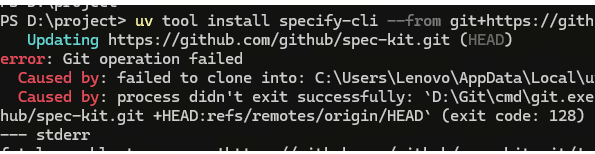
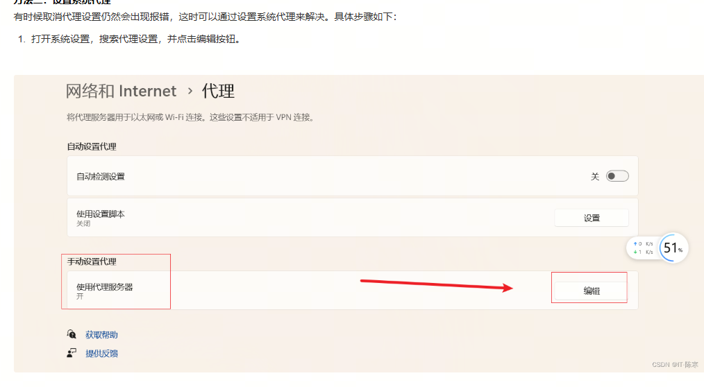
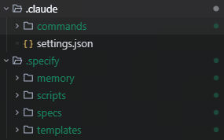
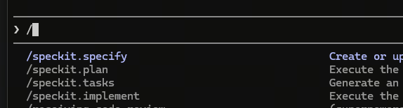
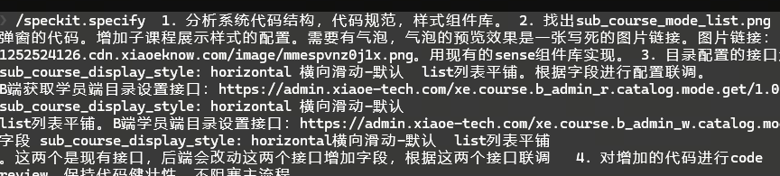
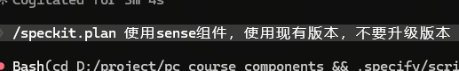

# 什么是Spec Kit？它为何而来？
规范驱动开发颠覆了传统的软件开发模式。几十年来，代码至上——规范仅仅是搭建的框架，一旦开始“真正的”编码工作，规范就会被弃之不用。规范驱动开发改变了这一切：规范变得可执行，能够直接生成可运行的实现，而不仅仅是指导实现。

它主要解决了什么问题？

告别“氛围编码”：你是否曾对AI说“帮我写个登录功能”，结果生成的代码看似正确却无法运行？Spec Kit通过结构化流程杜绝这种即兴且不靠谱的编码。

终结混乱与返工：从想法到实现，缺乏清晰步骤导致后期大量修改。Spec Kit明确了 Specify（规范）→ Plan（计划）→ Tasks（任务） 的流程，让开发有序可控。

保证代码质量：它强制推行测试驱动开发等最佳实践，确保AI生成的代码不仅能用，而且可靠、可维护。

简单说，Spec Kit就像建筑领域的“蓝图”，它要求你在动工（写代码）前，先画出详细的图纸（规范），后续所有工作都严格按图施工，极大提升了开发效率与质量。

# 安装
持久安装（推荐）
一次安装，到处使用：

uv tool install specify-cli --from git+https://github.com/github/spec-kit.git

命令行安装可能遇到 连接githup失败的问题：

需要设置git 代理，代理服务器设置端口7890

git config --global http.proxy http://127.0.0.1:7890
然后查看git 配置
git config --global -l

然后直接使用该工具：

## Create new project
specify init <PROJECT_NAME>

## Or initialize in existing project
specify init . --ai claude
## or
specify init --here --ai claude

## Check installed tools
specify check

持久安装的优势：

该工具将保持安装状态并添加到 PATH 环境变量中。
无需创建 shell 别名
更好的工具管理uv tool list，uv tool upgradeuv tool uninstall
更简洁的 shell 配置

## 确立项目原则
在项目目录中启动您的AI助手。/speckit.*助手内部提供各种命令。

使用该/speckit.constitution命令创建项目的管理原则和开发指南，这些原则和指南将指导所有后续开发工作。
/speckit.constitution Create principles focused on code quality, testing standards, user experience consistency, and performance requirements

## 创建规范

使用该/speckit.specify命令描述你想构建的内容。重点在于“是什么”和“为什么”，而不是技术栈。

/speckit.specify Build an application that can help me organize my photos in separate photo albums. Albums are grouped by date and can be re-organized by dragging and dropping on the main page. Albums are never in other nested albums. Within each album, photos are previewed in a tile-like interface.

## 制定技术实施计划
使用该/speckit.plan命令提供您的技术栈和架构选择。
/speckit.plan The application uses Vite with minimal number of libraries. Use vanilla HTML, CSS, and JavaScript as much as possible. Images are not uploaded anywhere and metadata is stored in a local SQLite database.

## 分解成多个任务

用于/speckit.tasks根据您的实施计划创建可执行的任务清单。
/speckit.tasks

##  Execute implementation

Use /speckit.implement to execute all tasks and build your feature according to the plan.
/speckit.implement

# 实际使用示例

在项目命令行生成项目文件结构：
specify init . --ai claude

项目会生成多个配置文件

然后打开claude code 环境，开始使用spec kit 功能。

/specify 

第一步描述整个需求：/specify 加需求 
会生成spec.md 文件，

 下一步: 可以使用 /speckit.plan 进入规划阶段，或使用 /speckit.clarify 澄清需求细节。

第二步，生成规划 /speckit.plan 加计划 
会生成plan.md 文件，描述项目的技术栈和架构选择。

第三步: 可以使用 /speckit.tasks 生成任务清单，或直接开始实现。

下一步: 可以使用 /speckit.taskstoissues 将任务转换为 GitHub issues，或直接开始实现。

第四步： 使用 /speckit.implement 执行所有任务并构建功能。

