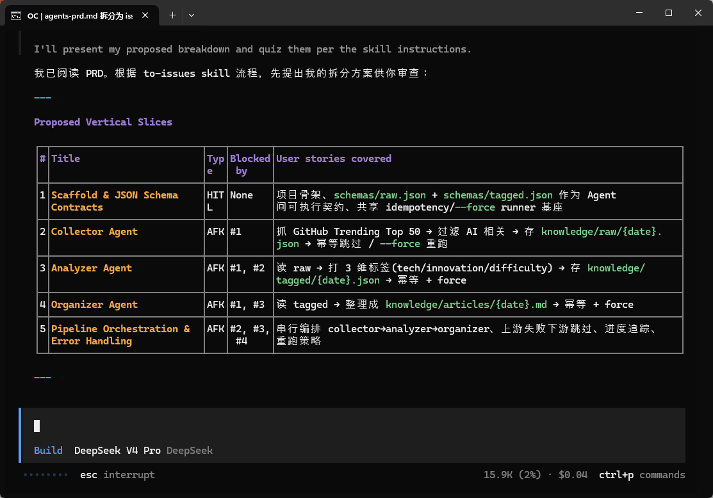
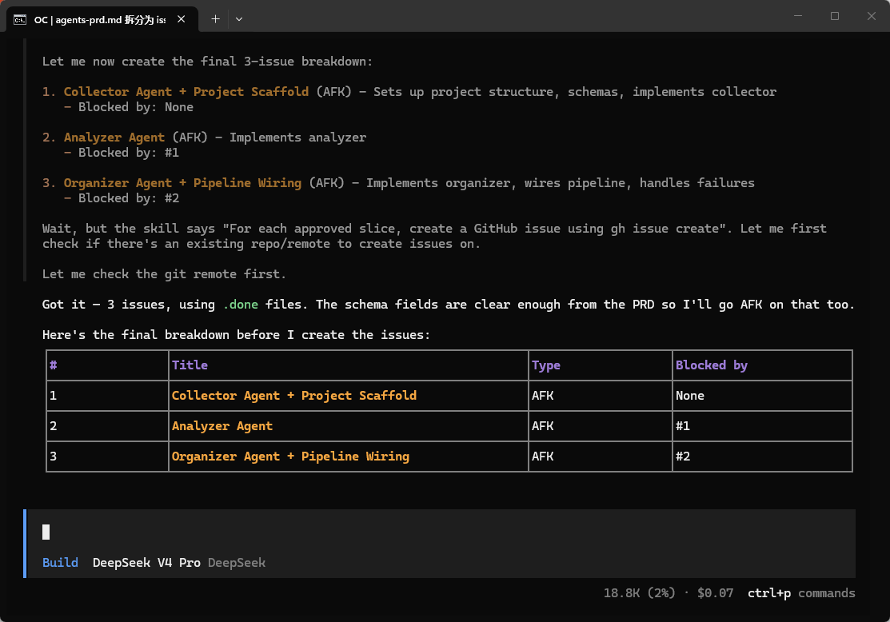
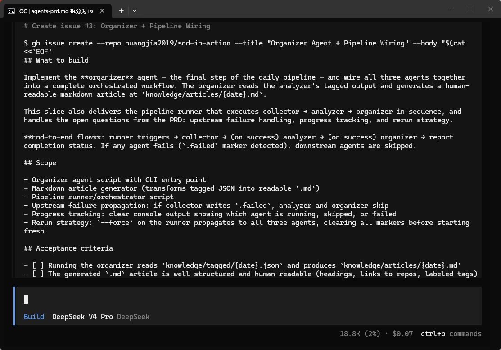
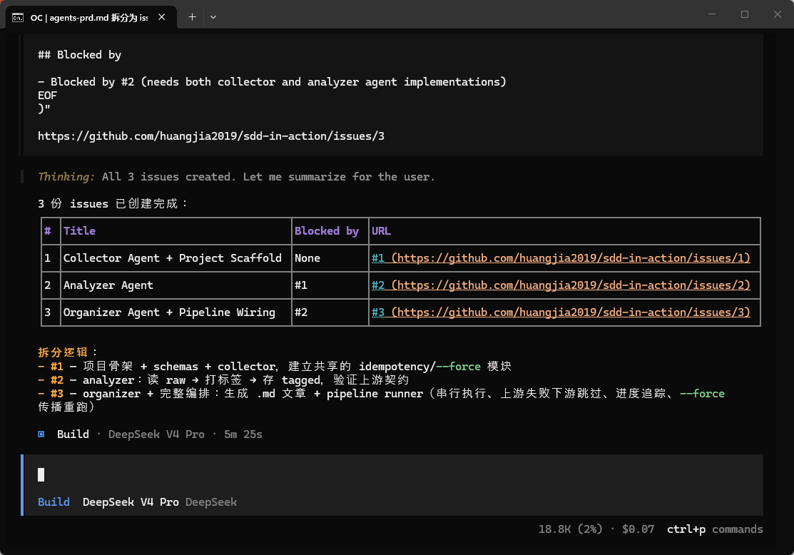

# 第 3 节（SDD 强化训练）：Sub\-Agents 角色分工\-三 Agent 协作规格

我们第一周的项目 ai\-knowledge\-base/v1\-skeleton 有[三个 Agent](https://github.com/huangjia2019/ai-knowledge-base/tree/main/v1-skeleton/.opencode/agents)：

collector    →    analyzer    →    organizer

\(采集\)             \(分析\)              \(整理\)

当 collector 抛异常时 analyzer 怎么办？analyzer 的输出长什么样 organizer 才能读？这些是 Agent 间的依赖关系和验收标准，用自然语言提示词表达会漏，必须拆成带依赖的显式任务。


本节我们来装 Matt Pocock 的第二个 skill——to\-tickets——把高阶 PRD 展开成一组带依赖和验收的任务票（ticket

0，每个 Agent 一份。


**时效声明：本节基于 mattpocock/skills 2026 年 7 月版。这个 skill 已从 to\-issues 更名为 to\-tickets，安装方式、产出路径与字段名都有调整，本节已按新版对齐。开源工具迭代较快，请以仓库 README 为准。**

**方法论（先拆 PRD、再把依赖与验收显式化）是稳定的,工具细节会变。**


### 预备知识

- [老项目逆向 · 改哪里 spec 补到哪里](https://github.com/huangjia2019/sdd-in-action/blob/master/week1/advance/03-%E8%80%81%E9%A1%B9%E7%9B%AE%E9%80%86%E5%90%91%E7%AD%96%E7%95%A5.md)


### 环境准备

#### Claude Code

```Bash
npx skills@latest add mattpocock/skills   # 交互式选择 skill 与 coding agent
/setup-matt-pocock-skills                 # 每个 repo 跑一次,tracker 选 Local markdown
ls ~/.claude/skills/   # grill-me / to-tickets 都在
```

#### OpenCode（推荐）

```Plain Text
npx skills@latest add mattpocock/skills   # 交互式选择 skill 与 coding agent
/setup-matt-pocock-skills                 # 每个 repo 跑一次,tracker 选 Local markdown
ls ~/.agents/skills/
```

### 本节目标

为 v1\-skeleton 的三个 Agent 产出：

1. specs/agents\-prd\.md —— 一份**高阶 PRD**，写清 3 个 Agent 的职责和协作流

2. specs/issues/01\-collector\.md / 02\-analyzer\.md / 03\-organizer\.md —— 三份 **issue 任务票**，每份含 depends\_on / acceptance / schema

3. \.opencode/agents/\{collector,analyzer,organizer\}\.md —— 三个 Agent 配置文件，从 issue 派生


### 双路并行

这个双路并行的设计是为了比较自己和 AI 聊和有 SDD 思想/工具做指导的差异。

#### A 路 · Vibe · 10 分钟

复制下面的 Prompt 让 AI 做：

```Plain Text
我在做 AI 知识库，有 collector / analyzer / organizer 三个 agent。
帮我写 .opencode/agents/ 下的 3 个角色定义文件。
数据流：collector 抓 GitHub Trending → analyzer 打标签 → organizer 输出 MD。
```

有什么踩坑点呢？


三个 Agent 各自知道自己要做什么，但**谁先谁后、谁触发谁、失败怎么办**都在空气里。测试时，你会发现 analyzer 在 collector 还没写完时就启动了。


#### B 路 · SDD · 40 分钟

##### 阶段 1 · Specify（10 分钟）

先写一份高阶 PRD（specs/agents\-prd\.md），强制自己想清“协作”两个字：

```Markdown
# AI 知识库 · 三 Agent PRD v0.1

## 总流程
每天 UTC 0:00 触发 · collector → analyzer → organizer · 串行。

## Agent 职责
- collector: 抓 GitHub Trending Top 50 · 过滤 AI 相关 · 存 knowledge/raw/
- analyzer: 读 raw · 给每条打 3 维度标签
- organizer: 读已标注 · 整理成 MD

## 开放问题（? 用 to-tickets 细化成任务）
- 上游失败下游怎么办？
- 数据怎么传？文件 or 消息？
- 重跑策略？
- 进度追踪？
```

这里同样故意留下几个 ?。下阶段让 to\-tickets 展开成任务票。


##### 阶段 2 · Clarify（20 分钟）

to\-tickets 的作用不是追问（那是 grill\-me），是把高阶 PRD 展开成一组带依赖和验收标准的 任务票\(ticket\)——每个 Agent 一份。

提示词：

```Plain Text
使用 to-tickets skill,基于 specs/agents-prd.md 拆成任务票。
```


**产出示例**（specs/issues/02\-analyzer\.md）：

注：新版 to\-tickets 的票模板字段为 —— 标题 / What to build\(端到端行为\)/ Blocked by\(阻塞它的票号\)/ Acceptance criteria\(勾选框\)/ Status: ready\-for\-agent。下方示例保留本书 SDD 结构以便教学，实际跑工具时以上述字段为准。













**阶段 2\.5 · 生成数据契约 schema\(5 分钟\)**

任务票里的 Acceptance criteria 是自然语言,描述了每个 Agent 该产出什么、该收到什么。但 collector 传给 analyzer 的数据到底长什么样、字段是否合法。需要一份机器可校验的契约。这一步把验收里的数据约定固化成可执行的 JSON Schema。

**提醒：schema 的生成不归 to\-tickets 管。to\-tickets 只产出任务票；除非你事先用 Matt 的 /prototype 做过原型、把 schema 片段内联进票，否则票里不含 schema。把验收里的数据契约固化成 JSON Schema，是你单独的一步。**

**提示词:**

基于任务票里各 Agent 的 Acceptance criteria 和输入输出字段,为 Agent 之间传递的数据生成可执行的 JSON Schema，存到 specs/schemas/，每个数据契约一份。

产出示例\(specs/schemas/raw\-item\.schema\.json —— collector 产出、analyzer 消费\)：

```Plain Text
{
  "$schema": "http://json-schema.org/draft-07/schema#",
  "title": "RawItem",
  "type": "object",
  "required": ["repo", "url", "stars", "captured_at"],
  "properties": {
    "repo": {"type": "string"},
    "url": {"type": "string", "format": "uri"},
    "stars": {"type": "integer", "minimum": 0},
    "description": {"type": "string"},
    "captured_at": {"type": "string", "format": "date-time"}
  }
}
```

第 2 份 schema\(labeled\-item\.schema\.json\)在 raw\-item 基础上增加 analyzer 打的标签字段\(domain / maturity / relevance\)，用 allOf 引用 raw\-item 复用字段定义。有了 schema，analyzer 收到 collector 的输出后可以先做一次校验，不合法直接拒绝，问题在边界处暴露，而不是流到下游才崩掉。

##### 阶段 3 · Implement（10 分钟）

从 issue 派生 \.opencode/agents/\{collector,analyzer,organizer\}\.md——每个 Agent 配置文件直接引用对应 issue 作为职责说明。


### A vs B 对比

|维度|A 路|B 路|
|---|---|---|
|耗时|10 min|40 min|
|协作依赖|口头约定|Ticket 的 Blocked by 字段|
|验收标准|主观判断|Ticket 的 Acceptance criteria checklist|
|failure 场景|跑一次才发现|Issue 规划时就覆盖|
|新人理解成本|读 3 个文件|读 PRD \+ 3 份 ticket|

多 Agent = 多依赖。依赖必须显式化成 issue 的 depends\_on，验收必须显式化成 acceptance——**任务票才有真相源**。


### 完成清单

- specs/agents\-prd\.md（高阶 PRD）

- specs/issues/\{01\-collector, 02\-analyzer, 03\-organizer\}\.md\(3 份 ticket · 带 Blocked by \+ Acceptance criteria\)

- specs/schemas/\*\.json\(2 份可执行 schema · 单独一步生成,见阶段 2\.5\)

- \.opencode/agents/\{collector,analyzer,organizer\}\.md（从 issue 派生）


### 下一节

第 4 节 Skills 能力封装 —— 三个 Agent 的骨架有了。但 collector 真正的“技能”藏在 skills/github\-trending/SKILL\.md 里。下节引入 **writing\-great\-skills**，让 AI 用 SDD 方式帮你从零聊出一份可复用 SKILL\.md。这是 Week 1 的收官节，敬请期待。

