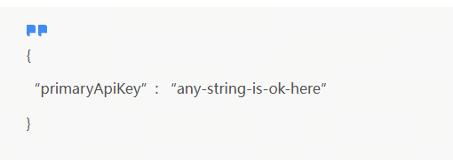
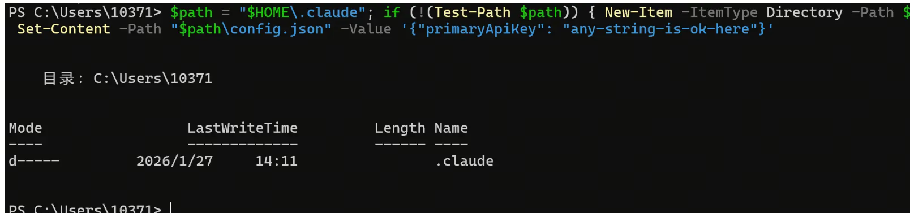
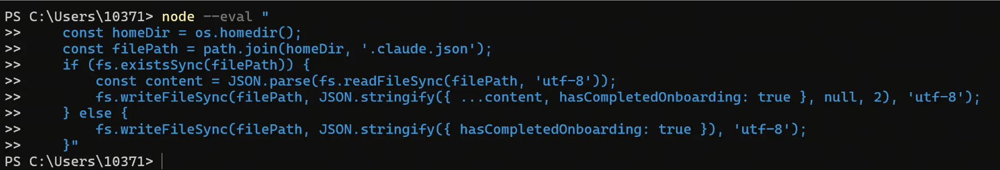
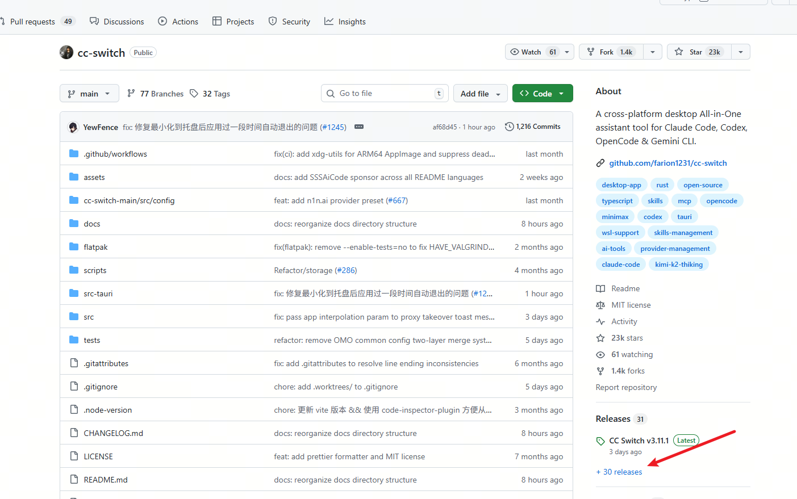
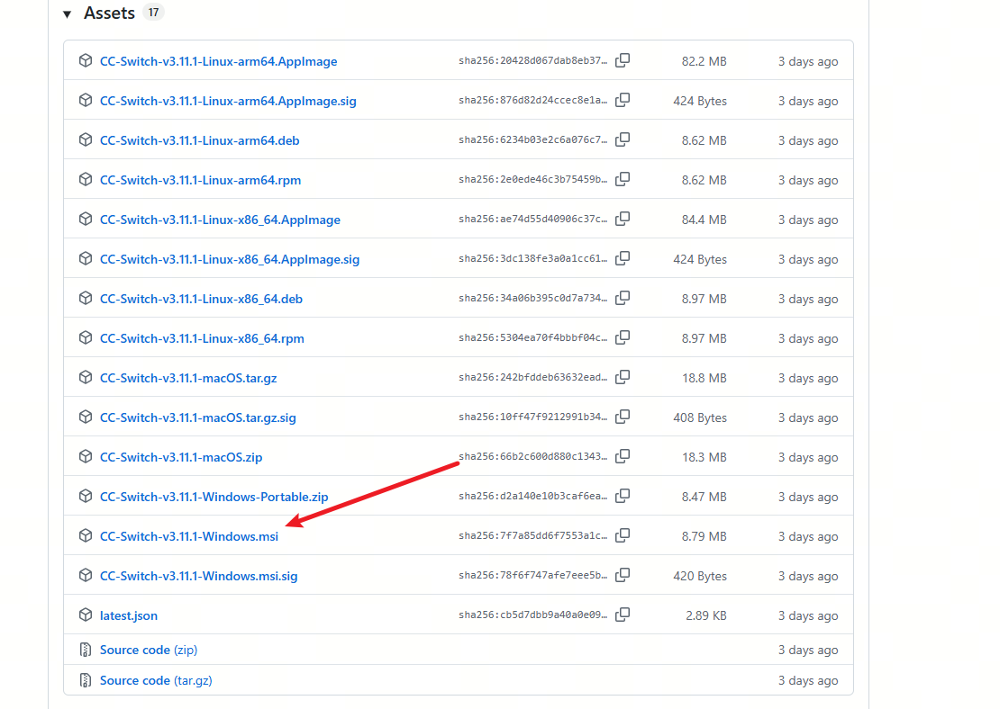
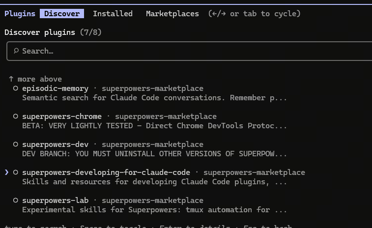
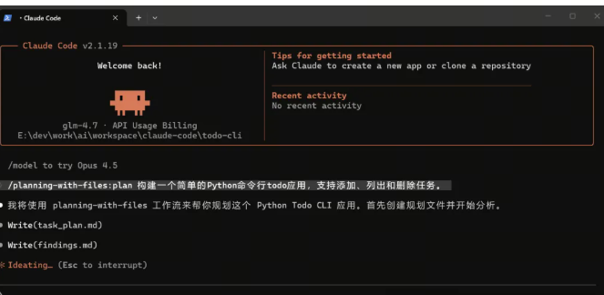
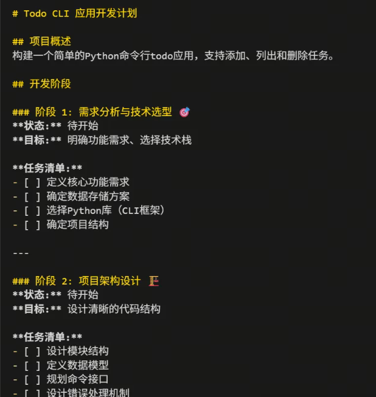

# claude安装

# 一、环境准备：安装 Node.js
Claude Code 依赖 Node.js 环境，首先需要确保你的系统已正确安装 Node.js。

1.下载
访问 Node.js 官网 (https://nodejs.org/en/download)，下载适合你操作系统的版本。

2.验证安装
安装完成后，打开PowerShell (Windows) 或终端 (macOS/Linux)，输入以下命令检查版本，出现版本号即表示成功。

node -v

npm -v

# 二、安装Claude Code
最新版本2.1.19已经放弃了npm安装方式，所以通过npm安装的后续也不再自动更新。如果你以前是通过npm安装的，可以通过官方的命令升级成最新的原生版本。
claude install

最新的原生版本的安装方式大家根据自己的系统选择对应的命令即可（记得开启科学上网）。

### Mac用户

brew install claude-code

### Linux用户

curl -fsSL https://claude.ai/install.sh | bash

### Windows PowerShell用户

irm https://claude.ai/install.ps1 | iex

### npm 安装 
npm install -g @anthropic-ai/claude-code --registry=https://registry.npmmirror.com

Claude –version

# 三、开启第三方端点配置
这是最关键的一步。默认情况下，最新版的Claude Code 仅支持官方模型。我们需要手动创建配置文件来通过“验证门槛”并开启第三方模型支持。此步骤包含两个部分的配置：

### 1 .key类型配置
我们需要在 .claude文件夹中创建一个config.json文件。文件路径如下：

Windows:

macOS/Linux:

文件内容如下：

快速创建命令 (PowerShell)： 你也可以直接复制以下命令在 PowerShell 中运行，一键创建该文件：

$path = "$HOME\.claude"; if (!(Test-Path $path)) { New-Item -ItemType Directory -Path $path -Force }; Set-Content -Path "$path\config.json" -Value '{"primaryApiKey": "any-string-is-ok-here"}'

macOS/Linux 命令：

mkdir -p ~/.claude && echo ‘{“primaryApiKey”: “any-string-is-ok-here”}’ > ~/.claude/config.json

2.跳过官方引导流程 

旧版本不需要此步骤，但新版必须配置，否则启动时会强制要求登录官方账号，无法使用第三方模型。我们需要在用户主目录下修改或创建 .claude.json 文件（注意文件名前面有个点），添加hasCompletedOnboarding字段。配置内容如下：

{

“hasCompletedOnboarding”: true

}

node --eval "

const homeDir = os.homedir();

const filePath = path.join(homeDir, '.claude.json');

if (fs.existsSync(filePath)) {

const content = JSON.parse(fs.readFileSync(filePath, 'utf-8'));

fs.writeFileSync(filePath, JSON.stringify({ ...content, hasCompletedOnboarding: true }, null, 2), 'utf-8');

} else {

fs.writeFileSync(filePath, JSON.stringify({ hasCompletedOnboarding: true }), 'utf-8');

}"

node -e "const fs=require('fs'),os=require('os'),p=require('path').join(os.homedir(),'.claude.json');let d={};try{d=JSON.parse(fs.readFileSync(p,'utf8'))}catch{}d.hasCompletedOnboarding=true;fs.writeFileSync(p,JSON.stringify(d,null,2))"

# 四、下载cc-switch

https://github.com/farion1231/cc-switch

### 配置cc-switch
配置 api key 和请求地址

# 五、安装vibe-kanban

事情太多，命令行的claude code没有留存，安装vibe-kanban

开发过程中，我经常需要针对某个/多个项目并行下发多个指令，另外一个就是需要针对该项目查看前面执行的history

终端运行：npx vibe-kanban

官网：https://www.vibekanban.com/

githup: https://github.com/BloopAI/vibe-kanban

# 六、安装Superpowers 
描述不清楚需求，AI乱撞墙（“事情的关键是做好关键的事”）
由于有些场景我们也不清楚具体要怎么做，在让AI执行过程中他经常会跑偏，或者需要我们频繁调试对话。
引入最强大脑“Superpowers”

Superpowers 是什么
Superpowers 是一个 Claude Code 插件，给 AI 加上了软件开发的工作流程和最佳实践。

它让 AI 像资深开发者一样工作，有设计文档、任务拆解、测试驱动开发、代码审查等环节。

Superpowers 怎么工作
它给 AI 加了个工作流程。不再是拿到需求就开始写代码。现在是：

讨论需求 → 写设计文档 → 拆解任务 → 写代码 → 跑测试 → 审查 → 部署

每一步都有检查点。

Superpowers 有 15 个技能模块，会在需要的时候自动触发：

brainstorming：通过提问理解需求
test-driven-development：强制先写测试
systematic-debugging：系统化调试
subagent-driven-development：启动多个子代理并行工作
requesting-code-review：代码审查
7 个工作阶段
Superpowers 把开发分成 7 步：

头脑风暴 - AI 通过提问理解你的需求，生成设计文档
Git Worktrees - 创建独立的开发分支，不影响主分支
编写计划 - 把功能拆成 2-5 分钟的小任务
子代理开发 - 启动多个子代理并行工作，每个任务完成后双重审查
测试驱动 - 强制 RED-GREEN-REFACTOR 循环，先写测试再写代码
代码审查 - 从功能、质量、安全、性能多个维度审查
完成分支 - 验证测试，生成报告，选择合并或创建 PR

安装
三条命令：
### 1. 注册插件市场
/plugin marketplace add obra/superpowers-marketplace

### 2. 安装插件
/plugin install superpowers@superpowers-marketplace

### 3. 验证安装
/help

GitHub 仓库：obra/superpowers:https://github.com/obra/superpowers)
插件市场：obra/superpowers-marketplace:https://github.com/obra/superpowers-marketplace)

# 七、安装planning-with-files

事情复杂，AI左脑拳打右脑
在尝试把项目全局分析优化过程中，由于AI调试频繁出错，导致会话上下文过长，最终产出不符合预期。（有小伙伴有更好的方法也欢迎分享）
引入planning-with-files插件，让ai每次回话结果能留档，并且能像manus一样工作。

planning-with-files 是一个 Claude Code 插件，借鉴了 Manus 的设计思路，用持久化的 Markdown 文件来做规划、进度跟踪和知识存储。它关注的不是模型能力，而是把文件系统当作稳定的工作记忆来使用。

planning-with-files 的核心做法是为每个复杂任务维护三个文件：

task_plan.md      → 拆分任务、规划阶段、追踪进度
findings.md       → 记录调研结果、关键发现与设计决策
progress.md       → 保存会话日志、实验记录和测试结果

参考文章：https://mp.weixin.qq.com/s/9HfSXGESVgqHsjNdi0kMvw

步骤一：把插件加入市场
在 Claude Code 的终端中执行：
/plugin marketplace add OthmanAdi/planning-with-files

步骤二：安装插件

/plugin install planning-with-files@planning-with-files

下面通过一个完整示例，展示 planning-with-files 在实际项目中的使用方式。

任务描述
构建一个简单的Python命令行todo应用，支持添加、列出和删除任务。
Phase 1：初始化规划
运行 /planning-with-files:plan + 任务描述

首先生成 task_plan.md，用于定义任务目标和阶段划分

# 八、安装插件

Trae安装插件
打开Trae，按ctrl + shift + x 打开扩展面板
搜索 claude code for trae 直接安装

vscode 安装插件
安装 Claude Code Yolo 插件
打开 VS Code，在扩展市场搜索并安装 Claude code yolo（请搜索全称）。这个魔改版插件允许在 UI 界面中直接配置第三方模型参数。
