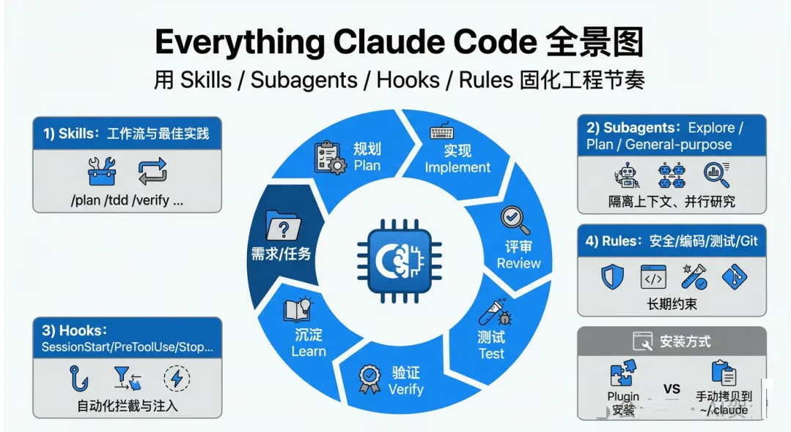
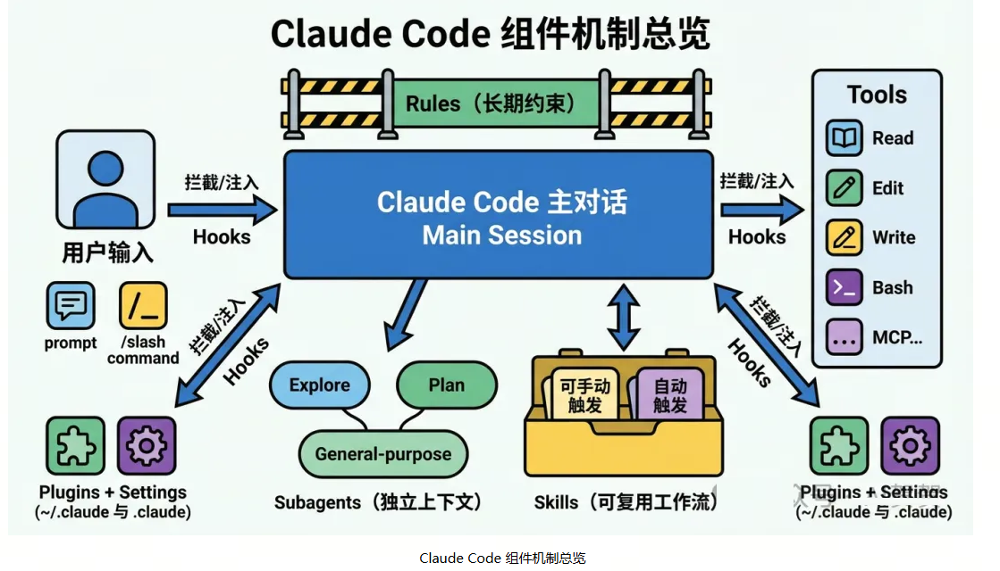
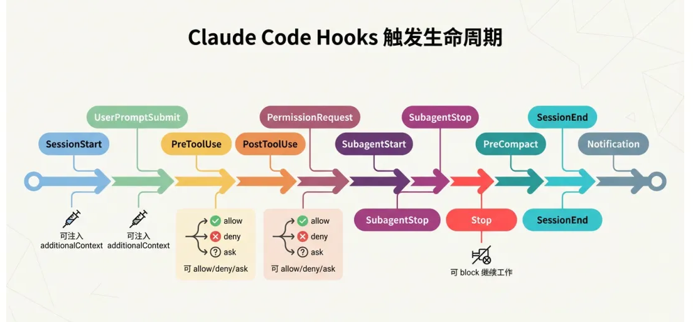
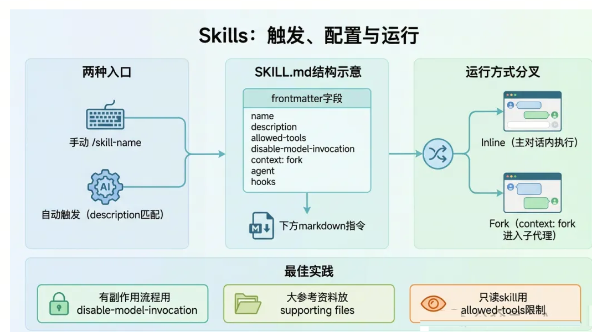
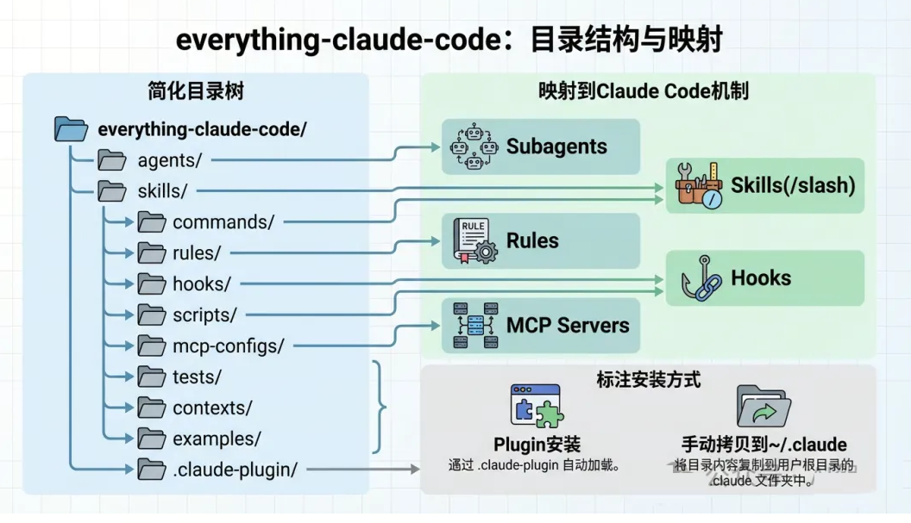
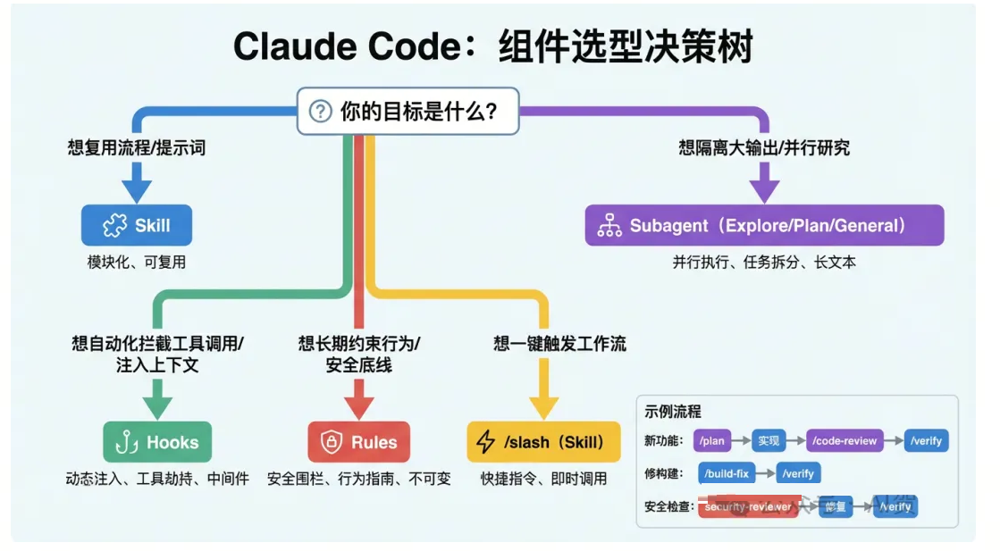
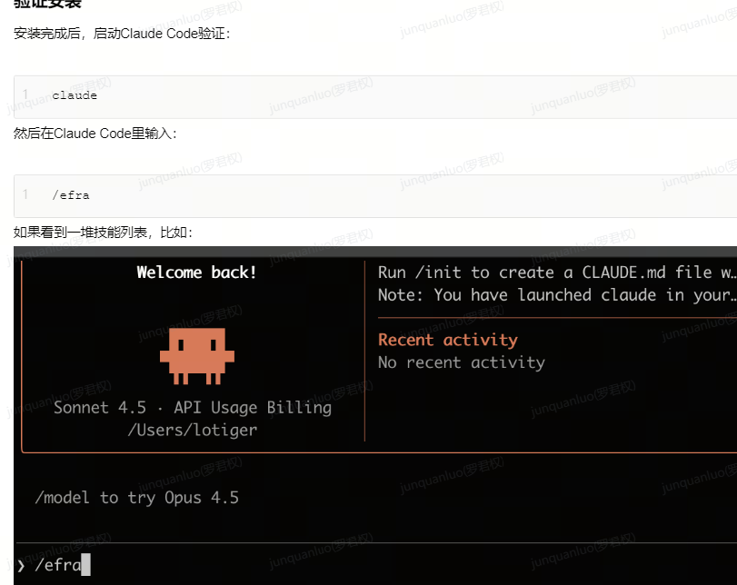

everything-claude-code：一套可复用的 Claude Code 工程工作流组件库

everything-claude-code 是一个面向 Claude Code（Anthropic 官方 CLI 编程助手） 的“全家桶”配置仓库/插件：把常用的 agents（子代理）、skills（工作流技能）、slash commands（斜杠命令）、rules（规则约束）、hooks（事件钩子自动化）、以及 MCP server 配置示例集中在一起，提供一套可直接复用的工程化工作流。

它更像是一个“可安装的 Claude Code 插件 + 参考实现集合”，目标是让 Claude Code 在真实项目里更像一个具备流程纪律的工程助手，而不是只会临时回答问题的聊天机器人。

核心作用/解决什么问题

1.把高频工程能力产品化：将规划、架构评审、代码评审、安全审查、E2E、TDD 等能力沉淀为可调用的 agents/skills/commands。

2.把“怎么用 Claude Code”固化为流程：通过 rules + commands + hooks，将“先计划/先测试/再实现/再验证”的做事方式变成工具行为，而不是依赖使用者记忆。

3.减少跨项目迁移成本：提供一套通用的目录结构与可拷贝配置（手动安装）或插件安装方式（推荐）。

4.统一工具链与脚本习惯：内置包管理器选择/配置逻辑（npm/pnpm/yarn/bun 自动探测），以及测试运行脚本与示例。

# 安装使用方式

作为 Claude Code 插件安装

/plugin marketplace add affaan-m/everything-claude-code

/plugin install everything-claude-code@everything-claude-code

参考文章： http://www.uml.org.cn/ai/202602054.asp

# 公司使用
公司在自己git 翻译everything-claude-code内容，并添加自己的内容

安装 
/plugin marketplace add 公司git仓库地址
/plugin install everything-claude-code@everything-claude-code

公司项目级别配置：

在项目下的.claude/settings下新增插件源配置信息

{
  "extraKnownMarketplaces": {
    "everything-claude-code": {
      "source": {
        "source": "git",
        "repo": "公司git仓库地址",
        "url":"公司git仓库地址"
      }
    }
  },
  "enabledPlugins": {
    "everything-claude-code@everything-claude-code": true
  }
}
方式二： 打开claude面板，直接复制粘贴：
把"公司git仓库地址"的rules安装到这个项目

