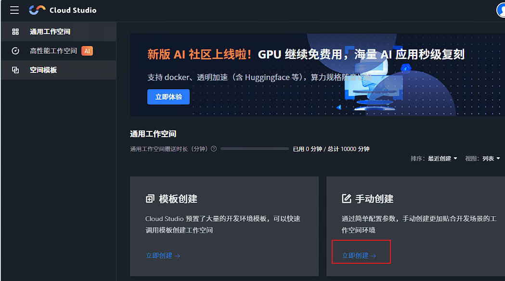
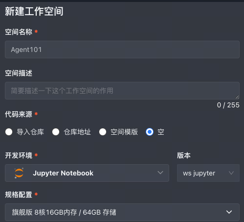
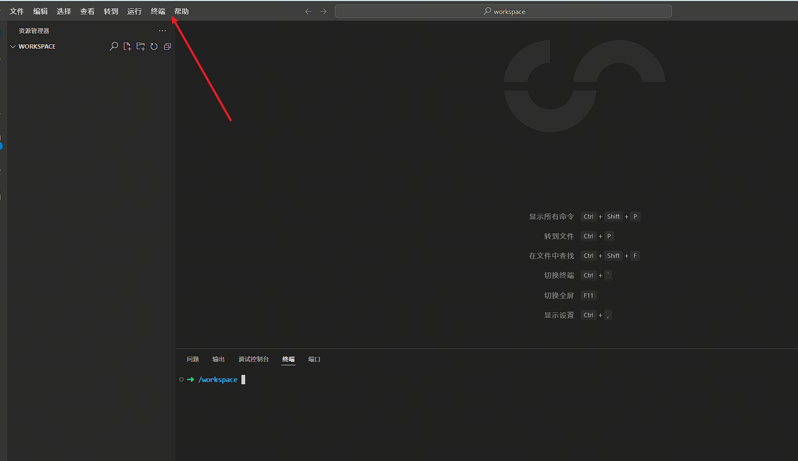
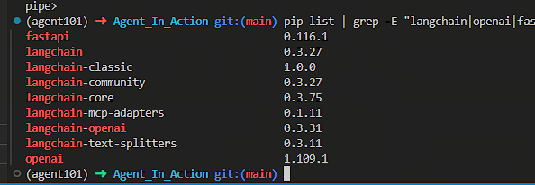

## 腾讯云 Cloud Studio
链接： https://ide.cloud.tencent.com/dashboard/workspace
微信登陆

## 创建工作空间
###  创建Jupyter Notebook环境

空间名称：Agent101
代码来源：空
开发环境：Jupyter Notebook
规格配置：旗舰版 8核16G内存/64G存储


创建完成之后，自动进入工作空间，页面会显示一个VS Code编辑器。
打开终端，后续命令都在终端里执行：


### 创建项目Conda环境
腾讯云已经默认安装了 Miniconda，并且默认使用腾讯云镜像，所以我们只需要创建项目专用环境即可：
```
# 创建名为 agent101 的环境，指定 Python 3.10.18
conda create -n agent101 python=3.10.18 -y

# 激活环境
conda activate agent101

# 验证 Python 版本
python --version
# 输出：Python 3.10.18

# 验证 pip 版本
pip --version
```

### JupyterLab 安装与配置
安装 JupyterLab

确保已激活 agent101 环境：
```
# 激活环境
conda activate agent101

# 使用 conda 安装 JupyterLab
conda install -c conda-forge jupyterlab -y

# 验证安装
jupyter lab --version
# 输出示例：4.0.9
```
### 生成配置文件
```
# 生成 JupyterLab 配置文件
jupyter lab --generate-config

# 输出示例：
# Writing default config to: /root/.jupyter/jupyter_lab_config.py
```
配置文件位置：~/.jupyter/jupyter_lab_config.py

### 配置 JupyterLab
编辑配置文件：
vim ~/.jupyter/jupyter_lab_config.py
不保存退出：ESC → :q → 回车
保存退出：ESC → :wq → 回车
强制不保存退出：ESC → :q! → 回车

添加或修改以下配置：
```
# 允许 root 用户启动（如果使用 root 用户）
c.ServerApp.allow_root = True

# 设置工作目录
c.ServerApp.root_dir = '/workspace/Agent101/code'

# 修改默认端口
c.ServerApp.port = 8000

# 设置可访问的 IP（0.0.0.0 表示允许所有 IP 访问）
c.ServerApp.ip = '0.0.0.0'

# 设置访问令牌（token）作为密码
# 方式1：自定义 token
c.ServerApp.token = 'fly123'

# 方式2：禁用 token（不推荐，仅本地使用）
# c.ServerApp.token = ''
# c.ServerApp.password = ''

# 禁用浏览器自动打开
c.ServerApp.open_browser = False

# 启用扩展
c.ServerApp.jpserver_extensions = {}
```
**重要配置说明**：

| 配置项            | 说明              | 推荐值                        |
| -------------- | --------------- | -------------------------- |
| `allow_root`   | 是否允许 root 用户运行  | True（如使用 root）             |
| `root_dir`     | JupyterLab 工作目录 | `/workspace/Agent101/code` |
| `port`         | 访问端口            | `8000`                     |
| `ip`           | 监听 IP           | `0.0.0.0`（允许远程访问）          |
| `token`        | 访问令牌            | 自定义强密码                     |
| `open_browser` | 自动打开浏览器         | False（服务器模式）               |

**说明：**

`root_dir` 指定的是 `/workspace/Agent101/code`，因为腾讯云默认的工作空间是 `/workspace`，所以项目代码也放在这里，可以在VS Code文件列表直接看到，方便操作。

## 安装 ipykernel（重要）
为了在 JupyterLab 中使用 conda 环境，必须安装 ipykernel：
```
# 确保在 agent101 环境中
conda activate agent101

# 安装 ipykernel
pip install ipykernel

# 将环境注册为 Jupyter 内核
python -m ipykernel install --user --name=agent101 --display-name="Python (agent101)"

# 验证内核安装
jupyter kernelspec list
```
**输出示例**：

```
Available kernels:
  agent101    /root/.local/share/jupyter/kernels/agent101
  python3     /root/miniconda3/envs/agent101/share/jupyter/kernels/python3
```
**管理内核**：

```
# 查看已安装的内核
jupyter kernelspec list

# 删除内核
jupyter kernelspec remove agent101

# 重新安装内核
python -m ipykernel install --user --name=agent101 --display-name="Python (agent101)"
```
## 测试 JupyterLab
```
# 启动 JupyterLab（前台运行）
jupyter lab --config=/root/.jupyter/jupyter_lab_config.py

# 输出示例：
# [I 2025-01-01 10:00:00.000 ServerApp] Jupyter Server 2.x.x is running at:
# [I 2025-01-01 10:00:00.000 ServerApp] http://0.0.0.0:8000/lab?token=fly123
```

点击`打开浏览器`，会在新页面访问 JupyterLab：

输入 token：`fly123`

**停止 JupyterLab**：按 `Ctrl+C` 两次

## 代码下载
创建代码目录
```bash
# 创建代码根目录
mkdir -p Agent101/code

# 进入代码目录
cd Agent101/code
```
## 克隆项目代码

```bash
# 克隆 Agent_In_Action 项目
git clone https://github.com/FlyAIBox/Agent_In_Action.git

# 进入项目目录
cd Agent_In_Action

# 查看项目结构
tree -L 2

# 或使用 ls
ls -lah
```
**项目结构**：

```
Agent_In_Action/
├── 01-agent-tool-mcp/          # 项目1-2: 智能体基础与 MCP 集成
├── 02-agent-multi-role/        # 项目3: 深度研究助手
├── 03-agent-build-docker-deploy/  # 项目4: 旅行规划系统
├── 04-agent-evaluation/        # 项目5: 监控与评估
├── 05-agent-model-finetuning/  # 项目6: 模型微调
├── docs/                       # 文档目录
└── README.md                   # 项目说明
```

## 安装项目依赖
```bash
# 项目1-2：智能体基础与 MCP
cd 01-agent-tool-mcp/mcp-demo
pip install -r requirements.txt

# 项目3：深度研究助手
cd ../../02-agent-multi-role/deepresearch/deployment
pip install -r requirements.txt

# 项目4：旅行规划系统
cd ../../../03-agent-build-docker-deploy
pip install -r backend/requirements.txt
pip install -r frontend/requirements.txt

# 项目5：评估监控
pip install langfuse langchain langgraph

# 返回项目根目录
cd /workspace/Agent101/code/Agent_In_Action
```
## 常用依赖包

项目所需的主要依赖包：

```bash
# 核心依赖
pip install langchain langgraph langchain-openai langchain-community
pip install openai anthropic
pip install fastapi uvicorn streamlit
pip install python-dotenv

# 工具包
pip install tavily-python serpapi
pip install requests httpx

# 监控评估
pip install langfuse langsmith

# 数据处理
pip install pandas numpy
```

```bash
# 验证 Python 包
python -c "import langchain; print(f'LangChain: {langchain.__version__}')"
python -c "import langgraph; print('LangGraph installed')"
python -c "import openai; print(f'OpenAI: {openai.__version__}')"

# 查看已安装的包
pip list | grep -E "langchain|openai|fastapi"
```

结果如下：


至此，基本的配置已经完成，注意代码根目录是`/workspace/Agent101/code/Agent_In_Action`。